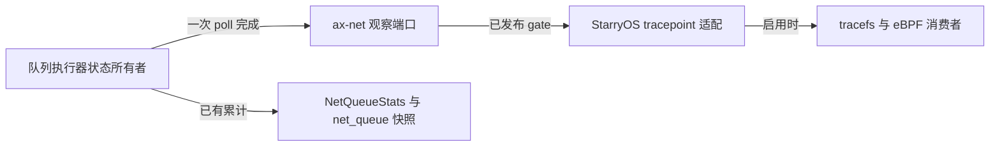

# 网络事件

网络事件把队列运行时报成 `net:*` tracepoint，供 tracefs 与 eBPF 消费。事实由网络栈自己的状态所有者产生，`ax-net` 拥有事实与窄观察端口，StarryOS 拥有事件名称、记录格式与启用状态；事件可被关闭或丢弃，因此不能代替 `NetQueueStats`、`net_queue_snapshots()` 或 `/proc/net/dev` 的累计。

事件清单目前只有 `net:queue_poll_round`；其余候选（rearm、IRQ、背压、最终丢弃）按各自准入条件逐项加入，未加入前不对外承诺字段。

## 1. 观察端口

`ax-net` 不依赖 StarryOS 或 `ax-tracepoint`，事件事实经一个窄观察端口交给操作系统适配层：

端口契约：

- `install_queue_poll_observer()` 每进程安装一次，重复安装同一函数幂等，替换存活消费者是不变量违背；端口不卸载。
- 报告只读一个已发布标志与一个函数指针槽，不分配、不读时钟、不取网络锁，可在队列执行器线程直接调用。
- 未安装端口等价于没有消费者：状态转换与结果不变。
- 安装发生在网络运行时已经运行之后，因此安装前完成的轮次不会被报告；这一段丢事件窗口是端口语义的一部分，不由缓存补偿。

`publish_queue_poll_gate()` 由 StarryOS 写入：启用事实仍由 `ax-tracepoint` 的门控拥有，运行时不维护第二份真相。查询 gate 与真正触发之间允许启停竞争，生成的 `trace_queue_poll_round()` 仍会做最终门控检查。

## 2. `net:queue_poll_round`

一次队列执行器 poll 调用返回时恰好报告一次，包括提前返回。报告的是一次队列轮询调用，不含其后的 IRQ rearm；未成功 `claim()` 因此没有进入 poll 的轮次不产生事件。

| 字段 | 类型 | 语义与约束 |
| --- | --- | --- |
| `discovery_order` | u32 | 设备在运行时输入列表中的位置；启动跳过设备后与接口发布序不同，只用于定位运行时内部设备。 |
| `group_id` | u32 | 驱动分配的队列组编号，仅在设备内唯一；`(discovery_order, group_id)` 才是 poll group 的键。 |
| `owner_cpu` | u32 | 建组时固定的队列归属 CPU，不是事件发生时的任意采样值。 |
| `budget` | u32 | 传给本次 poll 的 CPU 工作预算。它是本轮剩余预算，随同轮前序 group 递减，不是每队列固定值。 |
| `work_units` | u32 | 本次完成的执行器工作单位，含 TX 完成、TX 提交、RX 回收、RX 补投与 RX 取帧五类操作；不是帧数或包数，不能跨轮跨队列当作吞吐量比较。 |
| `outcome` | u32 | 固定数值：`0` 空闲、`1` 仍有工作、`2` 阻塞、`3` 失败。 |

结果码语义：

- `Idle`：本轮没有更多工作；调用方随后执行 IRQ rearm。
- `More`：预算耗尽，或 RX 补投暂时受阻但已有进展；两者都表示仍有工作，需要再调度。
- `Blocked`：TX 空闲槽、TX 提交或 RX 投递的目标环不可用，本轮就停在这里。
- `Failed`：本轮失败并禁用该 group。失败轮次同样携带失败前已完成的工作量，不把 `work_units` 填成零；轮内预算记账保持原有口径，不因报告而改变。

字段全部为固定宽度整数，转换在适配层进行并以饱和代替截断；运行时不会给出接近上限的值。

Linux 对照：本事件报告的事实对应 `napi:napi_poll` 的 `work` 与 `budget`。差异是结构性的——Starry 的队列执行器独立于 NAPI（不属于网络栈的软中断预算体系，因此不沿用 NAPI 的命名），`work_units` 是执行器工作单位而不是处理的包数，事件也不预计算耗时，不提供任何 duration 字段。

## 3. 启停与成本

- 事件由 `ax-tracepoint` 的每事件门控拥有。`tracefs` 的 `enable` 与 `perf`/BPF 附着都会改变回调集合，StarryOS 在回调集合变化的同一处把结果镜像到运行时的已发布标志。
- 镜像只在回调集合变化时更新，因此存在三种状态。**无回调**：队列执行器进入端口只付一次已发布标志读取与分支，不构造记录、不读时钟、不做格式化。**有回调且采集已启用**：完整付出记录构造与 `trace_pipe` 管线的成本。**有回调但采集未启用**（perf 附着后未 `enable`，或 `DISABLE` 之后）：镜像仍为真，事件函数照常被调用并遍历回调，最终由每个回调自己的启用位拦下——这一态按“无回调”以外处理，其开销与启用态同量级地走到分发入口。
- 事实所有者侧在进入端口前会组装报告值（本例是拷贝一个 `Copy` 结构），这一步发生在门控检查之前，编译器可以把它下沉到标志检查之后但不作保证；因此关闭态的准确口径是「一次已发布标志读取加分支，外加一次栈上报告值填充」。
- 判定成本时区分度量对象：比较“端口已安装且事件关闭”与“事件开启”只能得到含 `trace_pipe` 管线的增量；端口本身的开销需要另一个“未安装端口”的对照构建，该对照列为合入后的板卡测量任务，不作为合入前的门槛。

## 4. 事件准入

新增候选事件前必须固定：事实所有者与唯一触发边界、是否可重试与是否算最终丢弃的区别、身份字段与设备重建稳定性、整数宽度与范围转换、以及该上下文能否安全执行消费者。硬 IRQ 路径下的候选（例如 `queue_irq`）在证明解释器、helper、映射与错误路径都不睡眠、不分配之前不实施，也不把任意 eBPF 程序放进 IRQ 现场。

## 5. 验收

- `ax-net` 单元测试覆盖：每次 poll 恰一条报告、提前返回不重复报告、失败轮次报告真实工作量、端口开关与有无消费者都不改变 `GroupPollOutcome`。
- StarryOS 系统用例 `qemu/system/net-events` 覆盖：事件可发现且 `format` 声明了文档字段、启用后真实队列轮询产生记录且记录自洽、关闭后同样流量不再产生记录。
- eBPF 冒烟只证明 `load → attach → enable → read` 附着链路，不定义事件语义。
- 板卡测量（合入后）：对照构建比较未安装端口与已安装未启用的吞吐与 CPU，尾延迟指标在出现可靠载体前不列入。
