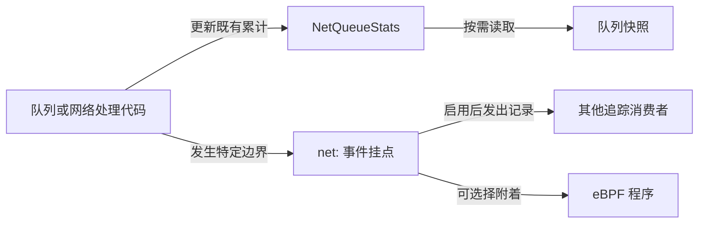

# StarryOS 网络栈能力与网络事件的关系

## 1. 四种不同的东西

[网络栈基础可观测性方案](starry-network-observability-plan.md)要建设的是网络栈自己拥有的事实出口，最终允许 eBPF 按需订阅这些事实。这里的“能力”比“事件”宽：能力可以是一份持续更新的计数，也可以是某个时刻发出的事件，还可以是控制事件启停的机制。把它们都叫事件，会误以为每增加一个计数或字段，就必须增加一个 tracepoint。

### 1.1 状态与事件

状态回答“现在是多少”，例如 `PollGroupState::stats` 中某队列累计收到多少次 IRQ、发生多少次 `rearm_race`；查询 `net_queue_snapshots()` 得到的是这些值的快照。事件回答“刚才发生了什么”，例如 `QueueGroupExecutor::poll()` 结束时报告这轮实际完成多少工作、为何停止。若一秒发生一千次轮询，启用后便可能有一千条事件；不启用时，已有队列计数仍照常维护。状态不应为了凑成事件而每次变化都额外发送一条记录，事件也不应成为权威计数的唯一来源。

### 1.2 挂点与消费者

`tracepoint` 是内核为某种事件规定的名称、字段布局和触发位置；`net:queue_poll` 中 `net` 是事件系统，`queue_poll` 是事件名。它不是一段 eBPF 程序。网络栈到达挂点并且该事件启用时，StarryOS 的追踪适配层才把事实封装为记录；eBPF 程序可以附着并处理记录，也可以由其他追踪消费者处理。同一个事件可服务多个消费者，一个消费者也可订阅多个事件，因此不存在“一个能力对应一个事件”或“一个事件对应一个 eBPF”的普遍规则。目标分支现有的 [`ax-tracepoint` 事件宏](../components/ax-tracepoint/src/basic_macro.rs)与 [StarryOS tracepoint 注册表](../os/StarryOS/kernel/src/tracepoint/mod.rs)提供这类挂点的框架；本方案的网络事件还没有在目标分支实现。

这张图把长期保存的状态和瞬时发出的事件分成两条路径。两条路径都从实际网络状态所有者出发，但只有事件路径涉及附着、启用与消费。

例如 `queue_poll` 可以在一轮结束时发一条“工作量和结束原因”记录；`poll_batches` 则仍在 `NetQueueStats` 中累计。这不是重复实现同一计数：前者保留一次发生的上下文，后者提供即使没有任何追踪消费者也可靠的累计值。

## 2. 原方案中的对应关系

原方案第 3 节列的是计划中的网络能力和候选事件，不能读成“目标分支已经提供了这些 tracepoint”。先分清本次拟实施的基本事件、只有需求成立才增加的帧边界事件，以及根本不属于事件的快照，后续才能准确判断 eBPF 最终能获得什么。

### 2.1 已有状态的出口

[`NetQueueStats`](../net/ax-net/src/queue_runtime/state.rs) 的 IRQ、调度、poll 批次、预算耗尽和 rearm race 等累计值已经存在；原方案第一批准备给每组队列补稳定身份，并通过 debugfs 读取快照。这个出口是网络栈基础能力，**没有一一对应的 `net:*` 事件**。它与 `/proc/net/dev` 的接口包/字节累计也不是同一层级：前者说队列运行状态，后者说接口累计流量。

### 2.2 拟提供的事件

原方案第二批以队列状态转换和最终丢弃为事件来源。下表列出它们回答的问题和计划中的代码边界；“拟提供”不是“已经实现”。一个边界可能有自己的累计计数，也可能没有，不能用计数是否存在决定事件是否存在。

| 拟提供事件 | 事件发生时回答什么 | 计划中的事实所有者 |
| --- | --- | --- |
| `net:queue_poll` | 哪组队列结束一轮轮询，完成多少工作、为何停止 | `QueueGroupExecutor::poll()` |
| `net:queue_irq` | 哪组队列在何 CPU 收到一次 IRQ 通知 | `PollGroupState::schedule_irq()` |
| `net:queue_rearm` | 哪组队列重设中断时发现工作仍在等待 | 队列执行器的 rearm 分支 |
| `net:queue_backpressure` | 提交为何暂时无法推进 | 队列执行器的提交结果分支 |
| `net:route_drop` | 哪个接口最终丢弃了帧及其原因 | `router::DeviceHandle` 的最终拒绝分支 |

`net:proto_poll` 在原方案中仍以实际排障价值为条件；它若加入，报告的是 Starry 单协议执行器一轮轮询是否仍有工作、是否让出执行权，不等同 Linux NAPI。`net:queue_poll` 等事件的字段应是现成的工作量、预算与结果，而非为了发事件持续维护一份计时状态。

### 2.3 有条件的帧边界

原方案第三批提出 `net:tx_queue`、`net:tx_submit`、`net:rx_publish`、`net:rx_consume`，分别描述协议交付、设备提交、接收帧发布和协议消费。它们目前只是**有条件的候选**：如果第二批事件与队列快照已经足够解释相关故障，就不因某个监控程序想多画一条曲线而全部添加。若最终交付必须保证 eBPF 看到某一边界，就需要在实施前把该事件改列为明确交付项；不能将候选列表当作已承诺的事件 ABI。

## 3. eBPF 能做与不能做的事

事件供应方与分析方的责任不同：网络栈负责如实报告发生时已知的事实，eBPF 负责订阅、筛选、聚合及解释。eBPF 可以对 `net:queue_poll` 按队列统计轮询次数和工作量分布，对 `net:route_drop` 按原因计数；它也可以结合队列快照核对一段时间内的累计变化。但事件可能关闭或丢失，所以不能由事件流反算 `/proc/net/dev` 或 `NetQueueStats` 的权威累计。

### 3.1 能直接得到的信息

只订阅一次完成事件，eBPF 就能得到该事件载明的设备、group、工作量或结果；是否需要跨事件关联取决于问题。比如找出“哪个队列频繁受背压”，可以直接按 `device` 和 `group` 聚合 `net:queue_backpressure`，不需要给每个帧建立 ID。找出“IRQ 之后具体哪一轮 poll 消费了它”，则需要可靠的关联语义；原方案刻意没有提供一个 IRQ 对应一个 poll 的假设。

### 3.2 明确得不到的信息

两条边界事件不自动形成同一帧的时延。仅有 `net:rx_publish` 和 `net:rx_consume`，却没有稳定同帧标识或随帧时间戳时，eBPF 能分别计数，不能可靠地计算“某个帧在队列等了多久”。同理，只有一次 `net:queue_poll` 结束事件而没有轮询开始时间，也不能从中算出该轮执行时长。要获得这些指标必须另行设计真实关联能力或合适的开始/结束事件，而不能假装观察到了原方案明确排除的 `DmaBuffer::carrier`。因此，本次基础事件方案**不承诺复刻来源分支的逐帧、跨阶段时延指标**。

## 4. 事件交付的判定

如果“最终供 eBPF 使用”是交付要求，每个必交付事件都必须有独立的网络语义和可检查的契约，而不能只在文档里写下名字。原方案仍保留第三批的选择权；本说明不修改该决定，只把它造成的能力边界写清楚。实施时，先明确希望 eBPF 回答的具体问题，再确定所需事件是否属于已承诺的第二批，或需要把第三批中的某个事件提升为必交付项。

### 4.1 一条事件需要约定什么

以 `net:queue_poll` 为例，应由 `QueueGroupExecutor::poll()` 在一次轮询结果确定后触发，并定义 `device`、`group`、`budget`、`work` 与结果码分别指什么；阻塞、失败和无工作的情形是否都发、各发几次也须固定。StarryOS 的追踪适配层再给出 `net/queue_poll` 的可发现名称与字段格式，启用前不执行只为记录而做的时钟读取、分配或字符串格式化。eBPF 只依赖对外事件格式，不依赖 Rust 函数名或 `DmaBuffer` 内部布局。

### 4.2 何时不应新增事件

已有队列快照能可靠回答的累计问题，不需要按每次计数更新发事件；只为计算特定时延而增加常驻时间戳，也不应包装成“网络基础事件”。只有一个实际网络状态转换、明确的触发边界、稳定的字段语义，而且消费者确实需要该次发生的上下文时，才值得成为新的 `net:*` 事件。这个标准让网络栈提供可复用的事实，而不把一种分析方法固化进内核热路径。
