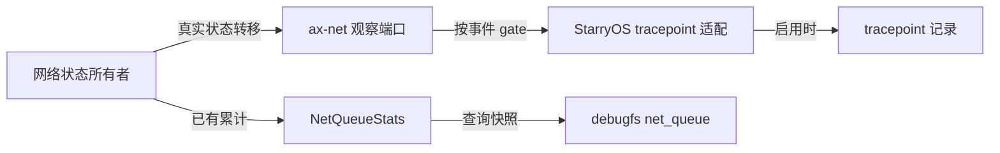

# StarryOS 网络栈基础可观测性方案

## 1. 目标与边界

StarryOS 需要像 Linux 一样，让网络栈本身能说明包在哪里被接收、排队、提交或丢弃，以及队列为何停止推进。这是网络栈的基础诊断契约，不以某个分析程序能否获得特定时延数字为目标。本方案从 `feat/net-observe` 的现状出发，参考 `sg2002/wifi-ebpf` 分支已经识别的边界和问题，但重新确定事件、状态及其所有者；不直接移植该分支代码。对照基线分别是目标分支 `d93f125cc5a97588ae3f83396e622be7c69e268d`、来源分支 `89361440b0a062e9b6066aeb3393586146300015`，以及本地 Linux `a635d6748234582ea287c5ffeae28b9b23f91c7e`。

### 1.1 要解决的问题

目标分支的 `net/ax-net/src/queue_runtime/state.rs` 已拥有每个 poll group 的 IRQ、调度、预算耗尽及 rearm race 计数，`NetworkQueueRuntime` 也能按组取计数快照，但 StarryOS 没有稳定的队列身份与对外诊断入口。`router::DeviceHandle`、`QueueGroupExecutor` 和 `poll_protocol_until_idle()` 分别掌握路由失败、设备队列推进与协议轮询的事实，却没有统一的事件边界。现有 `/proc/net/dev` 只回答接口包、字节和错误累计，无法代替这些状态。预期能力是：不运行任何监控程序，也能查询已有队列计数；启用某个网络事件时，能在该边界取得语义明确的原始记录；关闭事件时，不计算仅供该事件使用的时长。

### 1.2 明确不做的事

本方案不迁移来源分支的 `DmaBuffer::carrier`、默认逐帧采样、`net_sample_rate`、为采样增加的 `SpscProducer::has_room()` 路径，也不为探针保留函数而给网络、SDIO 或 WiFi 函数增加 `#[inline(never)]`。不迁移 `TcpSocket::flow_key` 和把连接尝试、对象析构、socket API 字节数混称为“流生命周期”的 `net:flow`。不增加逐包时延直方图、按帧关联表、流量采样策略或观测专用的跨层状态。来源分支的 eBPF helper、verifier、nofault copy、kprobe、可执行映射粒度和应用代码属于独立能力，不进入网络栈补强范围。

## 2. Linux 对照与正当性

Linux 同时提供标准接口统计、较细的队列统计和常驻定义但运行时可关闭的网络事件。这里“向 Linux 看齐”指拥有事实的子系统定义可复用的状态和事件，**不**表示复制 Linux 的内部对象或把同名事件赋予不同语义。以下对照固定在上述 Linux 提交；Linux 源码的主要依据是 `include/trace/events/{net,napi,skb,sock,tcp}.h`、`net/core/dev.c` 和 `Documentation/networking/{statistics,timestamping}.rst`，链接见第 7 节。

### 2.1 统计与事件的分工

Linux 的 `rtnl_link_stats64` 通过多种接口提供设备级累计；队列统计有 netdev netlink 路径；`net:net_dev_queue`、`net:net_dev_start_xmit`、`net:net_dev_xmit`、`net:netif_receive_skb`、`napi:napi_poll` 和 `skb:kfree_skb` 则标记实际发生的边界或结果。Starry 已有 `/proc/net/dev` 和 `NetQueueStats`，所以新增的正当性不是再建一套包/字节总账，而是让队列事实可查询、让跨所有权边界和失败原因可定位。现阶段采用 debugfs 暴露队列快照，是对已有状态的低成本出口；将来如果有稳定的结构化查询需求，再独立设计接口，不把 debugfs 文本当成 Linux netlink ABI。

### 2.2 拓扑差异

Linux 的 `sk_buff`、qdisc、`net_device` 与 NAPI 并不等于 Starry 的对象。Starry 的 `ax-net` 使用一个 smoltcp `Interface` 和 `SocketSet`、一个协议执行器，以及每组独立的 IRQ/队列执行器；预分配 SPSC ring 在执行器之间移交帧令牌。因此，Linux 的 `napi:napi_poll` 可作为“工作量和预算在轮询结束时报告”的先例，却不能把 Starry `QueueGroupExecutor::poll()` 命名或解释成 NAPI。Linux `net:net_dev_queue` 可作为 TX 入队边界的先例，Starry 的协议→SPSC 队列仍须用自己的事件名称和字段说明。仅有相似性、没有同一状态转换时，不添加事件。

### 2.3 时间戳的边界

Linux `SOF_TIMESTAMPING_RX_SOFTWARE` 是一项独立的接收时间戳功能：启用后，内核在驱动交给接收栈之后为 `sk_buff` 记录时间，`net/core/dev.c::net_timestamp_check` 在静态键未启用时不读时钟。它不是某个网络事件为了算差值而擅自增加的字段。本方案不实现 Starry 对应能力，也不借“对齐 Linux”把时间戳塞进 `DmaBuffer`。将来若确有 socket 可见的接收时间戳需求，应单独定义协议包的生命周期、时钟基准、启用范围及 API；该设计不能预设它会跨越 TX DMA 完成或 smoltcp 的流重组过程。

### 2.4 替代方案与取舍

网络诊断可以只用既有统计、只依赖动态函数探针，或建立静态事件契约；这些选择的代价不相同。这里选“已有计数出口 + 少量真实边界事件”，不是为了复制来源分支的事件数量，而是因为队列异常需要稳定身份与发生位置，而现有接口两者均未同时提供。

| 方案 | 能回答的问题 | 不足与处置 |
| --- | --- | --- |
| 不新增能力，仅使用 `/proc/net/dev` 与内部 `NetQueueStats` | 接口累计和内核内队列计数 | 队列身份及异常位置不能从现有对外接口稳定取得；不足以满足目标。 |
| 只导出既有队列计数 | 哪组队列长期积压、重试或发生 rearm race | 是第一批的必要基础，但无法给出一次异常发生的边界和原因。 |
| 仅靠动态函数探针 | 构建产物中尚存函数的入口/退出 | Rust 内联与符号不稳定；若强行 `#[inline(never)]` 会改变热路径，不能作为网络栈的长期契约。 |
| 静态边界事件与现有计数共用事实来源 | 稳定地描述真实队列状态转换及丢弃原因 | 需要维护事件字段和关闭成本；按第 3、4 节限制范围，是本方案选择。 |
| 常驻逐帧载体和测量状态 | 特定路径的逐帧时延 | 改动通用 DMA 令牌及热路径，且不是现阶段网络栈基础语义；明确排除。 |

选中方案不需要引入新的统计权威值：计数由队列状态继续拥有，事件从相同边界发出。若第一批计数出口已经足以定位某类问题，就不为该问题增加第二批或第三批事件。

## 3. 状态与事件契约

事件只陈述源头已有的状态转移或处理结果。对包、队列、协议轮询分别选择其所有者发出记录；报告原始状态，而不在热路径预先计算“IRQ→poll”或“提交→完成”的诊断差值。Linux 对应项是设计依据而非兼容承诺，具体事件清单需在实现前以同一评审确认。

### 3.1 队列身份与快照

`PollGroupState::stats` 继续是队列计数的唯一权威值。每个 poll group 在发布前固定一份不可变身份：设备在运行时输入顺序下的索引（发现序；启动跳过设备后它与接口发布序不同，故只用于定位运行时内部设备）、驱动分配的 group ID 和 owner CPU；三项都在 `NetworkRuntimeBuilder::build()` 建立 group 时写入，随 group 一起经过启动缺席裁剪，之后不再变动。对外接口名在 build 期并不存在，它由 `init_network` 决定；运行时在接口发布时绑定接口 ID，查询方按接口 ID 取名字，因此身份不需要为等一个更晚的值而推迟发布。对外视图取 `NetQueueSnapshot { identity, interface, stats }` 之类的形状，不把 `String` 塞进保持 `Copy` 的 `NetQueueStats`。`NetworkQueueRuntime` 在查询时汇集快照；StarryOS 的 debugfs 适配层负责渲染 `/sys/kernel/debug/net_queue`。这条路径不新增统计计数、不修改 `/proc/net/dev`，也不把 debugfs 当成真实状态来源。

### 3.2 候选事件

候选事件按“源对象、触发边界、Linux 对照、Starry 差异”收敛；字段只取当时已知且语义稳定的身份、长度、预算、工作量、结果或原因。下表中的名称是方案名称，实施前应核对 `net:*` 命名空间：目标分支为空，来源分支已有同名事件且字段不同，需逐项决定沿用、改名还是弃用，并固定字段版本。

| Starry 候选 | 真实触发边界与最小字段 | Linux 相似基础事件 | 差异与正当性 |
| --- | --- | --- | --- |
| `net:queue_poll_round` | `QueueGroupExecutor::poll()` 结束；设备、group、预算、完成工作量、空闲/仍有工作/阻塞/失败结果 | `napi:napi_poll` 的 `work`、`budget` | Starry 是独立队列执行器，不称 NAPI；不预计算耗时。实施时由 `net:queue_poll` 改名为 `net:queue_poll_round`：一次调用一轮，名称与被报告的对象一致。 |
| `net:queue_irq` | `PollGroupState::schedule_irq()` 观察到中断；设备、group、CPU | Linux IRQ 事件与 `napi:napi_poll` 可分别观察中断和轮询 | 这是队列归属的 IRQ 通知，不宣称一次 IRQ 对应一次 poll；不维护 `irq_at` 或专用序号。 |
| `net:queue_rearm` | rearm 已有工作等待或竞态分支；设备、group、结果 | 无逐字段等价的通用 `net:*` 事件 | Starry 自有 rearm 状态机已有 `rearm_race` 计数；只在真实异常转移处发出。 |
| `net:queue_backpressure` | TX 提交返回可重试或链路不可用；设备、group、分类后的原始结果 | `net:net_dev_xmit` 的结果、`napi:dql_stall_detected` 的停滞信息 | 可重试语义分属设备错误层（`NetDeviceError::Again`）与驱动返回层（`rd_net` 的 `NetError::Retry`），实现前固定报告哪一层，不假称 Linux `NETDEV_TX_BUSY` 的完整语义。 |
| `net:tx_queue`、`net:tx_submit` | 协议交付 SPSC、驱动接收提交；设备、group、长度、结果 | `net:net_dev_queue`、`net:net_dev_start_xmit`、`net:net_dev_xmit` | 只在确有独立排障价值的边界分别设置；不加入逐帧时间戳或“device_ns”。 |
| `net:rx_publish`、`net:rx_consume` | 队列发布完成帧、协议取走；设备、group、长度 | `net:netif_rx`（帧交给接收软队列）、`net:netif_receive_skb`（帧进入协议分发），消费语义另有 `skb:consume_skb` | SPSC 跨 CPU 移交是 Starry 特有；两个事件不承诺天然可逐帧配对。 |
| `net:route_drop` | 帧在分发路径被最终拒绝或丢弃；接口、长度、稳定原因 | `skb:kfree_skb` 的 drop reason | 只报实际丢弃，不把临时 `Again` 当丢弃，也不把所有设备错误折成一个虚假原因；无路由、MTU 超限、设备错误、接收队列满分属不同判定点，事件定义前先固定唯一触发点。 |
| `net:proto_poll` | `poll_protocol_until_idle()` 一轮结束；是否还有工作、是否让出执行权 | Linux 没有同一协议执行器对象；`napi:napi_poll` 仅作边界范例 | Starry 单协议执行器的推进状态具有独立诊断意义；不记录专用 duration。 |

`net:tx_queue`、`net:tx_submit`、`net:rx_publish` 与 `net:rx_consume` 是可选的第二批：只有第一批事件和已有计数仍无法区分队列边界故障时才添加。不能因来源分支已经有相似 tracepoint 就视为必需。任何事件都不暴露 `DmaBuffer` 内部地址为长期 ID；地址复用、帧复制或重组会使它失去唯一性。

`net:queue_rearm` 与 `net:proto_poll` 在 Linux 中没有对应事件：前者只存在于 NAPI 与 qdisc 的控制路径，后者的对象是 Starry 自己的协议执行器。二者作为 Starry 自有状态转移的如实报告保留，Linux 的相近机制仅作设计依据，不为对齐而改变它们的语义或触发点。

### 3.3 丢弃、连接与统计语义

`/proc/net/dev` 继续是接口包、字节和错误的权威累计，`NetQueueStats` 只计队列状态；事件可以被关闭或丢失，不用其反算权威统计。队列丢弃同时维护两个事实：一个是供对外查询的累计，只增不减；另一个是尚未折入接口的增量，被设备层取走后归零，接口 `rx_dropped` 继续由它汇总。两个事实同源记录、用途不同，查询出口只读累计，接口口径不受影响。Linux 的 `sock:inet_sock_set_state`、`sock:sock_send_length`、`sock:sock_recv_length` 和 `tcp:tcp_destroy_sock` 分别描述不同的连接/调用事实，Starry 不以一个 `net:flow` 混合它们。TCP 连接状态、socket API 字节数和网络帧字节数如需公开，必须分别由真正拥有该事实的模块定义，另行讨论 smoltcp 能提供的状态和准确触发点。

## 4. 实现边界与启停

基础设施的成本必须由使用状态决定。静态事件定义可以常驻，但未启用时不应采集时间、不构造格式化字符串、不分配、不改变帧令牌布局或队列算法。Starry 已有 `ax-tracepoint::define_event_trace!`、注册表与 `enable` 门控；网络栈不依赖 StarryOS 内核的追踪类型，而由 `ax-net` 的窄观察端口把事实交给操作系统适配层。

### 4.1 所有权与调用链

`net/ax-net` 定义只包含领域事实的网络事件和可选观察端口；`os/StarryOS/kernel/src/tracepoint/net.rs` 定义对外 `net:*` 记录并在追踪初始化时登记适配函数。事件的启用事实仍由 `ax-tracepoint` 的 tracepoint gate 拥有，不在网络栈再维护一份独立开关。调用点应先检查对应事件是否启用，再计算非免费字段。已核对现有宏：事件函数在函数体内检查 gate，调用点实参先于该检查求值，而事件字段的派生在 gate 之后；因此“未启用时不计算字段”已经成立，需要补的是调用点自己的非免费准备——由定义事件的模块或观察端口按同一权威 gate 提供一条启用查询即可，不必改追踪设施本身。关闭态的代价是每条触发点一次原子读加分支。



图中事件与计数从同一状态所有者出发，但生命周期不同：计数长期存在，事件可动态关闭。`ax-net` 没有 StarryOS 依赖；ArceOS 等其他使用者可不安装观察端口，且不能因此改变网络功能结果。若为整体裁剪加入 `cfg`，应放在适配/构建边界，不能让网络代码到处出现同一特性的条件编译，也不能以空成功实现掩盖不支持。

### 4.2 并发、资源与失败

观察端口在队列 IRQ、协议执行器及驱动回调上下文均可能被调用，因而启用检查和事件数据采集不得睡眠、分配或取得可能反向等待网络锁的锁。适配函数只在初始化时注册一次，并保持到内核停止；不可变的队列身份必须先于 IRQ 注册或执行器发布完成。网络运行时关闭时，先停止新事件来源，再按现有 `NetworkQueueRuntime` 的 IRQ 同步和资源释放顺序退场。事件字段只包含必要的队列身份、长度和结果，不导出包内容、端点地址或内核指针。观察失败、未安装端口或事件未启用，不得修改 TX/RX 所有权、重试语义或统计计数。若发现记录路径不能满足这些约束，应撤掉该事件，而不是改网络状态机迁就记录。

## 5. 从来源分支重做的顺序

迁移按独立网络能力交付，而不是按来源提交 cherry-pick。每一步都以目标分支当前实现为基线，保持包处理行为与已有统计含义。

### 5.1 第一批：已有事实出口

在 build 期为每个 poll group 固定身份（设备发现序索引、group ID、owner CPU），随 group 一起经过启动缺席裁剪；`init_network` 发布接口时把接口 ID 绑定到运行时，查询方据此取接口名。队列丢弃拆成对外累计与可 drain 增量：前者只增不减供查询，后者被设备层取走后归零，接口 `rx_dropped` 继续由后者汇总。随后新增对外快照入口，返回每组身份与计数，运行时尚未发布时返回空；StarryOS debugfs 暴露 `/sys/kernel/debug/net_queue`。保留现有 `NetQueueStats` 计数语义，检查接口名、设备索引与 group ID 在多设备和停止路径中的生命周期；只输出累计，不在内核维护速率。这个阶段无需新增网络热路径计时或逐帧字段。

### 5.2 第二批：状态边界事件

在现有状态转移处加入 `queue_poll_round`、`queue_irq`、`queue_rearm`、`queue_backpressure` 和 `route_drop`。先固定每个事件“何时恰好发一次”、失败与重试区别、身份来源和字段语义，再接 tracepoint 适配。协议执行器的 `proto_poll` 只在其工作量状态对定位仍有独特价值时加入。不可仅用 `#[inline(never)]` 和 kprobe 代替明确的事件契约。本节是原定顺序；实际交付的集合与逐项准入结论见 §8 与 §10。

### 5.3 第三批：包交接边界

仅在需要区分协议交付、队列发布、驱动提交和协议消费时，逐个增加第 3.2 节的 TX/RX 原始边界事件。它们报告发生，不承诺跨帧或跨层时延；不添加 `carrier`、采样器或完成时重新打戳。若后续需要 Linux 式软件接收时间戳，应立项为独立的 socket/包元数据能力，并先证明 smoltcp 与 Starry 的包生命周期及用户可见语义。

## 6. 验收与回滚

验收针对网络栈行为与观测契约，而非特定加载器的输出。第一批应证明多设备、多 group 的身份与已有计数一一对应（包括设备被跳过的情形），`/proc/net/dev` 不受影响，队列丢弃的对外累计与供接口折入的增量口径互不影响；第二批应证明状态转移、拒绝、重试和 drop 的事件语义不同且不会因禁用事件改变网络结果；第三批如实施，应证明边界事件不丢失帧令牌、不改变 FIFO、DMA 或 backpressure 所有权。检查无观察端口、事件关闭、事件开启三种条件下的热路径工作：关闭状态不读只用于观测的时钟，也不做每包采样。性能比较应在相同设备、负载和构建配置下覆盖吞吐、CPU 与尾延迟；QEMU 可证明装配和事件含义，不能代替实体设备的成本结论。

这属于共享网络状态与跨上下文回调的高风险设计：实现前须由网络运行时、Starry tracepoint 和驱动边界的维护者确认事件所有权、IRQ 安全与关闭顺序。回滚按批次撤销新出口或事件调用点，既有 `NetQueueStats`、`/proc/net/dev`、SPSC 和 DMA 类型不因本方案发生不可逆布局迁移。若需要通过改变这几个对象的所有权规则才能完成某个事件，应停止该批并重新审查必要性。

## 7. 依据

本方案的 Linux 对照固定在提交 `a635d6748234582ea287c5ffeae28b9b23f91c7e`，而不是随 `master` 漂移。下列资料用于核查事件名、触发语义及接口分工；对照不构成 Starry 与 Linux 记录布局的兼容声明。

### 7.1 Linux 原始资料

这些链接固定到同一 Linux 提交；事件定义用来核对名称和字段，接口文档用来核对统计与时间戳能力的适用范围。

- [网络事件定义](https://github.com/torvalds/linux/blob/a635d6748234582ea287c5ffeae28b9b23f91c7e/include/trace/events/net.h)、[NAPI 事件](https://github.com/torvalds/linux/blob/a635d6748234582ea287c5ffeae28b9b23f91c7e/include/trace/events/napi.h)、[skb 丢弃事件](https://github.com/torvalds/linux/blob/a635d6748234582ea287c5ffeae28b9b23f91c7e/include/trace/events/skb.h)。
- [socket 事件](https://github.com/torvalds/linux/blob/a635d6748234582ea287c5ffeae28b9b23f91c7e/include/trace/events/sock.h)、[TCP 事件](https://github.com/torvalds/linux/blob/a635d6748234582ea287c5ffeae28b9b23f91c7e/include/trace/events/tcp.h)。
- [网络接口统计说明](https://github.com/torvalds/linux/blob/a635d6748234582ea287c5ffeae28b9b23f91c7e/Documentation/networking/statistics.rst)、[接收时间戳说明](https://github.com/torvalds/linux/blob/a635d6748234582ea287c5ffeae28b9b23f91c7e/Documentation/networking/timestamping.rst)、[tracepoint 的关闭语义](https://github.com/torvalds/linux/blob/a635d6748234582ea287c5ffeae28b9b23f91c7e/Documentation/trace/tracepoints.rst)。

### 7.2 Starry 代码锚点

这些路径指向目标工作树中现存的状态所有者和追踪基础设施；第 3 至 5 节提到的新类型与事件仍是待实现的方案，不应被误认为这些路径已有对应实现。

- [队列计数与状态](../net/ax-net/src/queue_runtime/state.rs)、[运行时快照和资源关闭](../net/ax-net/src/queue_runtime/mod.rs)、[队列执行器](../net/ax-net/src/queue_runtime/executor/mod.rs)。
- [网络栈拓扑及协议执行器](../net/ax-net/src/lib.rs)、[路由边界](../net/ax-net/src/router.rs)、[现有 debugfs](../os/StarryOS/kernel/src/pseudofs/debug.rs)。
- [现有 tracepoint 注册](../os/StarryOS/kernel/src/tracepoint/mod.rs)、[事件宏及门控](../components/ax-tracepoint/src/basic_macro.rs)。

## 8. 落地记录（本分支）

本节记录本工作线已经落地的内容与验证证据，随分支推进更新。

### 8.1 已交付

分支 `feat/net-observe`（相对 `dev` 七个提交）：

- 队列身份与计数出口：`NetQueueIdentity`/`NetQueueSnapshot`/`net_queue_snapshots()`，接口在 `init_network` 绑定时绑定；队列 RX 丢弃拆成只增累计与可 drain 增量；StarryOS 侧 `/sys/kernel/debug/net_queue`，系统用例 `qemu/system/net-queue`。
- 事件面基础设施：`tracepoint/gate.rs` 的 gate sink 注册表，事件模块在安装时注册自己的镜像发布函数，注册表在回调集合变化时统一回调（覆盖 tracefs `enable` 与 perf/BPF attach 两条通路）。
- 六个网络事件：五个队列边界事件 `net:queue_poll_round`、`net:queue_rearm`、`net:queue_backpressure`、`net:tx_submit`、`net:rx_publish`，加协议执行器事件 `net:proto_yield`。`ax-net` 窄观察端口（通用 `ObservationPort<T>`，一个函数指针槽 + 一个已发布标志），每个事件一个端口实例，端口模块在 crate 根（`net/ax-net/src/observe.rs`）；StarryOS 适配层定义记录；系统用例 `qemu/system/net-events`；eBPF 冒烟 app `apps/starry/ebpf/net_queue_poll`。
- 事件分工：执行器侧四件（rearm/backpressure/tx_submit/rx_publish）在队列执行器线程，天然不持协议锁；协议侧四候选按 §10 结论处理。

### 8.2 验证证据

第一批 + 第二个事件（`net:queue_poll_round`）的验证：

- `cargo xtask clippy --package starry-kernel`：80 组 feature/target 全通过。
- `qemu/system/net-queue`：四架构通过（`groups=1 interfaces=1`）。
- `qemu/system/net-events`：四架构通过（真实流量下读到记录，字段自洽；关闭后同样流量不再产生记录）。
- `apps/starry/ebpf/net_queue_poll`：四架构通过（`load → attach → enable → read`，记录数与内核侧一致）。

执行器侧四事件（`2558509ab`）的验证：

- `cargo xtask clippy --since dev`：5 个包、140 项检查全通过（`www/net-observe-phase2-clippy.log`）。
- `cargo xtask test --since dev`：15 个包的标准库测试全通过，`ax-net` 144 项单元测试含四个新事件的端口测试（`www/net-observe-phase2-test.log`）。
- `qemu/system/net-events`：四架构通过。真实流量下读到 `queue_poll_round(budget=256 work_units=3 outcome=0)`、`tx_submit(frame_len=60)`、`rx_publish(frame_len=64)`；五事件都可发现、`format` 与文档一致、关闭后零记录（`www/net-observe-phase2-qemu2.log`）。
- `qemu/system/net-queue`（回归）：x86_64 通过（`www/net-observe-phase2-qemu2.log`）。
- `apps/starry/ebpf/net_queue_poll`：x86_64 通过（5 条记录，`inconsistent=0`）。这一轮补跑它是因为 `net.rs` 的 `install()` 改为注册五个 gate sink，而 perf/BPF 附着是发布 gate 的另一条通路——本轮的 `net-events` 用例只覆盖 tracefs `enable` 那条（`www/net-observe-phase2-app.log`）。

`net:proto_yield`（`829f4173e`）的验证：

- `cargo xtask clippy --package ax-net`（9 项）与 `--package starry-kernel`（80 项）全通过（`www/net-observe-phase3-clippy.log`）。
- `cargo xtask test --since dev`：15 个包全通过，含 `poll_runtime` 的三项预算分类测试（`www/net-observe-phase3-test.log`）。
- `qemu/system/net-events`：四架构通过。三个可回显架构都读到真实 `proto_yield` 记录：x86_64 `reason=1 work_pending=1`、aarch64 与 riscv64 `reason=1 work_pending=0`（loongarch64 用 `--capture-failures`，只回显失败输出，通过以 `status=0` 与 `total=1 passed=1 failed=0` 为准）；六个事件都可发现、`format` 与文档一致、关闭后零记录（`www/net-observe-phase3-qemu.log`）。
- `qemu/system/net-queue`（回归）：x86_64 通过。
- `apps/starry/ebpf/net_queue_poll`：x86_64 通过（8 条记录，`inconsistent=0`）；同上一轮的理由，验证 perf/BPF 附着这条 gate 发布通路在新增第六个 sink 后仍然工作。

第三轮 OCR（2026-10-02，六人团队 + 交叉质证）与修复（`986d40b9f`）：

- 结论 REQUEST CHANGES：0 实现缺陷，3 项契约文档陈述须修正（`events.md` §2.3 死引用与 §2.4 过宽、§5「必然出现」强于机制且与 `testing.md` 矛盾、两处覆盖声明与证据不符）。
- 已修：`QueueBackpressureReport.reason` 类型化并把准入与分类收敛为单一入口 `backpressure_reason() -> Option<QueueBackpressureReason>`；补 RX 补投重试、TX 链路不可用、永久拒绝（既不报接纳也不报背压）、保留帧发布四条用例，rearm 断言改全向量；系统用例改为「全部流量驱动事件出现或有界超时」并加固 `strstr`/`id` 判据；文档口径（§2.2 范围、§2.3 可达集合、§2.6 `reason=2`、§5 频率与覆盖、`api.md` 清单、`devices.md` 成本句）逐条对齐。
- 质证新发现并已写实：`(stage=RxRefill, reason=LinkDown)` 按构造不可达。
- 修复后的验证：`clippy --package ax-net`（9 项）与 `--package starry-kernel`（80 项）全过；`test --since dev` 15 包全过（`ax-net` 149 项，含新增的 RX 补投重试、TX 链路不可用、永久拒绝、保留帧发布四条用例）；`qemu/system/net-events` 四架构通过（三架构回显的真实记录均为 `proto_yield reason=1 work_pending=1`）；`net-queue` 回归与 eBPF app（7 条记录）通过。日志：`www/net-observe-r3fix-*.log`。
- 归档：`.ocr/sessions/2026-10-02-feat-net-observe/rounds/round-3/`。

### 8.3 未完成

- 端口开销的对照构建（“未安装端口”与“已安装未启用”）按约定挪到合入后的板卡测量，不作为合入门槛。
- 协议侧四候选的逐项结论见 §10：`proto_poll` 收窄后可发布但尚未实施；其余三件暂缓。
- `net:queue_irq` 未实施，卡在消费侧 IRQ 安全证明（见 `events.md` §4 的准入条件）。
- 未处理的既有缺口：TX 提交返回永久错误时帧被静默回收且无计数（见 §9.3 附注）。

## 9. 第二批剩余事件的设计（执行器侧四件，2026-10-02 增补）

本节的四个事件触发点都在队列执行器线程：不持协议锁（`SOCKET_SET.inner`）、不是硬 IRQ 上下文，因此沿用已验证的窄观察端口与 gate sink 链路即可。协议侧四个候选（`tx_queue`、`rx_consume`、`route_drop`、`proto_poll`）另见 §10 的调查结论。

### 9.1 端口泛化

现有 `observe.rs` 是单事件的「一个函数指针槽 + 一个已发布标志」。四件新事件不应复制四份，先泛化为一个通用类型：

```rust
pub struct ObservationPort<T> { observer: AtomicPtr<()>, enabled: AtomicBool, _marker: PhantomData<fn(T)> }
```

提供 `install`（CAS 从 null、同函数幂等、替换即断言）、`publish_gate`、`report`（先读标志再读槽）三个操作；每个事件一个 `static` 实例，对外仍以 `install_<event>_observer` / `publish_<event>_gate` 的自由函数暴露给操作系统适配层（保持 `queue_poll_round` 已验证的 API 形状）。

### 9.2 `net:queue_rearm`

- **触发点**：`QueueGroupExecutor::finish_idle()` 的 rearm 分支（`executor/mod.rs`）。只在**非 `Idle` 结局**时报告一次：`begin_rearm()` 因 `MISSED` 放弃 rearm、`rearm_and_check()` 返回 `WorkPending`、返回 `RetryAt`、或 rearm 失败。
- **不报告**：正常 `Idle`（每轮空转都会发生，报它等于给 `queue_poll_round` 翻倍）。
- **结果码**：`0` 竞态（MISSED，放弃 rearm 并重排）、`1` 仍有工作（对应 `rearm_race` 计数）、`2` 延迟重试（`RetryAt`）、`3` 失败（group 被禁用）。
- **字段**：identity + outcome。
- **与计数关系**：`1` 与 `stats.rearm_race` 同源同义（一次事件对一次计数），`3` 与既有失败计数同源；不新增计数。
- **成本**：每轮至多一次标志读；启用时只有异常转移才落记录。

### 9.3 `net:queue_backpressure`

- **触发点**：`poll_inner()` 里设备明确要求「等硬件事件」的两处——TX 提交返回可重试（`waits_for_hardware_event`，`NetError::Retry | LinkDown`，请求被保留在 `pending_tx`）、RX 补投返回 `Retry`（`rx_refill_blocked`）。
- **报告的是哪一层**：**驱动返回层**（`NetError`），不是协议/端口接纳层；`Again`（协议端口不接受）不算背压，它走 `Blocked`／`More` 的轮结局，不进本事件。
- **字段**：identity + `stage`（`0` TX 提交、`1` RX 补投）+ `reason`（`0` Retry、`1` LinkDown）。
- **语义**：每次「可重试的未接纳」一条，不是每帧、不是每轮；重试成功不会有第二条。
- **附注（本设计暴露的既有缺口）**：TX 提交返回**永久错误**时帧被静默回收（token 回 `tx_free`，包丢弃）且没有计数——不在本事件语义内（它不是可重试），记为后续单独决定是否补计数或丢弃事件。

### 9.4 `net:tx_submit`

- **触发点**：TX 提交循环里 `submit_with_options()` 返回 `Ok`（帧已交给驱动）。
- **语义**：只表示驱动**接纳**了帧；不表示硬件发出、不表示 TX 完成。失败（可重试）由 `queue_backpressure` 报告，失败（永久）不报成功。
- **字段**：identity + `len`（帧长）。
- **成本**：逐帧事件。关闭态每帧一次标志读；启用态每帧一条记录（ingress 环有界，高频会丢并计数）。

### 9.5 `net:rx_publish`

- **触发点**：执行器把 RX 完成成功 push 进协议侧 SPSC（`rx_ready`）的两处（`pending_rx` 重投、补投循环内）。
- **语义**：push 失败不算发布（那种情况帧留在 `pending_rx`）；报告的是「协议侧现在能看到这一帧」。
- **字段**：identity + `len`。
- **与 `rx_consume` 的关系**：两者不承诺逐帧配对（没有跨层帧 ID）；配对需要另有载体，本批不做。

### 9.6 验收口径

- 低层单测：每个事件「触发一次恰好一条」、gate 关闭时零条、开关不改变轮结果（沿用 `queue_poll_round` 的判据形状）。
- 系统用例：六个事件都要证明「可发现 + `format` 与文档一致 + 关闭后零记录」；流量驱动的四个（`queue_poll_round`、`tx_submit`、`rx_publish`、`proto_yield`）还要证明启用时真实出现记录。`queue_rearm` 的非 Idle 结局与 `queue_backpressure` 需要设备真的忙/真的竞态，QEMU 下不保证触发——这是**已记录的覆盖边界**，由低层单测覆盖语义，系统侧只保证装配与格式。
- 成本：三态对照（未安装端口/已安装未启用/启用）仍按约定在合入后板卡测量；逐帧两个事件是主要观察对象。

### 9.7 `net:proto_yield`（协议执行器让出，2026-10-02 增补）

- **改名理由**：候选名 `proto_poll` 报告的对象是「一次协议轮询」，而收窄后的触发边界是「预算耗尽让出 CPU 这一次调度转移」，按 queue_poll→queue_poll_round 的同一命名原则改名为 `proto_yield`：名称与被报告的对象一致。
- **触发点**：`poll_protocol_until_idle()` 的 `budget.consume()` 判真分支（`lib.rs`），在 `drain_deferred_poll_wakes()` / `yield_network_thread()` 之前报告。锁域：`get_service().poll(&mut SOCKET_SET.inner.lock())` 的守卫是语句临时值，报告点不持任何网络锁。
- **字段**：`owner_cpu`（执行器按亲和性固定在协议归属 CPU，故 `this_cpu_id()` 就是归属 CPU，不是采样值）、`reason`（`0` 轮询次数上限、`1` 经过时间上限、`2` 同一次检查两者同时）、`work_pending`（让出前那一轮是否还有工作）。
- **为什么拆分 reason**：预算的两个上限是分别判定的事实。只报「预算耗尽」会得到一个常量字段（无信息）；只报次数上限会漏掉轻载下占多数的「睡过时间上限后的第一次轮询」。同时到达时报 `2`，不做优先级归并，避免把判定结果说成别的意思。
- **频率（诊断口径，必须写清）**：预算只在让出时重置，因此连续轮询到次数上限、或距上次重置超过时间上限的第一次轮询都会产生记录；轻载下大致每个唤醒周期一条。判读要结合两字段：`reason=0` 或 `work_pending=1` 才是协议侧饱和信号，其余是让出后随即空闲的常规转换。
- **API 变化**：`ProtocolPollBudget::consume()` 由 `bool` 改为 `Option<ProtoYieldReason>`（唯一调用点就是该分支）；`observe.rs` 从 `queue_runtime/` 上移到 crate 根（`net/ax-net/src/observe.rs`），因为端口不再只服务队列事件。
- **验收与覆盖边界**：单测覆盖预算分类的三种情况（`poll_runtime.rs`）；端口发射语义由六个事件共用的 `ObservationPort` 单测覆盖；触发环路在协议执行器线程内、host 单测不可达，真实触发由系统用例证明（轻载下必然出现记录）。这一条与其它事件的「边界由单测证明」不同，是**已记录的覆盖边界**。

## 10. 协议侧四个候选的调查结论（2026-10-02）

四个候选各由一名代理独立调查触发点与锁域，再由第二名代理对抗性复核（复核要点：触发点是否真实存在、锁域论断是否成立、出锁方案是否只把锁内事实搬出去而不新增计数）。结论如下。

### 10.1 共同约束（复核确认）

事实都发生在 `poll_protocol_until_idle()`（`lib.rs`）里那一句 `get_service().poll(&mut SOCKET_SET.inner.lock())` 的**语句内部**：`SERVICE`（最外层）与 `SOCKET_SET.inner` 两把协议锁在整个 `Service::poll()` 期间持有。**语句结束即释放**，所以循环体后续（预算判定、`drain_deferred_poll_wakes`、让出）天然在锁外。

复核同时修正了一处被夸大论断：`service.rs` 顶部的锁序规则只规定**获取顺序**（外层→内层）与「持锁时不得 `wake()`」，**并没有**明文禁止在持网络锁时运行消费者代码。因此"锁内报告被文档禁止"不成立；真实的反对理由是工程性的——消费者代码不受我们控制，持协议锁同步运行它会拉长持锁时间，且一旦它反向取外层锁就构成锁序反转。

### 10.2 逐项结论（复核后的最终版本）

| 候选 | 结论 | 理由（复核后） |
| --- | --- | --- |
| `net:tx_queue` | **暂缓** | 复核推翻了"契约禁止在协议锁内报告"这一理由（见 10.1）：真正的反对理由是工程性的，且还有两条独立依据——① 生产路径的 `Fifo` 端口把"端口接纳"与"SPSC push"分成两个边界，事件语义会有二义；② 方案本就把 `tx_queue` 列为可选的第三批，准入条件是"现有出口不足以区分边界故障"，而端口接纳口径与 `/proc/net/dev` 的 `tx_packets` 在同一边界 1:1（`router.rs` 的 `count_tx`），不满足该条件。 |
| `net:rx_consume` | **暂缓** | 事实是一次成功的 `rx_ready.pop()`，只在协议执行器持锁上下文中可见（`SERVICE` + `SOCKET_SET.inner` 跨整个 `Service::poll`）；锁外只能报告"本轮取了多少帧"这类计数。复核补充两点：`NetQueueStats` **没有**任何取帧计数，所以组级计数是**新状态**而不是重复计数；与 `rx_packets` 的"重叠"只在"只算交付进 Router 的 IP 帧"语义下成立——畸形帧/MAC 不符帧/非 IP 帧在 `ethernet.rs` 内被丢弃且无任何计数。因此若确有排障需求，正确的第一步是给 `NetQueueStats` 加组级取帧计数（走既有 debugfs/快照出口），而不是加事件名。 |
| `net:route_drop` | **暂缓** | 不是单一事实：真实丢弃分布在三个层次、至少 15 个判定点，且**其中至少四处完全没有计数**（无路由、设备槽被移除、`send_on_device` 找不到设备、`pending_packets` 补投溢出）。复核指出"多数已被 `/proc/net/dev` 覆盖"这个说法只对其中一部分成立。要发布必须先固定一个覆盖范围与原因集合，并把四处无计数的丢弃纳入或明确排除——这属于设计工作，不能靠加事件名完成。 |
| `net:proto_poll` | **收窄后可发布** | 唯一天然在锁外的边界：循环里"预算耗尽 → 排空唤醒 → 让出"这一段（`get_service().poll(...)` 的 guard 是语句临时值，语句结束即释放）。复核指出按"一轮结束"定义的多值结果码有一半不可达（until-idle 的返回只在 `more == false` 时发生），因此有信息量的形态是**只报告"协议执行器因预算耗尽而让出"**这一次转移。 |

### 10.3 对下一阶段的建议

- 本轮交付停在执行器侧四个事件 + 端口泛化（已完成）；协议侧四个按上表处理，其中三个暂缓的理由是"事实无锁外报告点且聚合已被现有出口覆盖"，不是因为工作量。
- 若将来确实需要协议侧逐帧事实（例如定位"帧进了协议栈但没被处理"），正确的做法是先确认**缺少哪个现有出口无法给出的量**，再为该量设计锁内暂存 + 锁外排空的载体，而不是先加事件名。
- `net:proto_poll` 若要实施，按收窄形态：边界在 `poll_protocol_until_idle` 的让出分支，字段只需标识协议执行器与让出原因（预算耗尽），不承诺"一轮"语义。
