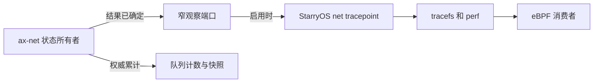

# StarryOS 网络追踪事件扩展意见

## 1. 目标与边界

`feat/net-observe` 已把队列身份、累计计数和快照作为网络栈基础能力，并交付 `net:queue_poll_round` 这一条 tracepoint 链路。本意见供该分支继续实施时使用：把原方案中除 `net:queue_irq` 外的剩余候选逐项处理，优先以 StarryOS tracepoint 发布真实的网络状态边界。这里扩大的只是评审与实施目标；每个名称能否成为对外事件，仍由事实语义和触发上下文决定。本文不改写此前只承诺首条链路的交接文档，也不把尚未实施的候选描述成已完成。

### 1.1 为什么选择 tracepoint

Linux 的 `napi:napi_poll`、`net:net_dev_queue` 和 `skb:kfree_skb` 表明：在网络栈已有的处理边界定义静态追踪事件，是提供可选诊断事实的成熟方式。tracepoint 定义名称、字段和触发点；tracefs、perf 和 eBPF 都可消费，并非专为 eBPF 设置。Linux 文档还明确说明，启用后的回调在触发者的上下文中同步执行。因此，Starry 可以沿用现有 `ax_tracepoint::define_event_trace!`、`tracepoint_init()` 和 `TracepointPerfEvent::set_bpf_prog()` 链路，但必须先审查每个调用点的执行上下文和锁。

这个选择并不意味着复制 Linux 对象或 ABI。Starry 的 `QueueGroupExecutor`、SPSC 帧交接和单协议执行器并不等于 Linux 的 NAPI、qdisc 或 `sk_buff`。Linux 相近事件只能帮助识别真实边界；Starry 事件的字段和触发次数应以自己的状态机为准。队列累计、`/proc/net/dev` 和 debugfs 快照仍是权威状态；事件可以关闭、丢失，不能反算累计。

### 1.2 本轮交付口径

在已实现的 `net:queue_poll_round` 之外，本轮逐项处理 `net:queue_rearm`、`net:queue_backpressure`、`net:route_drop`、`net:tx_queue`、`net:tx_submit`、`net:rx_publish`、`net:rx_consume` 和 `net:proto_poll`，共八个候选名称。`net:queue_irq` 明确不在本轮范围：按原候选位置，`PollGroupState::schedule_irq()` 从硬 IRQ action 到达；当前 Starry tracepoint 的 eBPF 回调会在事件现场运行，尚无足够证据允许任意程序在硬 IRQ 中执行。

对每个候选都应给出可审查的结论：要么发布语义稳定的 tracepoint，要么说明它被现有事件或快照覆盖、真实边界不存在，或同步执行风险尚未解决。不能以“八个名字全部出现”为完成标准，也不能把未通过准入的候选悄悄计入已实现事件数。若交付目标要求八个都实际发布，必须先与委托方确认那些语义争议项的最终边界，而不是由实现代码先行决定。

## 2. 候选事件的事实边界

每个事件先回答一个网络诊断问题，再确定唯一事实所有者、一次触发的规则和稳定字段。以下是实施评审的起点，不是预先冻结的事件 ABI；实际字段名、宽度和结果码应在定义 tracepoint 前固定，并写入目标分支的 `docs/docs/architecture/net/events.md`。

### 2.1 队列状态

`QueueGroupExecutor::finish_idle()` 和 `QueueGroupExecutor::poll_inner()` 已经掌握 rearm 与设备提交的结果。优先从这些现成结果报告事实，不增加独立的“观测状态机”，也不把重试解释成丢包。

| 候选 | 建议事实边界 | 实施前必须固定的语义 | Linux 对照 |
| --- | --- | --- | --- |
| `net:queue_rearm` | `finish_idle()` 调用 `rearm_and_check()` 后 | 仅报告 `WorkPending` 等确有诊断价值的结果，还是报告全部 `Idle`、`RetryAt`、错误；一次调用至多一条，和 `queue_poll_round` 严格分开 | 没有逐字段等价的通用网络事件 |
| `net:queue_backpressure` | `poll_inner()` 中 TX 提交返回可重试，或选定的另一处单一阻塞边界 | `NetError::Retry`、`NetDeviceError::Again`、TX ring 满、RX refill 阻塞属于不同层；先选一层，必要时拆名，不把它们混成一个原因码 | `net:net_dev_xmit` 报告发送结果；`napi:dql_stall_detected` 报告另一种停滞，均非直接等价 |
| `net:tx_submit` | 队列执行器把帧交给驱动 `submit_with_options()` 并取得结果 | “提交成功”不等于硬件发出或 TX 完成；失败时明确帧仍由谁持有、是否可重试 | `net:net_dev_start_xmit`、`net:net_dev_xmit` 是相近发送边界 |
| `net:rx_publish` | 队列执行器将完成帧成功发布到 RX SPSC | push 失败不是成功发布；明确记录的是帧长度还是缓冲长度，以及设备、group 身份 | `net:netif_rx` 是相近的接收交接边界 |

队列执行器由 `queue_executor_main()` 在线程中调用 `group.poll()` 和 `finish_idle()`。这避免了候选 IRQ 事件的硬中断问题，却不自动保证回调安全：驱动调用、队列锁、关抢占段、资源所有权转移和 eBPF helper 的约束仍需按实际插入点检查。若报告点落在驱动回调或持锁段内，优先在状态已经确定且释放相关锁后报告；不能为了移出回调而改变帧所有权或结果顺序。

### 2.2 协议与丢弃

`poll_protocol_until_idle()`、`router::DeviceHandle` 的分发路径和协议侧 SPSC 消费掌握的是另一组事实。这里最容易因“字段看上去类似 Linux”而误认对象相同，尤其最终丢弃和协议取帧必须从 Starry 的真实状态转换定义。

| 候选 | 建议事实边界 | 实施前必须固定的语义 | Linux 对照 |
| --- | --- | --- | --- |
| `net:tx_queue` | 协议把待发送帧成功交给 TX SPSC | 队列接纳与驱动提交不同；失败或 `Again` 不得记录为成功入队 | `net:net_dev_queue` 是相近边界 |
| `net:rx_consume` | 协议执行器成功取走 RX SPSC 中的一帧 | 这里的“consume”是取走队列项，不等同 Linux `skb:consume_skb` 的正常释放；与 `rx_publish` 无稳定同帧 ID 时不能承诺逐帧配对 | `net:netif_receive_skb` 可参照接收分发；非同一对象 |
| `net:route_drop` | 已选定的一类最终拒绝或丢弃处 | 无路由可能尚无出口接口，设备错误与 RX 队列满在不同位置；先限定覆盖范围、身份可缺失性及原因集合，`Again` 不是最终丢弃 | `skb:kfree_skb` 有 drop reason，但覆盖范围更广 |
| `net:proto_poll` | `poll_protocol_until_idle()` 中一轮协议推进结束 | 明确“一轮”是一次 `get_service().poll()` 还是整个 until-idle 调用；是否仍有工作、是否让出 CPU 必须来自现有事实 | Linux 没有同一单协议执行器事件；`napi:napi_poll` 仅作轮询报告范例 |

协议执行器是任务上下文，但 `poll_protocol_until_idle()` 会调用持有 `SOCKET_SET.inner` 的协议轮询。若某个候选只能在该锁内得知事实，应审查同步 tracepoint 回调及所附 eBPF 是否可能反向取锁、触发网络路径或造成过长停顿；不能仅以“不是硬 IRQ”作为准入结论。`route_drop` 尤其可能没有一个覆盖全部原因的唯一调用点：可以先发布范围明确的窄事件，或在充分证明同一结果契约后再统一；不应强行制造“所有丢弃都在此处”的假象。

## 3. 实现边界与运行安全

`ax-net` 拥有网络事实，StarryOS 拥有 tracepoint 名称、记录格式和启用门控。对新增事件应延用 `queue_poll_round` 已建立的窄观察端口与适配分层：`ax-net` 不依赖 StarryOS 或 `ax-tracepoint`，没有安装端口的其他操作系统仍按原有网络语义运行。

### 3.1 事件链路

调用链必须能从真实网络结果追到最终消费者，而不新建第二份网络计数或全局事件总线。以下关系也说明 eBPF 只负责验证附着链路，不决定内核应记录什么。

事件门控以 `ax-tracepoint` 的回调状态为权威；镜像到运行时的标志只是跳过无消费者时的报告成本，不是第二个启用事实。发布者、观察者、初始化时序和关闭时在途回调的释放责任应沿现有 `queue_poll_round` 路径证明。不要为了凑字段保存逐帧 `carrier`、观测专用时间戳、采样器或跨帧关联表，也不要通过 `#[inline(never)]` 保留探针符号。

### 3.2 上下文与性能

Linux tracepoint 回调在触发者上下文同步执行；Starry 当前 `TracepointPerfEvent::set_bpf_prog()` 也在回调现场执行 eBPF VM。任务上下文仅排除了硬 IRQ 的一部分限制，不允许默认睡眠、分配、递归取锁或无界运行。每个新挂点应记录：具体调用栈、当前锁与关抢占状态、消费者可调用的 helper/map/日志路径、回调失败如何处理，以及网络结果是否仍然不变。

事件关闭时不应做只为事件服务的字符串格式化、时钟读取、包解析或堆分配；事件开启时也应避免让高频逐帧 tracepoint 主导队列尾延迟。性能比较至少区分端口未安装、端口已安装但事件关闭、事件开启三种状态，并在同一网络负载下看 CPU、吞吐和尾延迟。QEMU 能证明语义与装配，不能代替板卡成本结论；无法测量时应明确保留该风险，而非宣称“tracepoint 天然零开销”。

## 4. 评审与验收

事件不是为了把候选表补齐。每个候选只有在真实边界、字段与上下文经过审查后，才成为 Starry 的对外追踪契约；单个候选不成立时，应保留明确的审查结论，不修改网络栈行为迁就事件名称。

### 4.1 逐项准入

对每个候选先记录它要解决的具体排障问题、现有快照或 `queue_poll_round` 是否已足够、事实发生点和唯一触发次数，再固定字段、整数范围、可重试与最终丢弃的区别、接口和队列身份的生命周期。随后审查执行上下文、锁、回调生命周期与成本。不能确认任一关键条件时，先缩窄事件语义或暂缓该项，并把对交付范围的影响反馈给委托方。

Linux 对照应核对事件定义和真实调用位置，而非只按名字匹配。既有原方案固定的 Linux 参考提交为 `a635d6748234582ea287c5ffeae28b9b23f91c7e`；实现期间若改用其他版本，应说明差异。Starry 不承诺与 Linux 事件记录布局兼容。

### 4.2 完成证据

对获准发布的事件，目标分支应提供 tracefs `id`、`format`、`enable` 与实际触发记录，证明一次真实状态转换对应约定条数和字段；关闭后不再产出记录，且队列结果、帧所有权、现有累计及 `/proc/net/dev` 口径不变。按网络状态机做必要的低层测试，用 StarryOS 系统测试覆盖真实装配；eBPF 冒烟只需证明代表性的 `load → attach → read` 链路及对外 `format` 的解析，不用为每个事件创建一个独立分析应用。验证使用项目 `cargo xtask` 入口，记录实际运行的目标和结果。

最终清单应逐项标明“已发布”“缩窄后已发布”或“暂缓”，并给出理由；`net:queue_irq` 明确标为本轮排除。已发布事件要同步更新 `docs/docs/architecture/net/events.md`。这份可核对的结果比宣称“候选事件全部完成”更能保护未来的通用事件面。

## 5. 依据

本意见以目标分支当前 `net/ax-net/src/queue_runtime/{state.rs,executor/mod.rs}`、`net/ax-net/src/router.rs`、`net/ax-net/src/lib.rs`、`os/StarryOS/kernel/src/tracepoint/net.rs`、`os/StarryOS/kernel/src/perf/tracepoint.rs` 和 `docs/docs/architecture/net/events.md` 为 Starry 代码锚点。此前的 [首条事件交接方案](starry-network-events-handoff.md)限定了已完成阶段的范围；本意见是后续范围扩展建议，不追溯改变该阶段的完成定义。

Linux 对照采用 [tracepoint 执行语义](https://www.kernel.org/doc/html/latest/trace/tracepoints.html)、固定提交的 [网络事件](https://github.com/torvalds/linux/blob/a635d6748234582ea287c5ffeae28b9b23f91c7e/include/trace/events/net.h)、[NAPI 事件](https://github.com/torvalds/linux/blob/a635d6748234582ea287c5ffeae28b9b23f91c7e/include/trace/events/napi.h)和 [skb 事件](https://github.com/torvalds/linux/blob/a635d6748234582ea287c5ffeae28b9b23f91c7e/include/trace/events/skb.h)。这些资料用于核查 Linux 的相近基础机制，不把 Linux 名称移作 Starry 的兼容承诺。
