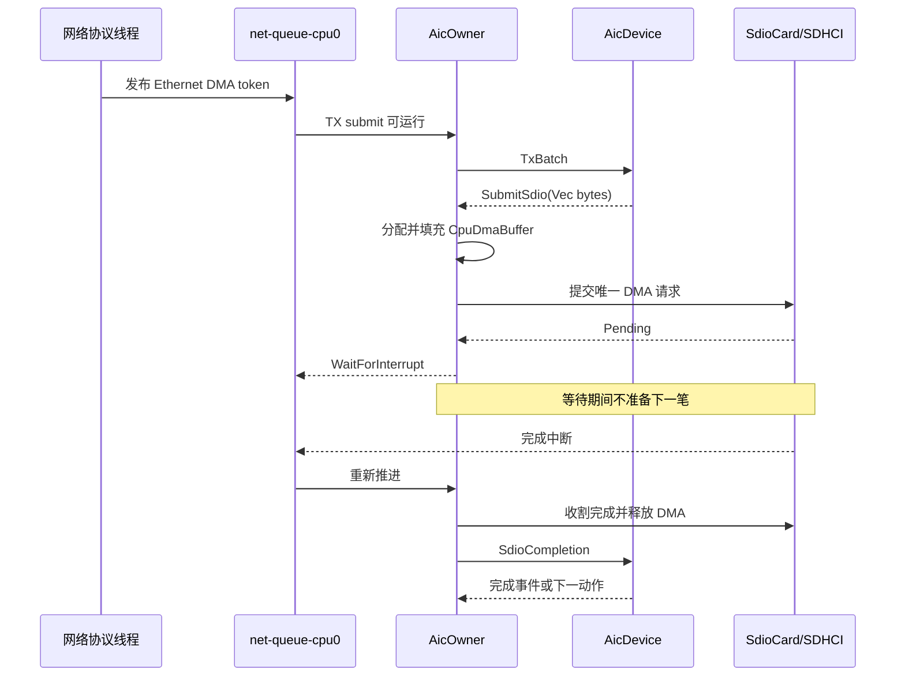
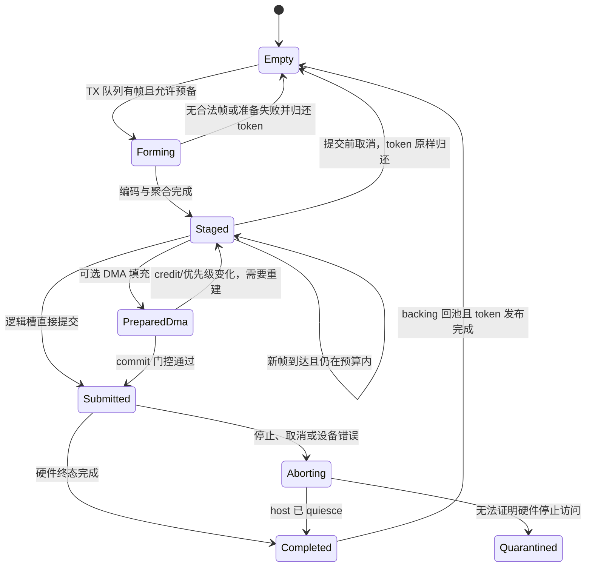
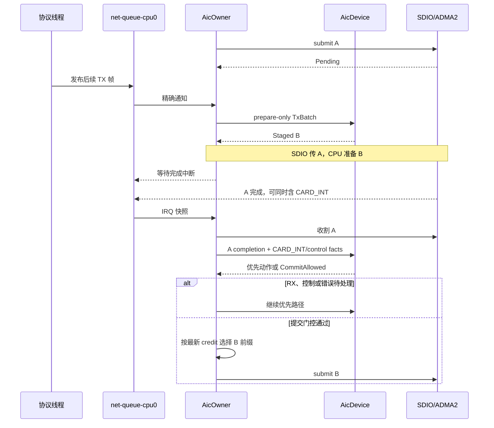

# AIC8800 SDIO 硬件异步流水线重构方案

本文设计 AIC8800 在 SG2002 单核平台上的发送流水线优化。核心目标不是引入 Rust `async fn`，也不是让多笔 SDIO 命令并发，而是在 SDIO 控制器和 DMA 独立执行当前事务时，让 CPU 有界地准备下一笔发送，从而把原本串行的“数据准备—硬件传输—下一笔准备”改为“单笔硬件在飞、下一笔 CPU 预备”的流水线。2026-09-29 的 `attrib2` 板测已经取得，本版据此收敛优化顺序和收益上界；这些数据证明存在可重叠窗口，但尚未包含 prepare-ahead 实现的 A/B 对照，因此不能预先承诺最终吞吐提升。

## 1. 目标与结论

第四阶段要解决的是 CPU 工作与 SDIO 硬件工作没有重叠的问题。现有 `AicOwner` 在 `ActiveOperation::advance()` 返回 `Pending` 后立即结束推进，`AicDevice::prepare_next_transmit()` 又在 `active_tx` 存在时直接返回，因此当前事务在硬件上运行期间，下一批帧不会进入协议成形、聚合或 DMA 准备。

### 1.1 优化目标

目标流水线在任意时刻最多保留一个硬件在飞事务和一个 CPU 所有的预备事务。预备阶段不访问 SDIO 寄存器、不消费固件 credit、不改变设备可见状态；提交阶段才重新检查接收、控制、credit 和取消条件，并把预备缓冲区交给硬件。

```text
CPU:   prepare A ─ submit A ─ prepare B ───────── commit B ─ prepare C
SDIO:                         transfer A ──────── transfer B ─────────
                               CPU 与硬件重叠
```

这一结构保留“一次只有一笔 SDIO 事务在飞”的现有安全边界。收益来自隐藏 CPU 准备时间，而不是增加总线队列深度；即使最终测得收益不足，这一边界也允许实验路径独立关闭，不影响现有串行行为。

### 1.2 板测结论

最新完整日志位于 Windows 路径 `C:\Users\Asta\Desktop\logs`，WSL 对应文件为 `/mnt/c/Users/Asta/Desktop/logs/[com COM6]  (2026-09-29_065738)  COM6  (USB-SERIAL CH340 (COM6)).log`。以下统计使用纯 TX 的 80.769–98.786 秒和双向的 104.789–122.796 秒，各取 10 个完整稳态窗口；配置为 `clock=on`、`agg=32x49152`。日志中的 `prep frames`、`append bytes` 和 `wire_bytes calls` 表明这次运行使用现有 framed 路径，而不是直接准备路径。

| 指标 | 纯 TX 稳态 | 双向稳态 | 含义 |
| --- | ---: | ---: | --- |
| 应用结果 | TX 30.2 Mbit/s | TX 29.5 Mbit/s，RX 12.4 Mbit/s | 只描述本次射频会话，不是优化对照 |
| TX 写样本 | 3748 | 2983 | 阶段归一化分母 |
| `dispatch + dma + program + bus` | 约 2073 µs/写 | 约 2446 µs/写 | 与 IRQ `pre` 加权均值一致 |
| `bus` | 约 1874 µs/写 | 约 2233 µs/写 | 可供 CPU 工作遮蔽的主要硬件窗口 |
| `post` | 约 391 µs/完成 | 约 376 µs/完成 | 完成中断后到任务取回事务的独立空档 |
| `pull + form + bytes` | 约 379 µs/写 | 约 465 µs/写 | 逻辑双槽可前移的墙钟区间 |
| `dma` | 约 141 µs/写 | 约 155 µs/写 | DMA 双槽可进一步前移的墙钟区间 |
| 逻辑准备加 DMA | 约 520 µs/写 | 约 620 µs/写 | 分别约为 `bus` 的 27.8% 和 27.9% |
| 完成前 RDIF 非空 | 62.6% | 53.9% | 下一批至少已有一帧的保守机会比例 |
| 完成前 RDIF 深度至少 4 | 56.4% | 49.4% | 单预备槽经常能够形成聚合，但不能覆盖每笔写 |

阶段值不是把日志里显示的平均数直接相加，而是先用每项的 `count × average` 恢复窗口总量，再除以 TX 写数。`form` 每笔会被调用多次，且包含快速空操作，因此其日志均值不是“一笔写的成形耗时”；按总量归一化后才表示当前串行路径每笔写承担的相关墙钟成本。IRQ `pre` 已经包含 `dispatch`、`dma`、`program` 和 `bus`，`post` 又包含完成后的部分 owner 工作，所以这些区间不能重复相加。

这些探针测的是单核上的墙钟区间，可能包含中断或调度打断，不等同于纯 CPU cycles。纯 TX 下，把当前近似服务周期写成 `379 + 2073 + 391 = 2843 µs`，逻辑预备最多隐藏约 13.3%；若连 DMA 准备都能前移，最多隐藏约 18.3%。双向负载对应上界约为 14.1% 和 18.9%。这只是没有供应空洞、门控推迟和射频瓶颈时的服务周期缩短上界；完成前 RDIF 非空率只有约五至六成，单凭重叠机制通常无法兑现全部上界，实际吞吐必须由同会话 A/B 实验确定。

### 1.3 方案判断

板测已经足以裁决“是否值得做最小 prepare-ahead 实验”，但不足以支持直接进入广泛 DMA API 重构。下表把既有事实和本次新证据合并为实施判断。

| 项目 | 当前结论 | 设计影响 |
| --- | --- | --- |
| 平台并行能力 | SG2002 当前只有一个 CPU，但 ADMA2/SDIO 的 `bus` 阶段约 1.9–2.2 ms | 重叠必须利用控制器独立运行，不能依赖第二个核 |
| SDIO 并发深度 | `sdhci-host` 使用 depth-one ADMA2 请求和控制器级描述符表 | 保持一笔硬件在飞，不引入第二笔 CMD53 |
| 逻辑准备 | `pull + form + bytes` 约 0.38–0.47 ms/写 | 先实现一个逻辑预备槽，价值已经达到可实验门槛 |
| 下一批供应 | 完成前 RDIF 非空约 54%–63%，到达时队列非空约 95% | 精确由 TX 到达触发；接受部分写无法命中，不周期轮询 |
| 直接准备实验 | 已消除逐帧临时缓冲和追加拷贝，但未得到可归因吞吐差异 | “少复制”不能代替“与硬件重叠”，仍不据此默认启用 |
| 完成后延迟 | `post` 约 0.38–0.39 ms，和逻辑准备同量级 | prepare-ahead 不会消除 `post`，调度归因继续独立保留 |
| DMA 准备 | 每笔约 0.14–0.16 ms，release 仅约 5–6 µs/写 | DMA 双槽可能追加收益，但重点是提前分配、填充和 publish，不是单纯省 release |
| 双向竞争 | 双向时逻辑准备区间更长，RX 同时占用 owner | 必须维持 CARD_INT/RX/控制优先级，不能用 TX 吞吐交换 RX 公平性 |

因此推荐顺序已经从“等待归因后选择方向”更新为：保留现有探针作为基线，先做行为等价的状态分离，再做默认关闭的逻辑单预备槽；只有逻辑槽确实降低 `completion_to_commit` 且没有损害 RX/控制后，才设计 DMA 双槽。`post` 仍值得并行调查，但它不是否定 prepare-ahead 的理由，也不能与硬件重叠收益混成一个实验。

### 1.4 非目标

本轮不会把所有可能的吞吐优化合并进同一重构。以下方向要么超出硬件异步命题，要么会破坏尚未证明需要突破的安全边界。

- 不在 `AicDevice` 中创建线程、休眠、主动让出处理器或持有操作系统锁。
- 不用 `async fn`/`Future` 包装现有推进函数来冒充硬件重叠。
- 不允许两笔 CMD53 或其他 SDIO 操作同时提交给控制器。
- 不在硬中断中构帧、分配、复制、排空队列或调用协议栈。
- 不改变普通数据 `hostid=0`、控制帧 confirmation、credit 记账和 RX 及时排空的既有语义。
- 不在第一版实现 scatter-gather、跨层零拷贝或通用 `dma-api` 大改。

这些限制让第一轮实验只改变 CPU 工作发生的时间，不同时改变线上协议、总线并发度和完成语义，便于把收益和回归归因到 prepare-ahead 本身。

## 2. 现有执行链

现有实现分为驱动核心、RDIF 适配、SDIO 协议与主机控制器、网络运行时四层。`AicDevice` 决定协议动作，`AicOwner` 独占 `SdioCard` 并把动作变成实际事务，`ax-net` 的固定 CPU 队列线程负责唤醒和推进，中断端点只记录事实。

### 2.1 分层与源码锚点

下表列出重构会接触的关键对象。设计以对象所拥有的不变量为边界，而不是按文件机械移动代码。

| 层 | 关键对象 | 当前职责 | 重构后的职责 |
| --- | --- | --- | --- |
| 驱动核心 | `AicDevice`、`ActiveTx`、`TxState` | 协议成形、聚合、credit 决策、token 完成 | 增加“已预备但未提交”的逻辑状态，不持有 DMA 能力 |
| RDIF owner | `AicOwner`、`OwnerOutputs`、`ActiveOperation` | 拉取帧、提交/推进唯一 SDIO 操作、发布完成 | 管理 staged/in-flight 两个槽和 DMA 生命周期 |
| SDIO 协议 | `SdioCard`、`SdioDmaTransferRequest` | 把一笔有所有权 DMA 请求交给 host | 保持一次一笔在飞，不感知 AIC 双槽 |
| 主机控制器 | `sdhci-host` ADMA2 路径 | 程序化描述符和寄存器、完成/中止请求 | 第一阶段不变；后续只接收已准备 DMA |
| 网络运行时 | `QueueGroupExecutor`、`PollGroupState` | 固定 CPU 轮询、通知、预算与重武装 | 在新 TX 到达时允许 owner 做一次有界预备，不增加周期轮询 |

主要源码锚点是 `drivers/net/aic8800/src/device/data_plane.rs` 的 `prepare_next_transmit()`、`transmit_operation()` 和 `discard_pending_transmit()`，`drivers/net/aic8800/src/rdif/owner/progress.rs` 的 `advance_with_cause()`，以及 `drivers/net/aic8800/src/rdif/owner/operation.rs` 的 `ActiveOperation::submit()`/`advance()`。DMA 类型由 `memory/dma-api/src/owned.rs` 的 `CpuDmaBuffer`、`PreparedDma`、`InFlightDma` 和 `CompletedDma` 表达。

### 2.2 当前串行路径

当前 owner 只要发现 `self.active` 存在，就先推进同一操作；操作仍为 `Pending` 时直接返回等待。控制请求、待发帧和核心 tick 都排在该分支之后，因此硬件在飞时即便 `tx_submit` 已有新帧，也不会进入准备路径。



这条路径把构帧、聚合、请求字节复制、DMA 分配与填充都放在提交之前；完成后还要经历中断唤醒、请求收割和 DMA 释放。prepare-ahead 只应搬动其中不会影响设备状态的 CPU 工作，不能把完成确认或 CARD_INT 服务推迟到下一笔提交之后。

### 2.3 当前所有权障碍

异步流水的难点不是多保存一个 `Vec`，而是把“逻辑批次”“准备好的请求”和“硬件正在访问的 backing”分成不能混淆的所有权阶段。

| 障碍 | 当前表现 | 直接复制现有代码的风险 |
| --- | --- | --- |
| `active_tx` 一槽多义 | 同时表达聚合内容、待提交写和完成 token | 增加第二槽后容易重复完成或覆盖 token |
| 请求可在提交前丢弃 | `discard_pending_transmit()` 可以撤销 `io.next` | 把唯一聚合缓冲直接移进请求会失去重建来源 |
| RDIF 输入是 DMA token | `OwnerOutputs::take_tx_frame()` 先复制成 `Vec`，原 token 留待完成 | 直接借用 token 数据跨等待会扩大生命周期和别名契约 |
| SDIO DMA 长度固定 | `CpuDmaBuffer::prepare_for_device()` 使用整个 backing 长度 | 固定大池不能安全地用任意逻辑前缀提交 |
| 完成与 CARD_INT 共线 | 同一中断快照可能同时含传输完成和卡侧工作 | 完成后无条件直提 staged 写会破坏 RX/控制优先级 |

重构必须先让类型表达这些阶段，再考虑减少拷贝。若先用共享指针、全局池或 `Arc<Mutex<_>>` 绕过所有权，虽然能让代码编译，却会失去取消、设备完成和 DMA 访问之间的可证明关系。

## 3. 设计原则

目标设计遵循单 owner、消息转移所有权和中断只同步事实的现有架构。任何优化都不得创建第二套 credit、token 或设备状态事实来源。

### 3.1 必须保持的不变量

以下不变量是所有实现阶段的合入前提。它们比性能目标优先，任一项无法证明时应回退到现有串行路径。

1. `AicOwner` 仍是 `SdioCard`、主机请求和 AIC 核心的唯一任务上下文所有者。
2. 任意时刻最多一个 `ActiveOperation` 已提交硬件；`staged` 永远不等同于第二个在飞请求。
3. DMA backing 在 `PreparedDma`/`InFlightDma` 阶段不能被 CPU 修改；CPU 只写另一个槽。
4. hard IRQ 只确认、屏蔽和发布事件，不分配、不构帧、不触碰 DMA payload。
5. credit 只在提交裁决点按现有权威逻辑检查和消费，预备阶段只能保存快照用于诊断。
6. 每个 TX token 恰好完成或归还一次；取消、提交失败和设备错误不能遗失或重复发布 token。
7. CARD_INT、控制 confirmation/indication、内部 EAPOL 和错误恢复优先于普通 staged 数据写。
8. 关闭时先阻止新预备，再处置 staged，最后 abort/quiesce in-flight 并回收或隔离 DMA。

其中第 2、3、6 项应由 move-only 类型和状态转换保护，不能只写注释约定。第 5、7 项需要在状态机测试中构造具体交错，证明预备存在时仍沿现有顺序推进。

### 3.2 异步的准确含义

本方案中的异步是硬件所有权与 CPU 所有权的重叠。SDIO 控制器读取槽 A 时，CPU 可以写槽 B；单核并不妨碍这种重叠，因为总线/DMA 无需 CPU 持续执行，但 CPU 时间仍会与网络协议、RX 交付和其他内核任务竞争。

设每笔的 CPU 准备时间为 `P`，硬件传输时间为 `H`，完成唤醒与提交门控为 `S`。串行稳态近似为 `P + H + S`；理想单预备槽稳态近似为 `max(P, H) + S`。因此只有 `P` 能落进 `H` 的部分可被隐藏，`S` 不会因双槽自动消失。

这个模型解释了为什么调度与 prepare-ahead 必须分别测量：若 `S` 主导，双槽最多消掉很小的 `P`；若 `P` 可观且 `H` 足够长，双槽才可能明显缩短完成到下一笔提交的空档。

### 3.3 分层边界

驱动核心应保持 `no_std`、无操作系统依赖和无 DMA 能力。DMA 槽属于 `aic8800::rdif`，线程唤醒和固定 CPU 调度属于 `ax-net`，设备树只提供实验策略而不成为运行状态来源。

| 能力 | 所有层 | 不应进入的层 |
| --- | --- | --- |
| 协议头、聚合边界、frame offsets | `AicDevice` | `ax-net`、SDHCI host |
| `DeviceDma`、DMA backing、提交/回收 | RDIF owner / SDIO 适配 | `AicDevice` |
| 硬件中断确认与快照 | IRQ endpoint / host | 数据队列和协议核心 |
| 固定 CPU、通知、执行预算 | `ax-net` runtime | 可移植驱动核心 |
| 实验开关和板级资源 | `ax-driver` FDT 解析 | 协议常量和硬编码地址 |

这一边界意味着“直接写 DMA”不能通过让 `AicDevice` 持有 `DeviceDma` 实现。后续若要消除最后一遍复制，应由核心提供与 DMA 无关的编码/批次计划，RDIF owner 把计划写入自己拥有的 CPU 可写 DMA 槽。

## 4. 目标流水线

目标流水线包含逻辑预备槽、可选 DMA 预备槽和唯一硬件在飞槽。第一阶段只实现逻辑槽，第二阶段在数据证明 DMA 准备值得优化后才引入 DMA 槽。

### 4.1 状态对象

建议把当前 `active_tx` 的多重职责拆成下列概念。名称是设计建议，最终实现可以按邻近代码风格调整，但所有权阶段不能重新合并。

| 类型 | 所有者 | 保存内容 | 允许操作 |
| --- | --- | --- | --- |
| `TxAggregate` | `AicDevice` | 编码后的帧流、逐帧结束偏移、token、包数 | 追加帧、按策略截取前缀、取消并归还 |
| `StagedTx` | `AicDevice` 或 RDIF staging port | 已成形但未承诺提交的逻辑批次 | 重验 credit、让控制流抢占、转成提交计划 |
| `PreparedTxDma` | `AicOwner` | CPU-owned DMA backing、有效长度、批次身份 | 提交、因门控变化而丢弃/重建 |
| `InFlightTx` | `ActiveOperation` | device-owned 请求、批次身份、完成所需元数据 | 由 IRQ 推进、abort、完成后回收 |
| `CompletedTx` | `AicOwner` | 回收的 backing 和待发布 token | 回池并向队列发布完成 |

`TxAggregate` 必须保留逐帧结束偏移，因为 prepare 时可以按配置上限收集帧，commit 时却必须使用最新 credit 决定合法前缀。块对齐 padding 只属于实际提交前缀，不能把最大批次的 padding 混入中间帧流。

### 4.2 所有权状态机

状态机把 CPU 可写、设备可读和可回收阶段分开。`Staged` 到 `Submitted` 是唯一消费 credit 和转移 DMA 所有权的边界。



`Quarantined` 不是正常池成员。若 abort 后无法证明总线主设备已停止访问，宁可沿 `dma-api` 现有语义隔离 backing，也不能让它重新进入 CPU 或下一笔设备请求。

### 4.3 稳态时序

下面的时序强调准备与提交的区别。当前事务 A 在飞时，owner 只对独立槽 B 做 CPU 工作；A 完成后先处理硬件事实，再决定 B 是否仍可提交。



不能在 A 的中断回调中直接提交 B。硬中断仍只发布事实，真正的收割、门控和提交都由固定 CPU owner 在任务上下文完成。

### 4.4 预备触发与预算

预备必须由已有事件精确触发，不增加周期性设备轮询。新 TX 帧进入 RDIF 环时，`PollGroupState::schedule_task()` 已能通知队列线程；owner 被调用后若硬件仍在飞，可以做一次 prepare-only 步骤，再重新进入中断等待。

一次 prepare-only 调用应满足以下限制：最多形成一个 staged 槽；最多拉取 `tx_aggregation.packets` 帧和 `tx_aggregation.bytes` 字节；若已有 staged 槽则不重复唤醒或重做；若 IRQ 快照、控制请求或 runnable output 已存在则先处理这些工作。

这样可以避免两类退化：一是 TX 高频到达导致 owner 在硬件完成前不断醒来重建同一批；二是单核 CPU 长时间用于聚合，推迟协议线程产帧、RX 排空或控制响应。

## 5. 提交门控

prepare-ahead 的正确性主要由 commit 门控决定。准备可以激进，提交必须保守；任何不确定状态都应保留 staged 或退回串行路径。

### 5.1 Credit 处理

预备阶段不得调用现有 credit 消费逻辑，也不得把采样值当作预留。`aggregate_limit()`、薄池等待、保留 credit 和 `spend_tx_credit()` 仍由提交路径统一维护。

建议 `StagedTx` 保存所有帧边界，commit 时按最新权威状态选择可提交前缀：先运行现有 credit/等待决策，再确定帧数和字节数，最后生成块对齐长度。若最新 credit 只允许前缀，剩余帧继续留在 staged；若 credit 已失效，则保留 staged 并先发流控读，不丢弃已完成的 CPU 准备。

第一版可以采用更保守的策略：按准备时可用 credit 形成批次，commit 时若 credit 发生任何不利变化就废弃预备结果并沿原路径重建。它可能损失性能，但更适合验证状态机；只有废弃率成为实测瓶颈时，才增加“按 offsets 截前缀”的复杂度。

### 5.2 RX 与控制优先级

完成 A 后不得因为 B 已准备好就绕过 CARD_INT。owner 应先收割 A 并把完成输入核心，再消费同一快照里的卡中断、错误和控制进度；只有核心没有产生更高优先级 SDIO 动作，且中断重武装检查没有发现新工作时，才能提交 B。

优先级从高到低建议保持为：设备/host 错误与停止、在途事务完成、mailbox/控制 confirmation 与 indication、内部 EAPOL、RX 数据排空、普通 staged TX。普通 TX 的 CPU 预备可以在硬件等待期间发生，但它的硬件提交不能提升到这些路径之前。

### 5.3 取消与关闭

取消必须按资源所在阶段处理，而不是统一清空 `Option`。下表给出每个阶段的唯一释放责任。

| 阶段 | 取消行为 | token 结果 | DMA 结果 |
| --- | --- | --- | --- |
| `Forming` | 停止继续拉帧，释放已接收项 | 全部归还一次 | 尚未分配或仍为 CPU-owned |
| `Staged` | 丢弃批次 | 全部归还一次 | 无 DMA 或返回空闲槽 |
| `PreparedDma` | 不提交，恢复 CPU 所有权 | 全部归还一次 | `complete_without_device()` 或等价安全返回 |
| `Submitted` | 调用现有 abort 并等待 quiesce | 终态后统一完成/失败 | 完成后回池，无法证明停止则 quarantine |
| `Completed` | 不再响应重复取消 | 不重复发布 | 正常回池 |

关闭顺序应固定为：设置 stopping 并拒绝新预备，撤销 staged/prepared，屏蔽精确中断源，中止或完成 in-flight，确认 host quiesce，发布剩余 token，最后销毁池和端点。这个顺序也适用于启动中途失败和设备进入 `Failed` 状态。

## 6. 分阶段实现

实现应把状态机变化、DMA 公共接口变化和运行时调度变化拆开。每阶段都可独立回滚到串行模式；现有板测只决定实验值得进行，不足以支持一次建立完整 DMA 池和新公共接口。

### 6.1 阶段零：固定归因基线

现有 `attrib2` 镜像已经取得 `dispatch/dma/program/bus`、`release/rx_copy/pull/teardown/form/bytes/rx_parse/report`、`advance` 和 IRQ split 分类。阶段零现已完成，其交付物是第 1.2 节的加权基线、原始日志路径和计算口径；后续实验必须保留同口径指标，不能因实现变化改用不可比较的统计。

数据排除了“CPU 准备小到不值得实验”和“DMA release 是首要成本”两种判断。逻辑准备约 0.38–0.47 ms/写，足以进入逻辑双槽；DMA prepare 约 0.14–0.16 ms/写，适合作为第二阶段增量；release 仅约 5–6 µs/写，不支持仅为消除释放开销建立池。`post` 约 0.38 ms，仍需单独归因，但不改变先验证硬件等待期 CPU 重叠的顺序。

### 6.2 阶段一：状态分离

第一份代码改动只拆类型，不改变时序。把当前 `active_tx` 拆成逻辑 staged 和已提交元数据，仍在提交前同步准备，确保旧测试和板上行为等价。

该阶段应集中完成 token 唯一归属、取消回收、`discard_pending_transmit()` 替代语义和控制帧优先级。完成后即使异步实验永远不启用，代码也应比原先更清楚，而不是留下只为未来服务的空壳抽象。

### 6.3 阶段二：逻辑双槽

第二阶段允许 `ActiveOperation` 为 `Pending` 时，从 RDIF TX 环拉取一次有限批次，并调用不产生 SDIO 动作的 prepare-only 入口。输出只是一份 `StagedTx` 逻辑字节流，DMA 分配仍在 commit 时发生。

建议用默认关闭的实验策略启用，但策略名应表达行为，例如 `aic,tx-prepare-ahead`，而不是继续扩大 `tx-prep-direct` 的含义。现有 `tx-prep-direct` 决定一笔内部怎样成形，prepare-ahead 决定何时成形，两者是不同维度。

板测表明这一阶段可尝试遮蔽的是 `pull + form + bytes`，纯 TX 和双向分别约 0.38 ms/写和 0.47 ms/写。完成前 RDIF 非空率约 62.6% 和 53.9%，因此实现必须把“无后续帧”记录为正常 miss，而不能靠重复唤醒或周期轮询抬高命中率。

这一阶段回答三个问题：硬件在飞时是否真正完成了下一批逻辑准备；`staged_ready_at_completion` 是否与原始供应上限一致；`completion_to_commit` 是否下降而 RX/控制延迟不恶化。若准备命中率相对供应明显偏低，应先修正触发与预算；若命中率高但提交空档不降，应定位 commit 门控或调度；只有机制和结果都成立才进入 DMA 公共接口重构。

### 6.4 阶段三：DMA 双槽

逻辑双槽有收益后，RDIF owner 再持有两个可回收 DMA backing：一个可能在 `InFlightDma`，另一个保持 CPU-owned 用于下一笔。核心通过编码计划或有界 sink 写入 owner 提供的目标，不直接接触 `DeviceDma`。现有基线给出的增量可遮蔽区间约为 0.14–0.16 ms/写，所以 DMA 双槽是有数据支持的第二优先级实验，但它的复杂度门槛高于逻辑槽。

现有 `CpuDmaBuffer` 的逻辑长度等于 backing 长度，因此固定最大缓冲区不能直接提交较短前缀。较通用的改动是让 `dma-api` 支持“容量不变、活动前缀可变”的 move-only 状态转换，例如 `prepare_prefix(len)`；同步、segment 长度、完成和拒绝路径都以该逻辑长度为准，回收到 CPU 后仍恢复完整容量。

这个入口只有在实现内部能够检查 `0 < len <= capacity`、保持原始分配与对齐、只发布对应设备 segment，并在完成或未提交回滚后唯一取回 backing 时才应设计为安全方法。`PreparedDma`/`InFlightDma` 阶段不得暴露 CPU 可变访问，超时也不能直接恢复所有权；只有 host 完成、取消或复位协议已经证明设备停止访问后才能回到 CPU-owned 状态。若这些条件需要调用方额外维持，则接口边界尚未收敛，不应简单把责任转成宽泛的 `unsafe fn`。

这个接口影响所有 DMA 使用者，必须作为独立公共 API 设计审查。若暂时不改 `dma-api`，可以先按常见 512 字节块数维护小型精确尺寸池，但这只是实验替代，尺寸种类多、内存占用和长期维护都较差，不建议成为最终设计。

### 6.5 阶段四：策略收敛

板测确认收益和公平性后，才决定默认值并删除临时探针。若逻辑双槽有效而 DMA 池无额外收益，可以保留前者、删除后者；若调度优化已消除主要空档，prepare-ahead 也可以继续默认关闭或完全撤销。

最终提交不应长期保留两套等价发送状态机。实验结束后应选择一个默认实现，并把回退保持在清楚的功能边界或单一策略开关上，而不是在热路径散布条件分支。

## 7. 可观测性与决策

现有板测已经固定串行基线，但尚未观测 prepare-ahead 自身的命中、废弃和提交空档。新增观测必须先于行为实现确定，避免完成后再挑能够支持方案的指标。确定性所有权计数用于证明机制，阶段时间用于解释收益，吞吐只在同一热点会话内作最终效果判断。

### 7.1 必要指标

下表中的计数应来自 owner 权威状态，不建立第二份控制状态。窗口打印可以聚合，错误和资源不平衡必须能够立即暴露。

| 指标 | 含义 | 判定用途 |
| --- | --- | --- |
| `prepare_eligible` | 当前硬件在飞且有 TX 可供预备 | 流水线机会总数 |
| `prepare_started/completed` | 实际启动并完成预备 | 检查预算或错误造成的损失 |
| `prepare_missed_no_supply` | 硬件在飞但没有后续帧 | 区分自然供应空洞和实现未命中 |
| `staged_ready_at_completion` | 当前事务完成时下一槽已就绪 | 核心命中率 |
| `staged_credit_invalidated` | commit 时因 credit 变化废弃/缩短 | 判断是否需要前缀裁剪 |
| `staged_preempted_rx/control` | 被更高优先级路径推迟 | 证明优先级门控实际生效 |
| `prepare_cpu_nanos` | 逻辑成形 CPU 墙钟 | 与 `bus` 可重叠区间比较 |
| `dma_prepare_nanos` | 分配、填充和 cache publish | 决定是否需要 DMA 池 |
| `completion_to_commit_nanos` | 当前完成到下一写真正提交 | 直接观察空档是否下降 |
| `token accepted/completed/returned` | token 生命周期计数 | 要求整段严格守恒 |
| `dma acquired/recycled/quarantined` | DMA 生命周期计数 | 检查泄漏和异常退出 |

`staged_ready_at_completion / prepare_eligible` 只证明流水线被利用，不证明性能收益；`completion_to_commit_nanos` 下降也可能被 RX/控制工作变化解释。最终必须同时报告同窗口的 RX 事务、CARD_INT asserted、control 延迟和 credit 状态。

### 7.2 条件化决策

在没有预设绝对阈值时，可以用同一工作负载内的相对关系决定下一步。决策应使用全量活跃窗口和同尺寸/同 credit 桶，不挑最快或最慢样本。

| 观测结果 | 结论 | 动作 |
| --- | --- | --- |
| 当前基线：`P` 约 0.38–0.47 ms，`bus` 约 1.87–2.23 ms | 存在足够硬件遮蔽窗口 | 进入默认关闭的逻辑双槽实验 |
| 当前基线：`post` 约 0.38 ms | 双槽不会自动消除完成后调度空档 | 独立保留调度归因，不混入双槽结论 |
| `P` 可观且 `staged_ready_at_completion` 高 | CPU 工作可以被硬件时间遮蔽 | 保留逻辑双槽并评估 DMA 槽 |
| 预备命中高但提交空档不降 | 门控、调度或完成收割仍主导 | 不扩大 DMA 重构，先定位 commit 路径 |
| 当前基线：DMA prepare 约 0.14–0.16 ms，release 约 5–6 µs | DMA 有增量空间但不主导，release 更不是根因 | 只在逻辑槽有效后设计可变前缀 DMA 池 |
| staged 经常因 RX/control 推迟 | 负载混合下 TX 可隐藏空间有限 | 保持优先级，不用放宽 RX 换吞吐 |
| credit invalidation 高频 | 预备粒度过早或过大 | 实现前缀裁剪或推迟预备，不复制 credit 状态 |

任何吞吐收益都必须在同一热点会话、同一内核、只切换实验策略的条件下判断。跨会话结果只用于发现方向，不能用于决定默认开启。

## 8. 验证策略

验证需要分别证明状态机正确、DMA 所有权健全和真实硬件时序有效。宿主测试可以覆盖纯状态转换，但不能替代 SG2002 上的中断、DMA 和调度证据。

### 8.1 确定性测试

优先增强现有完整发送行为测试，而不是为每个字段建立回读用例。至少需要覆盖以下独特交错：A 在飞时形成 B 但绝不提交第二笔；A 完成并同时出现 CARD_INT 时先服务卡侧事实；B 准备后 credit 失效时不越权提交；staged 取消归还每个 token 一次；in-flight abort 完成后才回收 DMA；提交失败返回 backing 并保持批次可重试；内部控制帧能抢占普通 staged 数据。

测试应断言最终 token 集合、提交序列、credit 权威状态和 DMA 所有权，而不只断言某个私有 helper 被调用。对旧错误实现应存在明确失败信号，例如移除“单在飞”门控后测试必须观察到第二次 host submit。

### 8.2 适配层测试

RDIF/SDIO 集成测试使用可控制的 host 假实现，显式推进 `Submitted -> Pending -> IRQ -> Complete`，并在每个阶段插入 TX、CARD_INT、控制请求、取消和关闭。假实现只能证明所有权与顺序，不能声称已经证明真实 cache、控制器或调度语义。

若新增 `dma-api::prepare_prefix()`，需要从安全入口验证逻辑长度、cache 同步范围、拒绝后 backing 返回、完成后容量恢复和 abort/quarantine。任何新增 `unsafe` 只能留在 DMA 状态转换或 host 提交边界，并逐项说明范围、别名、设备访问和释放证明。

### 8.3 板卡验证

真实板测需要同一热点会话内对照串行基线、逻辑双槽和 DMA 双槽。每臂先确认关联、WPA2、TCP TX/RX、双向和控制请求无回归，再读取机制指标和性能指标。

板卡验收不能只看发送吞吐。还要确认 RX 事务和吞吐不退化、CARD_INT 不长期 asserted、mailbox/控制延迟没有长尾、token/DMA 计数守恒、没有停滞或 quarantine 增长，并报告调制格式、MCS、RSSI 和热点状态用于排除会话噪声。

### 8.4 当前结果的含义

这次日志是重构前的可行性基线，不是异步方案的效果测试。它能证明四件事：SDIO/ADMA2 确实留下约 1.9–2.2 ms 的独立硬件窗口；当前串行路径在每笔写前后承担约 0.38–0.47 ms 的逻辑准备；DMA 准备另占约 0.14–0.16 ms；超过一半写完成时 RDIF 已经有后续帧，因此“硬件传 A、CPU 准备 B”不是没有数据来源的空想。由此可以得出“值得做一个受控的逻辑单预备槽实验”，也可以否定“先为几微秒 release 成本重构 DMA 池”的优先级。

这次结果不能证明 prepare-ahead 已经提高吞吐，因为日志里的实现仍是串行路径，也没有同一射频会话内只切换该策略的 A/B 臂。它同样不能证明 13%–19% 的服务周期上界会变成相同比例的 Mbit/s：RF 速率、固件 credit、后续帧供应、RX/控制抢占和约 0.38 ms 的 `post` 都可能限制兑现程度。以后只有同时观察到 `staged_ready_at_completion` 命中、`completion_to_commit` 下降、吞吐改善以及 RX/控制无回归，才能把收益归因给硬件异步流水。

## 9. 风险与回滚

该重构的主要风险来自生命周期和优先级，而不是编码本身。每个阶段都需要明确停止条件，使性能假设不成立时能够删除实验实现而不恢复旧的所有权混乱。

### 9.1 主要风险

下表列出最可能导致错误或反向优化的场景。处置原则是优先保持设备和资源正确，再降低到串行路径。

| 风险 | 后果 | 设计缓解 |
| --- | --- | --- |
| staged 与 in-flight token 混淆 | 重复完成、缓冲区提前复用 | 不同 move-only 类型和独立字段 |
| CPU 修改 in-flight DMA | 数据损坏或未定义行为 | 两个物理 backing；设备所有阶段不暴露可变 CPU 访问 |
| staged 写越过 CARD_INT | RX/控制饥饿、固件缓冲恶化 | commit 前统一优先级门控和 rearm check |
| credit 在 prepare 后变化 | 超额提交或频繁重建 | commit 时权威重验；先保守废弃，后按证据加前缀裁剪 |
| 单核准备抢占协议线程 | 上游供帧反而下降 | 一个槽、一次有界预算、禁止自旋和周期唤醒 |
| DMA 池长度语义错误 | 控制器传输多余数据或 cache 范围错误 | 独立 `prepare_prefix` 契约和安全审查 |
| 关闭与完成竞争 | 释放后设备访问 | stopping 门、host quiesce、无法证明时 quarantine |

最危险的实现捷径是把 staged/in-flight 都放进可克隆共享对象，再用锁区分状态。引用计数只能保证内存存在，不能证明设备已经停止 DMA，也不能保证 token 只完成一次，因此不采用该结构。

### 9.2 回滚边界

阶段一的状态分离应保持行为等价，可独立保留。阶段二通过单一 prepare-ahead 策略关闭后恢复同步准备；阶段三的 DMA 池关闭后恢复每笔分配。任何异常都不能静默退回周期轮询、远端唤醒或多笔在飞。

如果板测表明 prepare-ahead 无收益，应删除阶段二热路径和临时配置，而不是长期保留默认关闭的大量分支。若 DMA 池无额外收益，则保留逻辑双槽、撤销公共 DMA API 扩展。探针在结论稳定前保留最小复现集，正式提交前裁剪高频日志。

## 10. 推荐实施结论

综合当前代码、历史观测和最新板测，硬件异步重构具备可行性，但证据只支持最小、可回退的单预备槽实验。最稳妥的主方案仍是“先分离状态，再做单在飞加单预备槽”，而不是直接追求零拷贝、多笔硬件并发或一次性改造 `dma-api`。

建议按以下顺序执行：把本次 `attrib2` 结果固定为串行基线；随后完成不改变行为的 `TxAggregate/Staged/InFlight` 状态分离；增加默认关闭的逻辑 prepare-ahead，并用供应、命中和提交空档指标解释结果；确认提交空档下降且 RX/控制无回归后，再评估约 0.14–0.16 ms/写的 DMA 准备是否值得引入可变前缀和双槽复用。`post` 调度问题继续独立分析，scatter-gather 与多笔在飞继续保持非目标。

最终架构应满足一句话描述：**SDIO 只执行一笔，CPU 最多准备下一笔；准备不承诺，提交才裁决；中断只同步事实，owner 独占推进，DMA 所有权由类型转移。**
