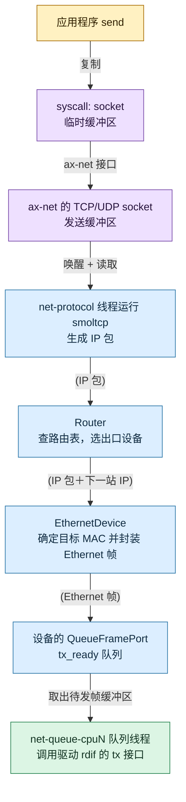
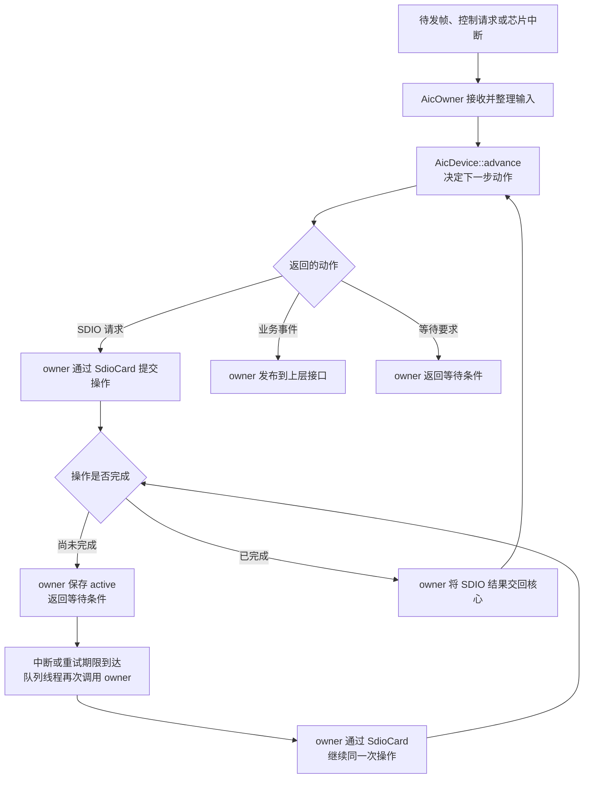
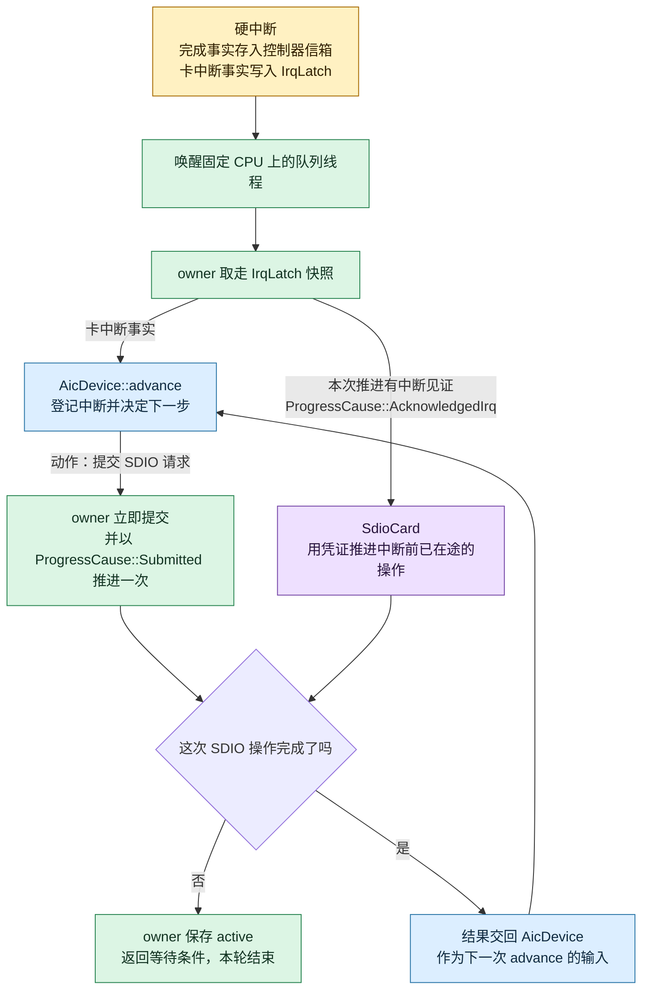
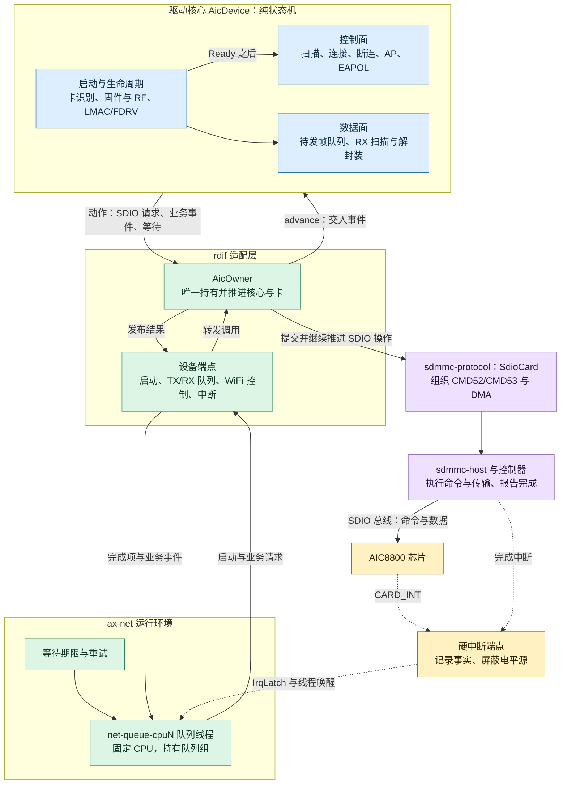
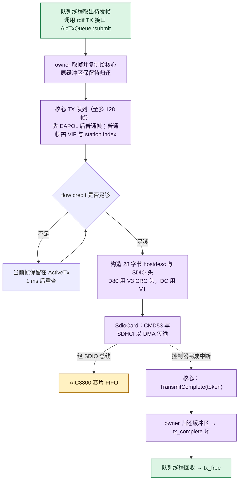
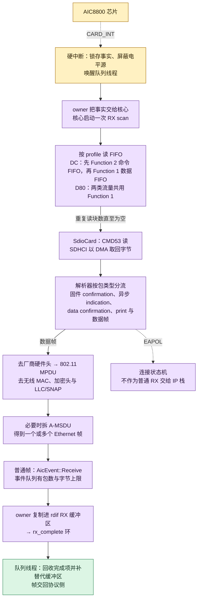

# AIC8800 驱动层原理分析

本文分析当前代码中的 AIC8800 WiFi 驱动。这里的“驱动核心”专指 `aic8800` crate 默认编译的 OS 无关部分；同一 crate 的可选 `rdif` 模块负责把核心接入实际内核。文中的路径均相对于本文所在目录。主要依据是 [AIC 驱动源码](tgoskits/drivers/net/aic8800/src/lib.rs)、[驱动说明](tgoskits/drivers/net/aic8800/README.md)、[统一 SDIO 与 AIC8800 设计文档](tgoskits/docs/design/unified-sdio-aic8800.md)，以及下文所列的实际接入代码。设计文档用于解释分层意图；具体运行流程以下述源码为准。

## 一、从 WiFi 功能看整体设计

### 1.1 驱动核心负责 WiFi 的什么

WiFi 驱动主要处理两类业务：

- **控制业务**：让芯片启动固件，并处理连接、断连等请求及芯片返回的结果。

- **数据业务**：把待发的 Ethernet 帧送向芯片，再把芯片收到的数据转换成 Ethernet 帧交回网络栈。

两类业务都需要与芯片通信，也都要处理“请求已经发出，但结果稍后才到”的情况。

核心对象 `AicDevice` 是被动推进的纯状态机，用来保存业务状态。输入一个事件（控制请求、待发帧、SDIO 操作结果或芯片中断），状态机决定下一步要做什么，然后输出一个动作请求（e.g. 读 FIFO、等待固件回复、报告一帧已收到），动作由外层执行；状态机本身不读控制器寄存器，也不创建线程。[核心输入与动作](tgoskits/drivers/net/aic8800/src/device/model.rs)、[状态推进](tgoskits/drivers/net/aic8800/src/device/progress.rs)。

### 1.2 向下：SDMMC 怎样帮助核心与芯片通信

AIC8800 通过 SDIO 与主机通信。控制业务和数据业务共用这条总线：读写芯片寄存器通常使用 SDIO 的 CMD52，读写 FIFO 通常使用 CMD53。核心只提出“读哪个 Function 的哪个地址、读多少字节”等要求，不自行编排 CMD52/CMD53。

`sdmmc-protocol` 中的 `SdioCard` 提供卡协议操作接口：识别 SDIO 卡及其 Function、启用 Function、设置块大小、读写寄存器和传输数据。它使用更下层的 `sdmmc-host` 能力发出总线命令、处理 DMA 和控制器完成事件；在当前 SG2002/CV181x 接入中，具体控制器由 `Cv181xSdhci` 实现。一次读取可能先返回“尚未完成”，等待控制器中断后再继续推进。因此，`SdioCard` 是卡协议对象，某次尚未完成的读取才是活动操作。[SdioCard](tgoskits/drivers/blk/sdmmc-protocol/src/sdio/io/mod.rs)、[host 能力](tgoskits/drivers/blk/sdmmc-host/src/host/mod.rs)。

### 1.3 向上：rdif 适配层怎样使用核心

核心与 SDIO 卡之间，以及核心与网络运行时之间，都由 AIC 的 **适配层** 组织起来。（位于同一 crate 的可选 [`rdif/` 模块](tgoskits/drivers/net/aic8800/src/rdif/mod.rs)。）

#### AicOwner

`AicOwner` 定义在 rdif 适配层，是驱动的执行者，负责把 `AicDevice` 作出的决定交给 `SdioCard` 执行，再把执行结果交还给 `AicDevice`。它先持有 `SdioCard` 完成卡识别，确认芯片型号后才创建 `AicDevice`；运行时，两者都由同一个 owner 持有和推进。

队列、控制请求、中断或等待期限到达时，运行时会再次调用 owner。owner 会处理收到的中断、继续推进尚未完成的 SDIO 操作，并在可以接收新业务时，把请求交给 `AicDevice`。`AicDevice` 根据自身状态返回下一步动作：可能是提交一次 SDIO 操作、发布业务事件，也可能是等待中断或稍后重试。owner 按动作执行：SDIO 操作交给 `SdioCard`，业务事件送到上层接口，等待要求交给运行时安排下一次唤醒。

SDIO 操作提交后可能尚未完成。此时 owner 把这次操作保存在自己的 `active` 中，暂停推进并等待控制器中断或重试时刻；再次被唤醒后，继续通过 `SdioCard` 推进**同一次**操作。完成时，owner 清除 `active`，把结果作为输入交回 `AicDevice`，再处理核心给出的后续动作。因此，核心负责决定“下一步做什么”，卡负责“怎样完成 SDIO 操作”，owner 负责按顺序衔接两者。[AicOwner 的推进流程](tgoskits/drivers/net/aic8800/src/rdif/owner/progress.rs)。

#### 设备适配到通用接口

适配层把 AIC 设备拆成上层通用的接口：
- TX/RX 队列：用于交接 Ethernet 帧和缓冲区
- WiFi 控制接口：接收连接等请求
- 启动接口：负责卡识别和固件启动
- 中断接口：负责通知有新工作

网络运行时不直接操作 `AicDevice` 或 `AicOwner`。[设备接口的组装](tgoskits/drivers/net/aic8800/src/rdif/device/endpoints/device.rs)、[队列实现](tgoskits/drivers/net/aic8800/src/rdif/device/queues.rs)。

### 1.4 更上层：`ax-net` 与队列线程

设备先由 **OS Glue** 建立：[`ax-driver` 的 AIC probe](tgoskits/drivers/ax-driver/src/net/aic8800/mod.rs)从设备树取得控制器、时钟、复位、中断和 DMA 等资源，创建适配设备，并登记候选 `wlan0`。登记只表示系统知道要尝试这块设备；卡识别和固件启动随后在运行时完成。

**Runtime** 由 `axruntime` 和 `ax-net` 配合提供。`axruntime` 收集已登记的设备，`ax-net` 的 `NetworkRuntimeBuilder` 为设备建立中断和队列运行环境，并创建固定在某个 CPU 上的 `net-queue-cpuN` **队列线程**。线程代码位于 [`ax-net` 的队列执行器](tgoskits/net/ax-net/src/queue_runtime/executor/mod.rs)，不在 AIC 驱动核心中。启动时，它经适配层的启动接口调用 owner；运行时，它在队列有新帧、芯片或控制器发出中断、等待期限到达时，经适配层继续推进同一个 owner。[设备收集](tgoskits/os/arceos/modules/axruntime/src/devices.rs)、[运行时构建](tgoskits/net/ax-net/src/queue_runtime/mod.rs)。

`ax-net` 还有处理 socket、路由、IP 和 Ethernet 的网络协议线程。发包时，它把 Ethernet 帧交给队列，队列线程再交给 AIC owner；收包时，owner 把帧放入接收队列，网络协议线程再取走。WiFi 连接等控制请求也经适配层送给 owner。由此，网络栈通过通用接口使用 AIC 驱动，而实际芯片操作仍由固定 CPU 上的 owner 执行。[网络栈入口](tgoskits/net/ax-net/src/lib.rs)。

## 二、rdif 怎样把 AIC 驱动接入内核

rdif 是 AIC 驱动对内核提供的适配层。它向上按通用设备接口交出启动、收发、控制与中断端点，向下独占 `SdioCard` 与 SDIO 控制器 host，中间用一个 `AicOwner` 把 `AicDevice` 提出的动作与卡上的 SDIO 操作串起来。本节依次说明一次推进怎样组织（2.1）、中断怎样被接住并转交（2.2）、接口与运行环境怎样建立（2.3），以及驱动运行时的中断触发、调度粒度与及时性（2.4）。

普通发包在到达 rdif 之前，已经由网络协议侧决定出口设备并完成封装；连接等控制请求也由网络运行时交给 rdif。[协议处理](tgoskits/net/ax-net/src/service.rs)、[路由与设备选择](tgoskits/net/ax-net/src/router.rs)、[队列接口](tgoskits/net/ax-net/src/queue_runtime/executor/mod.rs)。



图中最后一步已进入驱动：队列线程取出待发帧后调用 rdif 的 TX 接口。

#### 驱动触发源

AIC 驱动正常运行时的外部触发有三类，本节余下的内容都围绕它们展开：

- **新业务入口**：设备启动、待发 TX 帧、WiFi 控制请求。

- **硬件中断**：芯片的 `CARD_INT` 表示设备侧可能有待取数据或固件消息；SDIO 控制器的命令与数据传输完成中断表示先前提交的总线操作可以继续推进。

- **等待期限**：重试或超时检查的时刻到达后，继续先前保存的工作。

### 2.1 AicOwner

`AicOwner` 是 rdif 中协调驱动执行的对象，也是这一层里唯一接触卡的对象。初始化时，它先识别 SDIO 卡，确认芯片型号后才创建 `AicDevice`；运行时，它把核心提出的动作翻译成 `SdioCard` 上的操作，再把操作结果交回核心。[owner 定义与启动](tgoskits/drivers/net/aic8800/src/rdif/owner/progress.rs)、[rdif 队列](tgoskits/drivers/net/aic8800/src/rdif/device/queues.rs)、[控制请求队列与中断记录](tgoskits/drivers/net/aic8800/src/rdif/device/shared.rs)。

```rust
pub(crate) struct AicOwner<H: CompletionIrqRearmHost + 'static> {
    card: SdioCard<H>,                                       // 持有控制器 host 的 SDIO 卡协议对象。
    card_irq: Option<H::CardIrq>,                            // 控制芯片 CARD_INT 的屏蔽与恢复。
    init: Option<SdioInitRequest<H>>,                        // 保存尚未完成的卡识别操作。
    device: Option<AicDevice>,                               // 卡识别后创建的 AIC 业务核心。
    active: Option<ActiveOperation<H>>,                      // 保存尚未完成的核心 SDIO 操作。
    wifi_requests: crate::rdif::device::WifiRequestReceiver, // WiFi 控制请求队列的读取端。
    outputs: OwnerOutputs,                                   // 持有 rdif 的 TX/RX 队列 owner 侧端点并发布结果。
    irq_latch: Arc<IrqLatch>,                                // 保存硬中断端点记录的中断事实。
    mac: Arc<MacAddressState>,                               // 与设备控制接口共享已发布的 MAC 地址。
    started: bool,                                           // 标记核心已创建并开始启动。
    card_irq_wait: CardIrqWait,                              // 记录是否需要恢复芯片 CARD_INT。
}
```

owner 对运行环境只暴露有限几个入口：`start` 发起卡识别，`advance` 推进一轮，`rearm_and_advance` 推进一轮并在结束时恢复中断投递，`quiesce` 停止中断投递，`shutdown` 中止在途操作并关闭中断。一次推进的顺序是固定的：先把上一轮积压的输出项送出去，再取一次中断快照，随后循环检查“未完成的卡识别 → 未完成的 SDIO 操作 → 新的控制请求 → 待发帧 → 期限”。核心每给出一个动作，owner 随即执行：提交一次 SDIO 操作、发布一个业务事件，或返回一个等待条件。一轮最多 16 步，单个动作不会无限展开；同一时间只允许一个 SDIO 操作在飞，完成结果带着发起时的请求 ID 交回核心。构造 owner 时卡中断先被屏蔽，直到核心进入确实需要它的阶段，才按 2.2 的规则放开。



图中的三个出口，对应核心能够给出的三类结果：提交一次 SDIO 操作、发布一个业务事件、返回一个等待条件。`AicOwner` 自身没有线程，也不睡眠：它只在被调用时工作，并以返回值给出下一次调用所需的条件。

### 2.2 中断的设计

驱动参与的中断有两类，它们可能同时出现在同一次中断里：

- **SDIO 卡中断（`CARD_INT`）**：由芯片的 Function 中断拉高，电平触发，含义是设备侧可能有待取数据或固件消息。
- **SDIO 控制器完成中断**：命令完成、数据传输完成等，含义是先前提交的总线操作可以继续推进。

[SDIO 控制器事件](tgoskits/drivers/blk/sdhci-host/src/lib.rs)、[主机事件分类](tgoskits/drivers/blk/sdmmc-protocol/src/sdio/host.rs)。

**硬中断只记录事实，不推进协议。** 中断处理读取状态寄存器（命令完成、数据传输完成、`CARD_INT`，或错误）：

- 完成中断：把事件缓存进控制器侧的 mailbox，等待任务上下文取用；
- `CARD_INT`：记录事件，mask 卡中断使能位。

事件并入 `IrqLatch`：低位是“卡中断 / 完成 / 错误”三类事件，高位是递增序号，核心只对序号更新的卡中断启动接收扫描，重复读到同一份快照不会引发重复扫描。[控制器中断处理](tgoskits/drivers/blk/sdhci-host/src/lib.rs)、[AIC 硬中断入口](tgoskits/drivers/net/aic8800/src/rdif/device/endpoints/irq.rs)、[中断记录](tgoskits/drivers/net/aic8800/src/rdif/device/shared.rs)。

**中断唤醒固定 CPU 上的线程。** 硬中断端点把事件整理成一份队列工作快照（卡中断对应 RX，错误对应 ERROR，其余对应 TX 与 RX）后交给网络运行时的中断回调；回调把所属队列组标记为待处理，再通知绑定在该组 CPU 上的队列线程。中断只在被投递到被绑定到的 CPU 才会唤醒线程并推进驱动，若投递到错误 CPU 则该组被禁用并计数，不过 SG2002 单 CPU 不会出现这种情况。投递到正确 CPU 时，线程正在等待就唤醒它，尚未进入等待则只留下一个待处理标记交给它下一次进入等待时消费——先到的中断不会被漏掉。[中断注册回调](tgoskits/net/ax-net/src/queue_runtime/mod.rs)、[队列组调度状态](tgoskits/net/ax-net/src/queue_runtime/state.rs)、[线程通知](tgoskits/net/ax-net/src/queue_runtime/notify.rs)。

**线程被唤醒后处理中断事件。** 队列线程在恢复中断投递的阶段调用 `AicPollIrqControl::rearm_and_check`，由 `AicOwner::rearm_and_advance` 完成三件事：
1. 取走 `IrqLatch` 快照，把其中的事实交给核心；
2. 用同一次已确认的事件推进尚未完成的 SDIO 操作（卡识别阶段的识别请求同样由它推进）；
3. 恢复中断投递，并检查这期间是否又出现了新中断事件。

同一次中断若同时带有两类信息时，两者都会被处理。[rdif 运行接口](tgoskits/drivers/net/aic8800/src/rdif/device/endpoints/startup.rs)、[owner 推进](tgoskits/drivers/net/aic8800/src/rdif/owner/progress.rs)。

一次唤醒的流程：



核心返回的动作在同一轮内，以 cause=`Submitted` 被 owner 提交，意味着该操作不属于本次中断（只有中断直接触发，cause=`AcknowledgedIrq` 才会推进 SdioCard）；进入主循环，完成结果再交给核心，如此往复，直到核心返回等待条件或主循环一轮步数用尽。[owner 推进](tgoskits/drivers/net/aic8800/src/rdif/owner/progress.rs)。

**核心返回的三种等待要求**：

- 等中断；
- 等到某个期限的等中断；
- 到某个时刻重试。

owner 原样上交，由运行环境决定线程是睡在通知上还是睡到期限。

### 2.3 rdif 设备接口与运行环境

#### 2.3.1 设备接口与队列：内核-驱动的接口

`AicRdifDevice::into_parts` 把设备一次性拆成网络运行时使用的接口；拆分之后不再有设备整体句柄，各接口由同一个 `AicOwner` 协调。[设备接口组装](tgoskits/drivers/net/aic8800/src/rdif/device/endpoints/device.rs)。

| rdif 接口 | 网络运行时的操作 | AIC 实现 |
| --- | --- | --- |
| 启动接口 `AicOwnerStartup` | 启动、继续或取消设备启动 | 持有 owner，执行卡识别与核心启动 |
| TX/RX 队列 `AicTxQueue`、`AicRxQueue` | 提交待发帧和接收缓冲区，回收完成结果 | 通过有界队列与 owner 交接缓冲区 |
| WiFi 控制接口 `AicWifiControl` | 提交、继续或取消连接等控制请求 | 写入控制请求队列，读取 owner 发布的进度与结果 |
| 中断接口 `AicHardIrq`、`AicPollIrqControl` | 记录中断事实；关闭、恢复中断并推进或停止设备 | 前者写入 `IrqLatch`，后者调用 owner |
| 设备控制接口 `AicNetControl` | 读取设备 MAC 地址 | 读取 owner 启动后发布的地址 |

设备只提供一个队列组，TX 与 RX 各带一对有界环：提交环把缓冲区交给 owner，完成环把用过的缓冲区交回。环的容量与缓冲区大小来自 `AicRdifOptions`，默认每个方向 32 个缓冲区、每个 2048 字节；提交失败时缓冲区原样退回，调用方据此退避而非自旋。[队列实现](tgoskits/drivers/net/aic8800/src/rdif/device/queues.rs)。

##### TX：从网络协议线程交给 owner

**StarryOS 网络栈**：协议线程通过该设备的 `QueueFramePort` 取得可用 TX 缓冲区，写入完整 Ethernet 帧后放入 `ax-net` 的 `tx_ready`，并标记该队列组有工作。此时帧已交给对应设备的队列组，尚未进入 AIC owner；设备忙时，协议侧按设备策略最多再保留 64 帧，超出才向上返回“稍后再试”。[协议侧提交](tgoskits/net/ax-net/src/queue_runtime/executor/mod.rs)。

**rdif 驱动适配层**：CPU 队列线程从 `tx_ready` 取出缓冲区，调用设备的 rdif TX 接口，`AicTxQueue::submit` 把缓冲区**取出**并放入 rdif 的 `tx_submit` 环。owner 随后从 `tx_submit` 取帧，把帧字节复制给驱动核心，并保留原缓冲区以便完成后归还。`tx_ready` 到 `tx_submit` 转移了缓冲区所有权；owner 取帧时有一次数据复制。[队列线程提交](tgoskits/net/ax-net/src/queue_runtime/executor/mod.rs)、[rdif TX 队列](tgoskits/drivers/net/aic8800/src/rdif/device/queues.rs)、[owner 取帧](tgoskits/drivers/net/aic8800/src/rdif/owner/output.rs)。

核心报告 TX 完成后，owner 按发送标识找到保留的缓冲区，放入 rdif 的 `tx_complete` 环。CPU 队列线程通过 `AicTxQueue::reclaim` 取回缓冲区，再放入 `ax-net` 的 `tx_free` 供后续发包复用，并请求协议线程继续处理可能等待发送的数据；完成环已满时 owner 保留结果，在下一轮先尝试送出。[owner 发布完成](tgoskits/drivers/net/aic8800/src/rdif/owner/output.rs)、[队列线程回收](tgoskits/net/ax-net/src/queue_runtime/executor/mod.rs)。

##### RX：从 owner 交给网络协议线程

初始化队列组时，**StarryOS 网络栈** 队列线程按队列容量一次性给 rdif 分配 RX 缓冲区给 `rx_submit` 环，供 owner 收帧时取用。

**rdif 驱动适配层**：核心产生普通接收帧事件后，owner 从 `rx_submit` 取一个空缓冲区，把 Ethernet 帧复制进去，再把包含缓冲区和有效长度的 `RxCompletion` 放入 `rx_complete`；如果暂时没有空缓冲区，owner 保留这一帧，等到有缓冲区时再发。[RX 缓冲区准备](tgoskits/drivers/net/rd-net/src/lib.rs)、[rdif RX 队列](tgoskits/drivers/net/aic8800/src/rdif/device/queues.rs)、[owner 发布接收帧](tgoskits/drivers/net/aic8800/src/rdif/owner/output.rs)。

**StarryOS 网络栈**：CPU 队列线程通过 `AicRxQueue::reclaim` 从 `rx_complete` 取得完成项，然后先为 rdif 补充替代缓冲区，再把完成项放入 `ax-net` 的 `rx_ready` 并通知协议线程。协议线程经 `QueueFramePort` 取出帧，随后交给 `EthernetDevice` 与 `Router` 处理；用过的缓冲区由队列运行时事后回收。[队列线程接收与补充](tgoskits/net/ax-net/src/queue_runtime/executor/mod.rs)、[协议侧取帧](tgoskits/net/ax-net/src/device/driver.rs)。

#### 2.3.2 OS Glue 与运行环境

OS Glue 负责把具体资源接入 rdif。在 SG2002/CV181x 平台上，`ax-driver` 的 AIC probe 从设备树节点取得控制器、Syscon、时钟与复位等资源，构造 `Cv181xSdhci` 并配置 DMA，再用 `AicRdifDevice::new` 把控制器 host 与运行参数包装成可移植设备，最后以 `wlan0` 为名登记。探测阶段只做资源准备与登记，不发任何卡命令；卡识别与固件启动被推迟到运行环境就绪之后。[平台设备接入](tgoskits/drivers/ax-driver/src/net/aic8800/mod.rs)。

`axruntime` 的 `init_net` 收集已登记的设备，把驱动内部的中断源编号解析成物理 IRQ，并为每个队列按 `QueueConfig` 建立 DMA 池，然后连同在线 CPU 集合一起交给 `ax-net` 的 `NetworkRuntimeBuilder`。[设备收集](tgoskits/os/arceos/modules/axruntime/src/devices.rs)。构建过程按固定次序完成四件事：

1. **校验拓扑**：每个队列组至少要有一个中断端点，设备声明的每个中断源都必须被某个组使用。
2. **确定 CPU 归属**：共享同一条物理 IRQ 的队列组被并成一个亲和域，各域轮流分配给在线 CPU，得到每个组的 owner CPU。
3. **建立线程与中断**：在需要服务队列组的每个 CPU 上创建固定亲和性的 `net-queue-cpuN` 线程；为每个中断端点注册一条同样绑定到该 CPU 的中断；全部注册完成后统一使能。
4. **启动与发布**：线程在自己的 CPU 上完成设备启动与队列初始化并报告结果；启动成功的设备才作为网络端口发布给协议侧，运行时对象交给 `ax_net::init_network`。

第 4 步由启动接口承担：`AicOwnerStartup` 持有 owner，队列线程在亲和性与中断都就绪之后调用它的 `start` 与 `advance`，完成卡识别和固件启动；启动成功后，同一个 owner 被移交给该队列组的中断控制端点，运行期由 `rearm_and_check` 推进。设备若在启动阶段报告不存在，该队列组会被标记并从发布列表中剔除。板上配置的启动事务（例如开机即连接某个网络）同样作为一次普通控制请求，在上述步骤之后、网络服务发布之前提交。[线程创建](tgoskits/net/ax-net/src/queue_runtime/mod.rs)、[队列线程调用](tgoskits/net/ax-net/src/queue_runtime/executor/mod.rs)、[owner 转移与运行入口](tgoskits/drivers/net/aic8800/src/rdif/device/endpoints/startup.rs)。

### 2.4 运行时的中断触发、调度粒度与及时性

驱动的推进发生在固定 CPU 的队列线程上。`NetworkRuntimeBuilder` 为每个需要服务队列组的 CPU 创建 `net-queue-cpuN` 线程（固定 CPU）；线程独占这些队列组以及组内的 `AicOwner` 与 `SdioCard`，驱动自身没有线程，也不需要跨 CPU 互斥。线程先在自己的 CPU 上完成设备启动与队列初始化，随后进入主循环：处理本 CPU 上的队列组，无可运行工作时阻塞，等待通知或最近的重试期限。

#### 中断触发

驱动参与卡中断与控制器完成中断两类中断=。中断只投递到队列组的 owner CPU：硬中断在该 CPU 上记录事实、屏蔽电平源，并把所属队列组由空闲置为待执行，然后通知队列线程。组已处于待执行或正在轮询时，硬中断只补一个“期间又有事”的标记而不再发出通知。线程正在等待则被直接唤醒；尚未进入等待时，通知只留下一个待处理位，由其下一次进入等待时立即消费。除中断之外，待发帧入队、控制请求提交以及 owner 自己发布的完成项，也以同样的方式让队列组转入待执行；核心给出的重试期限则由线程睡到该时刻后重新推进。

#### 调度粒度

调度以队列组的一轮轮询为单位，不以数据包或单次 SDIO 操作为单位。一轮轮询按类别处理 TX 回收、TX 提交、RX 补充与 RX 回收，每类上限 64 项；线程一轮服务本 CPU 上的多个组，整轮上限 256 项，用尽即让出 CPU 后继续。驱动一侧的推进粒度是一次 `AicOwner::rearm_and_advance`，其中最多执行 16 个内部步骤。中断引起的驱动工作量因此有界，不会在单次调用中无限展开。

#### 及时性

中断的唤醒与中断的处理是两个环节：唤醒可以立即发生，处理固定落在轮询边界上。队列组的状态机只在空闲时接受中断的唤醒（转入待执行并通知线程）；对已待执行或正在轮询的组，中断只留下标记，既不打断当前轮询，也不在中断上下文里推进驱动。该标记使组在轮询结束时回到待执行而不转入空闲，线程因此回到循环顶部立即开始下一轮，并在那一轮的结束阶段（`rearm_and_check`，同一次调用中也恢复中断投递）才把中断事实交给 owner。从中断到达到驱动实际处理它，至少要跨过当前这一轮轮询的剩余部分，处理点位于相邻两轮之间的间隙，与 Linux NAPI 中“上半部只调度、下半部在轮询中取用”属同一设计。延迟非零，但受轮询预算约束而有界；线程被唤醒后何时取得 CPU 由内核调度决定。期限等待属于同一模式：到期由固定的 worker 线程取出后才唤醒等待者，到期时刻与实际处理时刻之间同样隔着一次 worker 轮次。

## 三、驱动的完整构成



## 四、沿数据方向看 RX 与 TX

本节描述普通 IP 数据的收发：ARP 由网络栈自身处理，WiFi 固件确认与 EAPOL 由 AIC 控制路径处理。

### 4.1 TX：从设备队列到芯片 FIFO



图中每个交接点都是缓冲区所有权的转移。

#### 队列到 owner

队列线程取出待发帧并调用 rdif TX 接口，`AicTxQueue::submit` 把缓冲区移入 `tx_submit` 环；owner 取帧时把帧字节复制给核心，同时保留原缓冲区以备归还，所有权由此转到驱动侧。[rdif 队列](tgoskits/drivers/net/aic8800/src/rdif/device/queues.rs)、[owner 输出](tgoskits/drivers/net/aic8800/src/rdif/owner/output.rs)。

#### 核心到芯片

核心的 TX 队列至多排 128 帧，先处理内部 EAPOL 再处理普通帧；只有取得 firmware VIF 与 peer station index 才能构造普通数据 TX。提交前先读芯片 flow credit，并为命令保留两个 buffer，credit 不足时当前帧保留在 `ActiveTx`、1 ms 后重查。credit 足够后，核心把 MAC 与 EtherType 放进 28 字节 FULLMAC `hostdesc`，只把剩余 L3 payload 放在描述符之后，外包 SDIO 数据头并按块对齐——D80 使用 V3 CRC 头，DC 使用 V1 格式——再经 `SdioCard` 以 CMD53 与 SDHCI 写出。[核心 TX 队列](tgoskits/drivers/net/aic8800/src/tx.rs)、[TX 封装](tgoskits/drivers/net/aic8800/src/protocol.rs)、[流控和完成](tgoskits/drivers/net/aic8800/src/device/data_plane.rs)、[SDIO 操作映射](tgoskits/drivers/net/aic8800/src/rdif/owner/operation.rs)。

#### 完成与回收

控制器报告传输完成后，核心发出 `TransmitComplete(TxToken)`；owner 按发送标识找到保留的缓冲区并放入 `tx_complete` 环，队列线程回收后放入 `tx_free` 供后续发送复用。这个完成点证明主机到设备的 SDIO 写已结束、缓冲区可以回收；代码中的 firmware data confirmation 只作 trace，不能据此声称远端无线接收成功。[核心完成事件](tgoskits/drivers/net/aic8800/src/device/data_plane.rs)、[token 回收](tgoskits/drivers/net/aic8800/src/rdif/owner/output.rs)。

### 4.2 RX：从芯片 FIFO 到设备队列



#### 中断到扫描

芯片拉起 card IRQ，硬中断只锁存事实并唤醒固定 CPU 的队列线程；owner 把该事实交给核心，核心启动一次 RX scan。DC 先查 Function 2 命令 FIFO，再查 Function 1 数据 FIFO；D80 的两类流量共用 Function 1。每条路径重复读块数直至为空，扫描期间出现的新电平合并处理，不堆积无限个扫描请求。[扫描状态机](tgoskits/drivers/net/aic8800/src/device/data_plane.rs)、[profile](tgoskits/drivers/net/aic8800/src/profile.rs)。

#### 读与分流

核心按 profile 解释 block count 或 byte mode 长度并发出 FIFO 读请求，适配层为 CMD53 准备 DMA、等待控制器完成，再把读出的字节交回核心；D80 的 `OTHER` 中断还走独立的读/清寄存器流程。解析器按包类型把聚合数据分流为固件 confirmation、异步 indication、data confirmation、print 与数据帧，长度与控制流量均有边界检查。[长度解释](tgoskits/drivers/net/aic8800/src/registers.rs)、[RX 解析器](tgoskits/drivers/net/aic8800/src/rx.rs)。

#### 解封装

普通数据帧先去掉厂商硬件头，再从 802.11 MPDU 去掉无线 MAC、加密头与 LLC/SNAP，必要时拆出 A-MSDU 子帧，形成一个或多个 Ethernet 帧；EAPOL 留给连接状态机，不作为普通 RX 交给 IP 栈。核心的事件队列有包数与字节上限，过量的普通 RX 会被丢弃，不会无限占用内存。[解封装与事件](tgoskits/drivers/net/aic8800/src/device/data_plane.rs)、[事件容量](tgoskits/drivers/net/aic8800/src/device/owner.rs)。

#### 上交设备队列

owner 把 Ethernet 帧复制进已提交的 rdif RX 缓冲区并放入 `rx_complete` 环；没有空缓冲区时暂存一帧，等队列线程补充后再发。队列线程回收完成项并先补上替代缓冲区，随后把帧交回协议侧。[RX 发布](tgoskits/drivers/net/aic8800/src/rdif/owner/output.rs)、[队列回收/补充](tgoskits/net/ax-net/src/queue_runtime/executor/mod.rs)。

两条链的异步边界可以压缩为：**协议侧 ↔ SPSC 队列 ↔ 固定 CPU 的 AIC owner ↔ SDIO 完成 IRQ／card IRQ ↔ 芯片**。软件队列的“已提交”、SDIO 的“已完成”、控制命令的 firmware confirmation 以及应用的“已收到”是不同阶段；定位丢包或停滞时应先分清卡在哪一个阶段。
