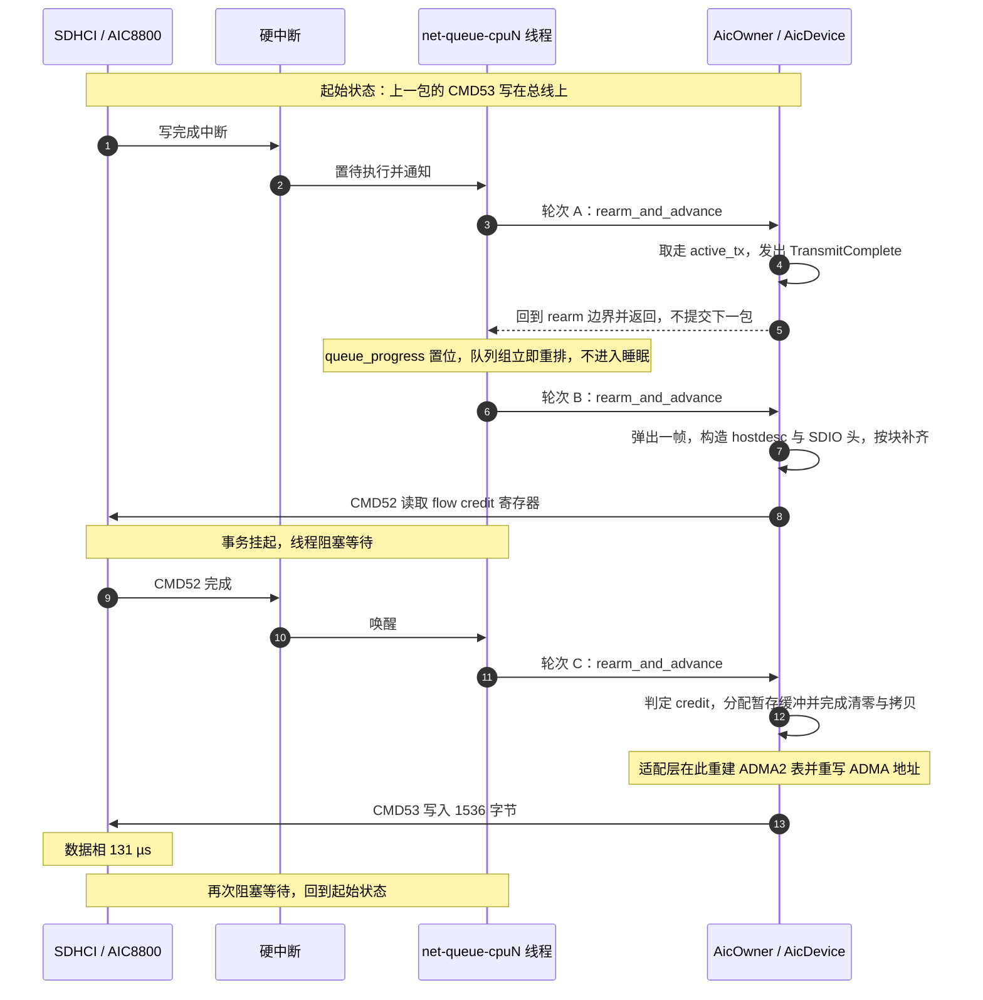

# AIC8800 SDIO 吞吐瓶颈静态分析

分析基线：`dev` @ `18ca1d2d4`。

---

## 1. 结论

| 项 | 结论 |
| --- | --- |
| 非阻塞性 | 已达成。稳态下无轮询、无忙等、无自旋，全部由完成中断、card 中断与期限唤醒推进 |
| 流水线深度 | 恒为 1。同一时刻全局只有一笔 SDIO 事务、一帧 TX 数据、一块暂存缓冲与一张 ADMA2 描述符表 |
| TX 主要瓶颈 | 每包的固定开销按包计费，总线在每包周期内存在较长空闲，空闲时间用于中断往返、owner 轮转、rearm 与发送侧数据准备 |
| TX 次要瓶颈 | flow credit 每包重读一次，且不足时固定回退 1 ms |
| 队列容量 | 不是瓶颈。上游各级队列在饱和负载下驻留多帧数据，限制吞吐的是 `active_tx` 以下的发送流水线 |
| 改进空间 | 异步机制共七项，其中五项缺失且不受硬件限制，TX 存在约一个数量级的提升空间 |
| 改进方向 | 优先消除每包一次的 flow credit 往返与每包一次的收发往返；包聚合排在最后，在纯流水线即可满足链路能力时并非必要 |

厂商驱动对照：厂商将最多 32 个包聚合为一次 CMD53，并在每个发送轮次开始时读取一次 flow credit；本仓库每包各发一次 CMD52 与一次 CMD53。如果以总线频率估算的话，厂商 Linux 驱动的 SDIO 总线利用率大概有 66%，本仓库代码大概是 8%。

---

## 2. 驱动的异步程度

### 2.1 非阻塞，但是软硬件是串行的

`AicDevice::advance` 每次调用返回至多一个可观察动作。核心和 `rdif` 适配层没有执行线程，只通过有界 SPSC 队列交换数据。协议侧的 `tx_ready` 队列对接驱动侧的 submit 环，`DmaBuffer` 在 submit 与 complete 两个方向的环之间轮转。

完成路径不依赖寄存器轮询。SDHCI 硬中断上半部将状态锁存进 `AtomicU64` mailbox，任务上下文随后以原子操作取用，不产生 MMIO。寄存器节奏轮询仅出现在非数据路径，包括 CMD/DAT inhibit 未清、R1b busy，以及 Reset、SetClock、SetSignalVoltage 等可能挂起的总线操作，统一按 100 µs 定速重试，与数据传输无关；PowerOn、PowerOff、SetBusWidth 等操作一步完成。

等待硬件期间 CPU 会让出。中断发生后，硬中断处理读取并确认状态寄存器，将事件锁存后唤醒队列线程。线程醒来先对队列做一轮有限次数的轮询（循环调用 rdif 收发接口处理 TX 回收、TX 提交与 RX 收发，每类上限 64 项、整轮上限 256 项）；轮询结束后，线程在同一处推进 `AicDevice` 与 `SdioCard`，若期间有新调度插入则本轮不推进，直接开始下一轮。对于 TX，一次推进最多向硬件提交一笔 SDIO 事务，而发出一个数据包需要依次完成 flow credit 读取与数据写入两笔事务。两笔事务分属不同轮次且互不重叠，因此同一时刻处于发送流程中的数据包数恒为 1。

总的来说，在队列线程主循环这，驱动先处理 tx、rx 队列（TX 回收、TX 提交、RX 发布、RX 回收补充），再推进 owner 硬件业务，一次轮询就是串行的。

### 2.2 流水线深度

同一时刻全局只有一笔 SDIO 事务、一帧 TX 数据、一块暂存缓冲与一张 ADMA2 描述符表，约束分布在四层：

| 层 | 单一槽位 | 位置 |
| --- | --- | --- |
| SDIO 事务（适配层） | `AicOwner.active: Option<ActiveOperation<H>>` | `drivers/net/aic8800/src/rdif/owner/progress.rs:74` |
| SDIO 事务（协议层） | `active_io_request_id`，重复提交直接返回 `Busy` | `drivers/blk/sdmmc-protocol/src/sdio/io/mod.rs:72-80` |
| SDIO 事务（核心层） | `AicDevice.io.pending: Option<PendingIo>` | `drivers/net/aic8800/src/device/owner.rs:47` |
| SDIO 事务（控制器层） | `host2_active_id`，非空即拒绝新提交 | `drivers/blk/sdhci-host/src/host2/mod.rs:102-119` |
| ADMA2 描述符表 | 控制器生命周期内唯一一张 | `drivers/blk/sdhci-host/src/host/mod.rs:69-71` |
| TX 帧 | `DataPlaneState.active_tx: Option<ActiveTx>` | `drivers/net/aic8800/src/device/owner.rs:63` |

`prepare_next_transmit` 在 `active_tx` 已占用时直接返回（`drivers/net/aic8800/src/device/data_plane.rs:420-423`），而 `active_tx` 只在数据写入完成的回调中被取走（`drivers/net/aic8800/src/device/data_plane.rs:398-402`）。因此上一包在总线上传输完成之前，下一包的 wire frame 构造不会开始。

---

## 3. TX 单包流程

以 1500 字节以太网帧为例，wire frame 按块对齐后为 1536 字节。队列线程每次推进 owner 一步，一次 `rearm_and_advance` 对应一轮。流程大致如下：



对应的代码位置：

| 步骤 | 位置 |
| --- | --- |
| 完成回调取走 `active_tx` | `drivers/net/aic8800/src/device/data_plane.rs:396-418` |
| 每包完成即退回 rearm 边界 | `drivers/net/aic8800/src/rdif/owner/progress.rs:47-65` |
| 弹帧并复制给核心 | `drivers/net/aic8800/src/rdif/owner/output.rs:61-70` |
| 构造 wire frame | `drivers/net/aic8800/src/tx.rs:33-45`、`drivers/net/aic8800/src/protocol.rs:154-199` |
| 读取 flow credit | `drivers/net/aic8800/src/device/data_plane.rs:373-394` |
| 暂存缓冲准备 | `drivers/net/aic8800/src/rdif/owner/operation.rs:106-136` |
| ADMA2 重建与地址重写 | `drivers/blk/sdhci-host/src/dma/request.rs:349-364` |

每个数据包至少需要 3 次 owner 推进与 2 次 SDIO 完成中断，分别对应 flow credit 读取与数据写入。队列环上存在待处理项时还会产生若干次仅做队列收发的轮转。

---

## 4. 异步改进空间

aic8800 硬件是串行的。理想情况下，硬件等待期间应完成后续数据的准备，对于硬件来说始终有活可干。当前实现各等待段的情况如下：

| 硬件等待段 | 当前状态 | 可改进方向 |
| --- | --- | --- |
| 等待 CMD52 读取 flow credit </br>（确认 FIFO 空闲空间，发数据前的必要一步） | 发送侧无准备工作，下一包的 wire frame 尚未构造 | 构造下一包的 wire frame 并备好暂存缓冲 |
| 等待 CMD53 数据相完成 | `active_tx` 仍被占用，`prepare_next_transmit` 直接返回，下一包未开始格式转换 | 完成下一包的 wire frame 构造与暂存缓冲准备，写入完成后立即连续发出 |
| flow credit 不足时的 1 ms 回退期 | 仅推进 RX 扫描，见 §7.3 | 完成任意数量的发送侧准备 |

驱动现在没有任何 TX 数据的异步准备工作，全部是串行的。发送侧未提前完成的工作共五项：

**一、wire frame 构造位于 flow credit 检查之后。** `prepare_next_transmit` 在 `emit(TransmitFlow)` 之前完成 `ethernet_tx_frame`（`drivers/net/aic8800/src/device/data_plane.rs:443-462` 与 `:71-74`）。该函数每次执行一次分配、一次清零与两次拷贝。

**二、暂存缓冲在发起 CMD53 前才分配，且数据通路包含多次拷贝。**

`rdif_eth::DmaBuffer` 是接口层命名，面向具备主机内存 DMA 能力的网卡。AIC8800 位于 SDIO 总线之后，对主机内存没有可见性，没有描述符环，也不持有缓冲区地址；数据由主机侧写入 SDIO FIFO 后经总线上传，不存在网卡侧 DMA。实际执行搬运的是 SDHCI 主机控制器内部的 ADMA2 引擎（`drivers/blk/sdhci-host/src/command.rs:455-467`、`drivers/blk/sdhci-host/src/dma/request.rs:349-364`），属于主机控制器的实现细节。

以 1500 字节 TX 包计，数据经过 4 次拷贝：

| 序 | 位置 | 动作 |
| --- | --- | --- |
| 1 | `drivers/net/aic8800/src/rdif/owner/output.rs:61-70` | rdif `DmaBuffer` 复制为 `Vec` |
| 2 | `drivers/net/aic8800/src/device/data_plane.rs:443-462`、`drivers/net/aic8800/src/protocol.rs:174-198` | 分配并清零 wire frame 缓冲，写入 hostdesc 与 payload |
| 3 | `drivers/net/aic8800/src/device/data_plane.rs:388` | 克隆 `active.wire_frame` |
| 4 | `drivers/net/aic8800/src/rdif/owner/operation.rs:114-121` | 分配并清零设备可见暂存缓冲，拷入 wire frame |

合计内存流量约为净荷的 10 倍。其中第 2、4 步各包含一次全缓冲清零，写入前即被后续拷贝覆盖；整条路径未使用缓冲池，每包执行一次分配与一次释放。第 3、4 步位于 flow credit 检查之后，处于 CMD52 与 CMD53 之间。

单独计量时，拷贝开销不是当前的主要瓶颈，但它位于每包关键路径上，且是提升流水线深度的前置条件。`dma-api` 提供的 `map_streaming` 与 `map_streaming_slice` 可用于直接映射已有缓冲，该通路未使用；rdif `DmaBuffer` 在 `tx_tokens` 中持有至完成回收，生命周期满足直接映射的要求。

**三、flow credit 每包重读。** 该寄存器提供固件空闲缓冲计数，每个数据包消耗一个。D80 的 V3 寄存器为完整 8 bit，可报告至 128（`drivers/net/aic8800/src/registers.rs:141-148`）。当前实现每包读取一次，未在本地记账，每次读取构成一次完整的 CMD52 往返，包含一次命令与响应、6 次 MMIO、一次中断与一次 owner 推进。

**四、上一包写入完成后才取下一包。** 见 §2.2。

**五、未做包聚合。** 每包各占一次 CMD53。厂商 Linux 驱动在同一位置将多个包写入一块连续缓冲后一次写出。

---

## 5. 队列与背压

各级队列容量均远大于单包：

| 层 | 容量 | 位置 |
| --- | --- | --- |
| 协议侧 FIFO qdisc | 64 帧 | `os/arceos/modules/axruntime/src/devices.rs:138-141` |
| rdif SPSC 环 | 31 帧，默认 `ring_size` 为 32 | `drivers/net/aic8800/src/rdif/device/endpoints/device.rs:23`、`drivers/net/rd-net/src/lib.rs:60-62` |
| 核心 TX 队列 | 128 帧 | `drivers/net/aic8800/src/tx.rs:7` |
| 核心 RX 事件队列 | 256 项、512 KiB | `drivers/net/aic8800/src/rx.rs:10-11` |

SG2002 的 DTB 未设置 `aic,queue-size`，取默认值 32。

饱和负载下三级发送队列合计驻留可达 223 帧。上游具备充分的提前准备能力，并已达到其容量上限；限制吞吐的是 `active_tx` 以下的发送流水线。§4 中等待期未完成的准备工作，均指驱动侧的 wire frame 构造与暂存拷贝，不涉及上游供帧。

---

## 6. RX 路径

RX 与 TX 共用同一条总线、同一个 owner、同一个线程与同一份 CPU 轮询预算（`net/ax-net/src/queue_runtime/executor/mod.rs:540-719`），两者之间没有并发。

- 每段 FIFO 读取前需要一次 CMD52 读取 block count；数据读完后在同一条路径上重复读取块数直至为空，再切换下一条路径（`drivers/net/aic8800/src/device/data_plane.rs:150-159` 与 `:362-366`）。D80 单通道只有 Function 1 一条路径，DC 有 Function 2 与 Function 1 两条（`drivers/net/aic8800/src/profile.rs:100-125`）。
- block count 编码支持至 112 个块（约 57 KiB），单次 CMD53 可读取较大数据段，因此 RX 的每字节事务数低于 TX。

RX 优先级高于 TX：`drive_receive_scan()` 排在 `prepare_next_transmit()` 之前（`drivers/net/aic8800/src/device/data_plane.rs:55-76`），且每次 TX 完成都会退回 rearm 边界以便先采样 RX（`drivers/net/aic8800/src/rdif/owner/progress.rs:47-65`）。该设计用于避免 RX 饿死，代价是 RX 突发会推迟 TX 提交。

RX 每帧包含 3 次拷贝，分别位于设备数据取回（`drivers/net/aic8800/src/rdif/owner/operation.rs:191-194`）、`parse_fifo` 解析（`drivers/net/aic8800/src/rx.rs:233`）与 RDIF RX 缓冲发布（`drivers/net/aic8800/src/rdif/owner/output.rs:198`）。

---

## 7. 每包固定开销

### 7.1 组成

| 项目 | 每包次数 | 位置 |
| --- | --- | --- |
| 硬中断上半部 | 2 | `drivers/blk/sdhci-host/src/lib.rs:452-512` |
| owner 推进与 rearm | 3 | `drivers/net/aic8800/src/rdif/owner/progress.rs:467-508`、`drivers/blk/sdhci-host/src/lib.rs:434-441` |
| CMD53 启动，含重建 ADMA2 表与重写 ADMA 地址 | 1 | `drivers/blk/sdhci-host/src/dma/request.rs:349-364` |
| CMD52 启动 | 1 | `drivers/blk/sdhci-host/src/command.rs:395-449` |
| `log_status` 诊断读 | 2 | `drivers/blk/sdhci-host/src/command.rs:442` |
| 帧字节拷贝 | 4 | 见 §4 |
| 堆与设备可见页分配、释放 | 3 | `drivers/net/aic8800/src/rdif/owner/output.rs:65`、`drivers/net/aic8800/src/protocol.rs:174`、`drivers/net/aic8800/src/rdif/owner/operation.rs:114-120` |

上述开销均按包计费，不随包大小摊薄。

### 7.2 每条命令的诊断读

`program_command` 在写入 COMMAND 寄存器后调用 `log_status`（`drivers/blk/sdhci-host/src/command.rs:442`）。该函数先读取 9 个寄存器，再按日志级别输出，读操作不受日志级别约束：

```rust
// drivers/blk/sdhci-host/src/command.rs:338-352
pub(crate) fn log_status(&self, reason: &str, cmd_index: u8) {
    let present = self.read_u32(REG_PRESENT_STATE);
    let (normal, error) = self.read_interrupt_status();
    let clock = self.read_u16(REG_CLOCK_CONTROL);
    let power = self.read_u8(REG_POWER_CONTROL);
    let host1 = self.read_u8(REG_HOST_CONTROL1);
    let host2 = self.read_u16(REG_HOST_CONTROL2);
    let reset = self.read_u8(REG_SOFTWARE_RESET);
    let (normal_status_enable, error_status_enable) = self.read_interrupt_status_enable();
    let (normal_signal_enable, error_signal_enable) = self.read_interrupt_signal_enable();
    if reason == "issued" {
        log::debug!(...);
```

每条命令提交固定产生 9 次 MMIO 读，按每包两条命令计为 18 次。绝对量级较小，但位于关键路径上，且为纯诊断开销。

### 7.3 flow credit 回退

```rust
// drivers/net/aic8800/src/device/data_plane.rs:14
const IO_RETRY: Duration = Duration::from_millis(1);

// drivers/net/aic8800/src/device/data_plane.rs:384-387
if credits <= DATA_TX_RESERVED_CREDITS {
    active.retry_at = Some(now.after(IO_RETRY));
    return Ok(());
}
```

`DATA_TX_RESERVED_CREDITS = 2`，固件可见缓冲少于 3 个时停止发送。中断提前到达不会触发提前重读：`drive_ready` 仅比较当前时间与期限，未到期时原样返回同一期限（`drivers/net/aic8800/src/device/data_plane.rs:63-68`），该行为由测试固定（`drivers/net/aic8800/src/device/data_plane.rs:1043-1082`）。

固件包缓冲池被压至 2 个以下时，TX 被限制在约 1 包/毫秒，与 SDIO 总线能力无关，且该期间只推进 RX 扫描。

1 ms 不是硬件要求。厂商驱动在同一位置使用递进退避，依次为 200 µs、1 ms 与 10 ms，恢复粒度为 200 µs，且不以单包为门限。

该门限由 `#2305` 引入。此前 DC 变体不经过 flow control，其余变体仅判断 `credits == 0`（`git show 97d07532a`）。

---

## 8. 板端实测对照

### 8.1 结果

测试在单块 LicheeRV Nano（SG2002）上进行，两侧使用同一片 AIC8800 与同一条 WiFi 链路，对端为同一台 PC。板端分别运行 Buildroot Linux（厂商驱动）与 StarryOS（本仓库代码），单流 TCP 结果如下：

| 方向 | Linux | 本仓库代码 |
| --- | --- | --- |
| 板到 PC | 58.5 Mbps | 6.61 ~ 7.30 Mbps |
| PC 到板 | 46.4 ~ 54.6 Mbps | 16.0 ~ 20.3 Mbps |
| UDP 板到 PC，饱和 | 73.8 Mbps | 不可用 |
| 多流 `-P4` | 与单流相当 | TCP 退化，UDP 不可用 |

折算为 SDIO 总线利用率：

| 用例 | 总线利用率 |
| --- | --- |
| Linux，板到 PC | 66% |
| 本仓库代码，板到 PC | 7 ~ 8% |
| 本仓库代码，PC 到板 | 23% |
| Linux，PC 到板 | 61% |

### 8.2 结论

同一块板、同一个芯片与同一条链路下，厂商驱动将总线用到 66%，本仓库代码为 7 ~ 8%。限制吞吐的是发送流水线，不是总线带宽。TX 的受损程度重于 RX，与 TX 每包额外承担一次 flow credit 往返和一套串行准备的判断一致。

### 8.3 对照的局限

对照组为厂商 Linux 驱动与 Linux 网络栈，被照组为本仓库驱动与 ax-net 网络栈，两侧软件栈均不同，因此该数据不能单独将差异归因于 aic8800 驱动。ax-net 的 TCP 实现未参与对照；两侧板端 iperf3 版本不同，且 StarryOS 未实现 TCP_INFO；测试期间 StarryOS 出现过 UDP 与多流卡死，部分用例的板端状态可能已经劣化。单流 TCP 受拥塞窗口与 RTT 支配，本数据无法区分驱动发送能力与 TCP 层供数能力。

---

## 9. 改进优先级

### 9.1 判断准则

发送路径上，只要仍有待发包，总线的空闲时间不应超过启动一笔事务的成本。据此需要消除三类情况：

1. 有包可发时存在超过事务启动成本的等待，包括 1 ms 回退、每包一次的 flow credit 读取与每包一次的 rearm 往返。
2. 等待期间未完成本可完成的准备工作，包括 `wire_frame` 克隆与暂存拷贝。
3. 每包重复付出的固定事务开销。

### 9.2 优化思路

| 序 | 动作 | 效果 |
| --- | --- | --- |
| P0 | flow credit 本地记账，读取一次后本地递减，降至阈值才重读 | 消除每包一次 CMD52、一次中断与一次 owner 推进 |
| P0 | `IO_RETRY` 由 1 ms 降至 100 ~ 200 µs | 缩短 credit 不足时的回退粒度 |
| P1 | 收割与发起放在同一 owner 轮次，不退回 rearm 边界 | 每包 owner 推进次数由 3 次降至 1 ~ 2 次 |
| P2 | `wire_frame` 克隆与暂存拷贝前置至 flow credit 检查之前 | 使两次拷贝移出 CMD52 与 CMD53 之间的窗口 |
| P3 | 加深 `active_tx`，使准备与硬件等待重叠 | 提升流水线深度，向总线极限靠拢 |
| P4 | `log_status` 的寄存器读受日志级别约束 | 消除每包约 18 次无谓 MMIO 读 |
| P5 | 在延迟约束下实施适度聚合，深度取 4 ~ 8 | 进一步降低每包事务开销 |
