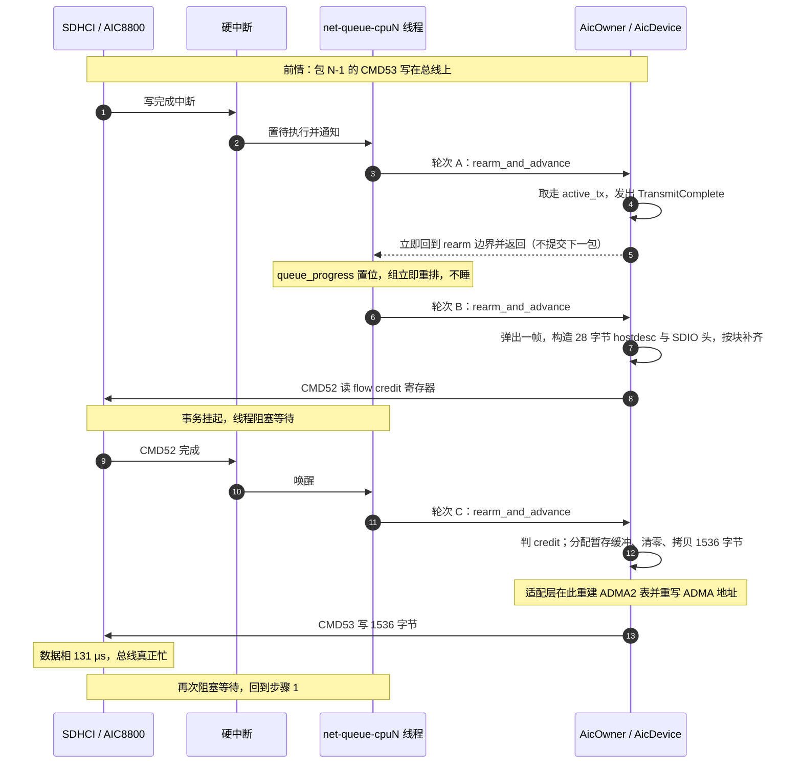

# AIC8800 SDIO 吞吐瓶颈静态分析

分析基线：`dev` @ `18ca1d2d4`。

路径约定：本文出现的仓库内路径均相对 tgoskits 检出根目录，形如 `drivers/net/aic8800/src/device/data_plane.rs:384`。行号对应当前基线，改动后需重新核对。

本文以静态分析为主。§1–§11 是对本仓库代码的分析；§12 引入板端实测数据作对照；§13 引入厂商 Linux 驱动源码作对照；§14 是综合前三者的实现定性、异步空间清点与改动优先级。除明确标注为「估算」的推算外，结论均可由代码或实测直接支持。

两个外部来源：

- 实测数据：板端双系统 iperf3 对比测试（2026-09-16/17），原始日志在仓库之外；
- 厂商驱动源码：`sipeed/LicheeRV-Nano-Build` 的 `osdrv/extdrv/wireless/aic8800/`，稀疏检出在 `../LicheeRV-Nano-Build`，检出提交 `d4003f1`（2026-01-14）。

---

## 1. 结论摘要

| 问题 | 结论 |
| --- | --- |
| 驱动是否异步（不占 CPU 空转） | 是。稳态下无轮询、无忙等、无自旋，全部由完成中断／card 中断／期限唤醒推进 |
| 驱动是否流水线化（提前加载、连续输送） | 否。**流水线深度在每一个维度上都恒等于 1** |
| TX 主瓶颈 | 每包周期里，总线有相当长一段时间是空的，空转时间花在中断往返、owner 轮转、rearm MMIO、wire frame 构造和暂存缓冲准备上 |
| 次瓶颈 | flow credit 每包重读一次，且不足时固定回退 1 ms |
| 队列容量 | 不是瓶颈。上游队列随时攒着约 0.4 秒的数据，缺的是把它们送出去的流水线（§5） |

一句话：**驱动的「异步」止步于「不阻塞 CPU」，没有延伸到「让硬件总有事做」。**

板端实测对照见 §12：同一块板、同一条链路上，厂商 Linux 驱动把 SDIO 总线用到约 66%，本仓库代码只用约 8%（TX）。**总线不是瓶颈这一条已由实测确认。**

厂商驱动源码对照见 §13：厂商把最多 32 个包聚合进一块 98 KB 缓冲、用一次 CMD53 整体写出，且 credit 只在一批开始时读一次；本仓库每包各发一次 CMD52 与 CMD53。**这就是 8% 与 66% 之间的结构性差距。**

**实现定性、异步空间清点与改动优先级见 §14。** 结论是：异步机制七项里有五项完全缺失，且都不受硬件限制；TX 有约一个数量级的空间；优先修 credit 路径与每包往返，聚合排在最后且不是必需项。

---

## 2. 异步程度的界定

「异步」在两个不同意义上要分开评价。

### 2.1 非阻塞性：已达成

`AicDevice::advance` 的契约是纯函数式的：给定显式时间、IRQ 快照和 SDIO 完成，返回**至多一个**可观察动作（`drivers/net/aic8800/src/device/mod.rs:21-58`）。核心不创建线程、不注册中断、不休眠、不自旋。上层 `rdif` 适配层同样没有执行线程，只有有界 SPSC 队列。

完成路径上没有任何寄存器轮询：SDHCI 的硬中断上半部把状态锁存进 `AtomicU64` mailbox（`drivers/blk/sdhci-host/src/host/irq_state.rs`），任务上下文取用时是零 MMIO 的原子操作。寄存器节奏轮询只出现在非数据路径上——CMD/DAT inhibit 未清、R1b busy，以及 Reset／SetClock／SetSignalVoltage 这几个可能挂起的总线操作——统一按 100 µs 定速重试（`drivers/blk/sdhci-host/src/command.rs:256`、`drivers/blk/sdhci-host/src/host2/bus.rs:126-131`，常量 `SDHCI_REGISTER_RETRY_DELAY` 在 `drivers/blk/sdhci-host/src/lib.rs:245`）；PowerOn／PowerOff／SetBusWidth 这类总线操作则一步完成。

这部分设计是合格的：等待硬件时 CPU 确实让出去了。

### 2.2 流水线深度：恒为 1

真正的问题在这里。同一时刻全局只有一笔 SDIO 事务、一帧 TX 数据、一块暂存缓冲、一张 ADMA2 描述符表：

| 维度 | 单一槽位 | 位置 |
| --- | --- | --- |
| SDIO 事务（适配层） | `AicOwner.active: Option<ActiveOperation<H>>` | `drivers/net/aic8800/src/rdif/owner/progress.rs:74` |
| SDIO 事务（协议层） | `active_io_request_id`，重复提交直接返回 `Busy` | `drivers/blk/sdmmc-protocol/src/sdio/io/mod.rs:72-80` |
| SDIO 事务（核心层） | `AicDevice.io.pending: Option<PendingIo>` | `drivers/net/aic8800/src/device/owner.rs:47` |
| SDIO 事务（控制器层） | `host2_active_id`，非空即拒绝新提交 | `drivers/blk/sdhci-host/src/host2/mod.rs:102-119` |
| ADMA2 描述符表 | 控制器生命周期内唯一一张，注释明写 depth one | `drivers/blk/sdhci-host/src/host/mod.rs:69-71` |
| TX 帧 | `DataPlaneState.active_tx: Option<ActiveTx>` | `drivers/net/aic8800/src/device/owner.rs:63` |

`prepare_next_transmit` 的第一行就是这个约束的体现：

```rust
// drivers/net/aic8800/src/device/data_plane.rs:420-423
fn prepare_next_transmit(&mut self) {
    if self.data.active_tx.is_some() {
        return;
    }
```

而 `active_tx` 只在数据写完的完成回调里被取走 （`drivers/net/aic8800/src/device/data_plane.rs:398-402`）。也就是说：**上一包在总线上跑完之前，下一包的 wire frame 构造根本不会开始。**

---

## 3. TX 单包时间线

以 1500 字节以太网帧为例（wire frame 按块对齐后为 1536 字节 = 3 个 512 字节块）。「轮次」指队列线程一次 `finish_idle()` 边界，每次边界上推进 owner 一步。



对应的代码位置：

| 步骤 | 位置 |
| --- | --- |
| 完成回调取走 `active_tx` | `drivers/net/aic8800/src/device/data_plane.rs:396-418` |
| 每包完成即退回 rearm 边界 | `drivers/net/aic8800/src/rdif/owner/progress.rs:47-65` |
| 弹帧并复制给核心 | `drivers/net/aic8800/src/rdif/owner/output.rs:61-70` |
| 构造 wire frame | `drivers/net/aic8800/src/tx.rs:33-45`、`drivers/net/aic8800/src/protocol.rs:154-199` |
| 读 flow credit | `drivers/net/aic8800/src/device/data_plane.rs:373-394` |
| 暂存缓冲准备 | `drivers/net/aic8800/src/rdif/owner/operation.rs:106-136` |
| ADMA2 重建与地址重写 | `drivers/blk/sdhci-host/src/dma/request.rs:349-364` |

即**每个包至少 3 次 owner 推进、2 次 SDIO 完成中断**（CMD52 一次、CMD53 一次）——图中第一个中断属于上一包。环上有待处理项时还会多出若干次只做队列收发的轮转，所以这是下界。

---

## 4. 硬件等待期间实际发生了什么

理想情形下，任何一段硬件等待都应该拿来准备后续数据。逐段对照：

| 硬件等待段 | 当前 CPU 在做什么 | 本可以做什么 |
| --- | --- | --- |
| 等 CMD52 credit 读完 | 无事。下一包的 wire frame 尚未构造 | 构造下一包的 wire frame、备好暂存缓冲 |
| 等 CMD53 数据相写完（131 µs） | `active_tx` 仍被占用，`prepare_next_transmit` 直接早退（`data_plane.rs:421-423`），下一包连格式转换都没开始 | 把下一包做成 wire frame 并备好暂存缓冲，写完立刻连环发出 |
| credit 不足的 1 ms 回退期 | 只跑 RX 扫描（见 §7） | 预加载任意多包 |

具体五处「没有提前加载」：

**其一，wire frame 构造被放在 credit 检查之后。** `prepare_next_transmit` 在 `emit(TransmitFlow)` 之前完成 `ethernet_tx_frame` （`data_plane.rs:443-462` 与 `:71-74` 的先后关系）。该函数每次 `vec![0; 1536]` 分配、清零、再做两次拷贝（`protocol.rs:154-199`）。

**其二，设备可见的暂存缓冲在发起 CMD53 的前一刻才分配，且整条通路是一串拷贝。**

先澄清命名：`rdif_eth::DmaBuffer` 是接口层的固定命名，为「设备自己 DMA 读主机内存」那类网卡准备的。AIC8800 挂在 SDIO 总线后面，**对主机内存没有任何可见性**——没有描述符环、看不到缓冲区地址，数据是主机侧写进 SDIO FIFO 再由总线上传，不存在网卡侧 DMA。真正在搬字节的是 SDHCI 主机控制器内部的 ADMA2 引擎（每次 CMD53 都设置 `XFER_MODE_DMA_ENABLE` 并重写 ADMA 地址，`drivers/blk/sdhci-host/src/command.rs:455-467`、`drivers/blk/sdhci-host/src/dma/request.rs:349-364`），那是主机控制器的实现细节，不是芯片的能力。

把「DMA 缓冲」换成「设备可见暂存缓冲」之后，这条通路的真面目是一串拷贝。一个 1500 字节 TX 包要经过 4 次：

| # | 位置 | 动作 |
| --- | --- | --- |
| 1 | `rdif/owner/output.rs:61-70` | rdif `DmaBuffer` → `Vec`（`to_vec()`），约 1500 B |
| 2 | `device/data_plane.rs:443-462` → `protocol.rs:174-198` | `vec![0;1536]` 分配 + 清零，再写 hostdesc(28 B) 与 payload(1486 B) |
| 3 | `device/data_plane.rs:388` | `active.wire_frame.clone()`，1536 B |
| 4 | `rdif/owner/operation.rs:114-121` | `CpuDmaBuffer::new_zero` 分配 + 清零 1536 B，再 `copy_from_slice_cpu` 1536 B |

合计内存流量约 **15 KB / 1500 B 净荷，放大约 10 倍**；RX 方向同样有 3 次拷贝 （§6）。按 1 GB/s 有效带宽折算约 15 µs/包——对理想流水线的 131 µs 总线时间约占 11%，对当前实测的 1.7 ms/包只占约 1%。

**所以拷贝不是当前的主瓶颈**，但它是可以省掉的：`dma-api` 已提供 `map_streaming` / `map_streaming_slice`（地址满足约束时直接映射，否则退化成 bounce buffer），而这条路径没有使用；rdif `DmaBuffer` 在 `tx_tokens` 里一直活到完成回收，生命周期是够的。此外第 2、4 步各有一次纯属浪费的**全缓冲清零**，而且整条 SDIO 路径没有使用任何缓冲池（`memory/dma-api/src/pool.rs` 存在但未被引用），每包一次分配、一次释放。

**其三，flow credit 每包重读，不批量消费。** 注释本身说明该寄存器是**包缓冲计数**而非块计数，一个包消耗一个 （`data_plane.rs:15-17`）；D80 的 V3 寄存器是完整 8 bit，可以报到 128 （`drivers/net/aic8800/src/registers.rs:141-148`）。读一次高 credit 本可连发数十包，现在每包都付一次完整的 CMD52 往返：一次命令／响应（约 4 µs 总线）、6 次 MMIO、一次中断、一次 owner 推进。

**其四，上一包写完才取下一包。** 见 §2.2。

**其五，完全没有包聚合。** 每包各占一次 CMD53。厂商 Linux 驱动在同一位置把最多 32 个包攒进一块连续缓冲、一次写出，见 §13。

---

## 5. 队列容量不是瓶颈

协议侧、适配侧和核心侧各有队列，且容量都远大于单包：

| 层 | 容量 | 位置 |
| --- | --- | --- |
| 协议侧 FIFO qdisc | 64 帧 | `os/arceos/modules/axruntime/src/devices.rs:138-141` |
| rdif SPSC 环 | `ring_size` − 1 = 31（默认 32） | `drivers/net/aic8800/src/rdif/device/endpoints/device.rs:23`、`drivers/net/rd-net/src/lib.rs:60-62` |
| 核心 TX 队列 | 128 帧 | `drivers/net/aic8800/src/tx.rs:7` |
| 核心 RX 事件队列 | 256 项 / 512 KiB | `drivers/net/aic8800/src/rx.rs:10-11` |

SG2002 的 DTB 未设置 `aic,queue-size`，因此取默认值 32。

结论：**缓存是够的，缺的是消费端吞吐。** 队列填满只会在驱动长期跟不上时发生。

### 上游的异步已经饱和

饱和负载下这三级队列合计最多驻留 **223 帧**，按 §12 实测的 566 帧/秒折算约 **0.4 秒的数据**；而同一时刻 SDIO 总线有 92% 的时间是空的（§12.2）。

也就是说「提前准备数据」并不是没做到，而是**已经做过头了**：上游排到了几百毫秒之后，设备仍然在闲着。把上游再加速一倍，一帧也不会多发出去——这是判断瓶颈在哪一侧最直接的判据。因此 **§4 讨论的「等待期准备数据」，指的是驱动侧 `active_tx` 以下的准备（wire frame 构造、暂存拷贝），不是上游供帧**。上游供帧早已具备，且是下游流水线化的前提。

---

## 6. RX 路径

RX 与 TX 抢同一条总线、同一个 owner、同一个线程和同一份 CPU 轮询预算 （`net/ax-net/src/queue_runtime/executor/mod.rs:540-719`），因此 TX／RX 之间零并发。

RX 的粒度比 TX 细：

- 每读一段 FIFO 前先要一次 CMD52 读 block count，读完数据后**在同一条路径上重读块数直到为空**，再切下一条路径（`device/data_plane.rs:150-159` 与 `:362-366`）。D80 只有 Function 1 一条路径，DC 有 Function 2／1 两条（`drivers/net/aic8800/src/profile.rs:100-125`）。
- 好在 block count 编码支持到 112 个块（约 57 KiB），单次 CMD53 可以读很大一段，所以 RX 的「每字节事务数」明显低于 TX。

RX 优先级高于 TX：`drive_receive_scan()` 排在 `prepare_next_transmit()` 之前 （`device/data_plane.rs:55-76`），且每个 TX 完成都强制退回 rearm 边界，让 RX 先被采样 （`rdif/owner/progress.rs:47-65`）。这是有意的抗饿死设计，但代价是 RX 突发会推迟 TX 提交。

RX 每帧仍有 3 次拷贝：从设备取回时拷贝成一个 `Vec` （`rdif/owner/operation.rs:191-194`），`parse_fifo` 再把每个帧拷一份 （`drivers/net/aic8800/src/rx.rs:233`），最后 `publish_rx` 拷进 rdif RX 缓冲 （`rdif/owner/output.rs:198`）。

---

## 7. 1 ms credit 回退：最尖的一处悬崖

```rust
// drivers/net/aic8800/src/device/data_plane.rs:14
const IO_RETRY: Duration = Duration::from_millis(1);

// drivers/net/aic8800/src/device/data_plane.rs:384-387
if credits <= DATA_TX_RESERVED_CREDITS {
    active.retry_at = Some(now.after(IO_RETRY));
    return Ok(());
}
```

`DATA_TX_RESERVED_CREDITS = 2`，即固件可见缓冲少于 3 个就停发。

关键在于**中断提前到达也不会提前重读 credit**：`drive_ready` 只比较 `now < deadline`，未到期就把同一个期限原样返回 （`device/data_plane.rs:63-68`）。这个行为被测试显式钉死 （`device/data_plane.rs:1043-1082`，测试名 `transmit_backoff_services_card_irq_without_retrying_credits_early`）。

后果：当固件的包缓冲池被压到 ≤2 时，TX 被钉在「约 1 包／毫秒」的节奏上，1500 字节包对应约 12 Mbit/s，与 SDIO 总线能力完全无关。这是「等待期不做事」最严重的形态——整整 1 ms 里只推进 RX 扫描，不做任何发送侧准备。

需要留意这条门限是 `#2305` 才收紧的：此前 DC 变体完全绕过 flow control，其余变体只判 `credits == 0`（`git show 97d07532a`）。

**1 ms 不是硬件要求。** 厂商驱动在同一位置用的是递进退避：200 µs × 30 → 1 ms × 10 → 10 ms × 10，共 50 次（`aic8800_bsp/aicsdio.c:659-694`、`aicsdio.h:53-54`），**恢复粒度是 200 µs**，而且它不是「每包一次门限」，是 drain 循环内本地计数降到阈值才重读（§13.2）。改成 100~200 µs 是 §14.5 的 P0 项之一。

---

## 8. 量化

### 8.1 总线天花板

SG2002／CV181x 的 WiFi SDIO 节点在 DTB 中声明 `max-frequency = 25000000`、`bus-width = 4`（`os/StarryOS/configs/board/aka-00-sg2002.dtb` 与 `licheerv-nano-sg2002.dtb` 的 `wifi-sd@4320000`）。源时钟 375 MHz （`drivers/blk/cv181x-sdhci/src/platform.rs:8`），SDHCI 使用二分频分频器 `base / (2n) ≤ target`（`drivers/blk/sdhci-host/src/lib.rs:301-311`），取 n = 8：

**实际 SDCLK = 375 MHz / 16 = 23.4375 MHz**，4 位并行。

- 原始上限：23.4375 M × 4 = 93.75 Mbit/s = **11.72 MB/s**
- 1500 字节包的数据相：1536 × 2 = 3072 时钟 = **131.1 µs**
- 加 CMD53 命令／响应与 CMD52 命令／响应（各约 4 µs）
- 每包纯总线时间 ≈ **140 µs**，对应上限约 **10.6 MB/s ≈ 85 Mbit/s**

注意这只是上限。要逼近它，两次 CMD53 之间不能有任何空隙。

### 8.2 每包固定开销（代码可证的项）

| 项目 | 每包次数 | 来源 |
| --- | --- | --- |
| 硬中断上半部（3R + 1~3W） | 2 | `drivers/blk/sdhci-host/src/lib.rs:452-512` |
| owner 推进 + rearm（约 10 次 MMIO） | 3 | `rdif/owner/progress.rs:467-508`、`drivers/blk/sdhci-host/src/lib.rs:434-441` |
| CMD53 启动（约 10W + 3R，含重建 ADMA2 表与重写地址） | 1 | `drivers/blk/sdhci-host/src/dma/request.rs:349-364` |
| CMD52 启动（4W + 2R） | 1 | `drivers/blk/sdhci-host/src/command.rs:395-449` |
| `log_status` 无条件诊断读（9R） | 2 | `drivers/blk/sdhci-host/src/command.rs:442` 调用，`:338-352` 定义 |
| 帧字节拷贝（4 次，约 15 KB 内存流量） | — | 见 §4 其二 |
| 堆与设备可见页分配／释放 | 3 次 | `rdif/owner/output.rs:65`、`protocol.rs:174`、`rdif/owner/operation.rs:114-120` |

### 8.3 一个附带发现：每次命令都做一轮无条件诊断读

`program_command` 在写完 COMMAND 寄存器后调用 `self.log_status("issued", cmd.index)`（`drivers/blk/sdhci-host/src/command.rs:442`）。该函数**先读寄存器再调 `log::debug!`**，读操作不受日志级别保护：

```rust
// drivers/blk/sdhci-host/src/command.rs:338-352
pub(crate) fn log_status(&self, reason: &str, cmd_index: u8) {
    let present = self.read_u32(REG_PRESENT_STATE);
    let (normal, error) = self.read_interrupt_status();
    let clock = self.read_u16(REG_CLOCK_CONTROL);
    let power = self.read_u8(REG_POWER_CONTROL);
    let host1 = self.read_u8(REG_HOST_CONTROL1);
    let host2 = self.read_u16(REG_HOST_CONTROL2);
    let reset = self.read_u8(REG_SOFTWARE_RESET);
    let (normal_status_enable, error_status_enable) = self.read_interrupt_status_enable();
    let (normal_signal_enable, error_signal_enable) = self.read_interrupt_signal_enable();
    if reason == "issued" {
        log::debug!(...);
```

即**每条命令提交都固定多出 9 次 MMIO 读**，与日志级别无关。按每包两条命令计，这是每包约 18 次无用 MMIO。绝对量级不大（数微秒），但它落在关键路径上，且属于纯粹的诊断开销。

### 8.4 估算区间

把 8.1 的总线时间与 8.2 的固定开销相加，若每包开销落在 60–150 µs （取决于中断唤醒延迟和每轮 MMIO 的绝对开销），则：

- 开销 60 µs：1500 B / 200 µs ≈ **7.5 MB/s ≈ 60 Mbit/s**
- 开销 150 µs：1500 B / 290 µs ≈ **5.2 MB/s ≈ 41 Mbit/s**

即**总线有效利用率不足 70%**，剩余时间全部消耗在 CPU 侧的串行准备与中断往返上。

以上为推算。**板端实测（§12）表明这个区间过于乐观**：实际落在 6.6–7.3 Mbps，对应每包约 1.6–1.8 ms 的占用。但「每包固定开销远大于零、总线存在可观空转」这一结构性结论由代码直接决定，与具体数值无关，并已被实测确认。

---

## 9. 瓶颈排序

1. **TX 流水线深度 1，叠加每包上百微秒的固定开销**——结构性瓶颈，量级上贡献 30%–50% 的吞吐损失。
2. **credit 1 ms 硬回退**——只要固件缓冲池饱和就上升为主导瓶颈，且抖动极大。单项收益最大。
3. **每包一次 CMD52 credit 往返**——在 140 µs 的包周期上额外付出约 4 µs 总线、一次中断、一次 owner 推进。
4. **无缓冲池，每包分配 + 清零 + 拷贝**——绝对开销次要，但全部落在关键路径上，且清零是纯粹的浪费。
5. **每条命令 9 次无条件诊断读**（§8.3）——单项开销最小，但改动也最直接。

本排序基于静态分析。板端实测（§12）确认了这一顺序的大方向，但报出的每包代价 （1.6–1.8 ms）大于第 1、2 项之和，说明清单中仍有未量化的开销。

---

## 10. 判断改动是否正确的一条不变式

> **只要还有包要发，总线的空闲时间就不应该超过「启动一笔事务的成本」。**

由此得到三个检查点，§14.5 的改动清单就是按它们展开的：

1. **有包可发时，是否存在超过启动成本的等待？** 1 ms 回退、每包一次 credit CMD52、每包一次 rearm 往返，都是违例。
2. **等待期间，有没有本该做完的准备没做？** `wire_frame.clone()` 与暂存拷贝。
3. **一笔事务能带走多少字节？** 决定固定开销被摊薄多少倍。

具体的改动清单与优先级见 §14.5。

---

## 11. 如何验证

结论中唯一需要实测校准的是 §8.4 的量级。有两条互相独立的测量路线：

- **总线侧**：在 `SdioCard::submit_write_dma` / `submit_read_dma` （`drivers/blk/sdmmc-protocol/src/sdio/io/transfer.rs:139-167`）入口与返回处打点，直接得到每次 CMD53 的挂钟耗时与总线上「忙／闲」比例。这是最直接的判据。
- **调度侧**：在 `PollGroupState::schedule_irq`（`net/ax-net/src/queue_runtime/state.rs`）与 `QueueGroupExecutor::poll` / `finish_idle` （`net/ax-net/src/queue_runtime/executor/mod.rs`）打点，得到中断到处理的延迟分布，即 §8.2 中「中断往返」一项的实际数值。

两条路线合起来即可把 §8.4 的估算区间收敛为确定值，并区分「总线利用率不足」与「credit 回退」各自贡献了多少。

---

## 12. 与板端实测数据的对照

本节数据来自板端双系统 iperf3 对比测试（2026-09-16/17）：同一块 LicheeRV Nano （SG2002）、同一片 AIC8800、同一条 WiFi 链路（PC 热点 ↔ 板 `wlan0`）、同一台 PC 作对端。原始日志在仓库之外。这一节把 §1–§11 的静态结论与该实测并置。

### 12.1 对照数字

| 方向（单流 P1） | Linux（Buildroot + 厂商驱动） | 本仓库代码（StarryOS） | 比值 |
| --- | --- | --- | --- |
| TCP 板→PC | 58.5 Mbps | 6.61 ~ 7.30 Mbps | **约 12%** |
| TCP PC→板 | 46.4 ~ 54.6 Mbps | 16.0 ~ 20.3 Mbps | **约 33%** |
| UDP 板→PC（饱和） | 73.8 Mbps | 不可用（卡死板子） | — |
| 多流 `-P4` | 与单流相当 | TCP 退化，UDP 卡死 | — |

### 12.2 折算成单包代价

按 1460 字节 TCP 载荷、1500 字节以太网帧、1536 字节 wire frame 折算；SDIO 原始上限 11.72 MB/s（§8.1），每个满帧占用总线约 140 µs。

| 用例 | 吞吐 | 折算包速率 | 每包占用 | **总线利用率** |
| --- | --- | --- | --- | --- |
| Linux TCP 板→PC | 58.5 Mbps | 5009 pkt/s | 0.20 ms | **66%** |
| 本仓库 TCP 板→PC | 6.6 ~ 7.3 Mbps | 566 ~ 625 pkt/s | 1.60 ~ 1.77 ms | **7 ~ 8%** |
| 本仓库 TCP PC→板 | 20.3 Mbps | 1738 pkt/s | 0.58 ms | **23%** |
| Linux TCP PC→板 | 54.6 Mbps | 4675 pkt/s | 0.21 ms | **61%** |

折算依赖「每包载多少字节」这一假设；若实际报文明显短于 1460 字节，绝对利用率会上升，但两侧的相对差距不会因此消失。

### 12.3 这组数字说明了什么

1. **总线远不是瓶颈。** 同一块板、同一个芯片、同一条链路，厂商驱动把总线用到 66%，本仓库代码只用 7–8%。差的是流水线，不是带宽。这是对 §2–§4 结构判断的直接支持。
2. **TX 比 RX 差得多**（8% vs 23%），与 §4 的判断一致：TX 每包要多付一次 CMD52 credit 往返和一整套「弹帧 → 构造 wire frame → 分配暂存缓冲」的串行准备；RX 的单次 CMD53 可以携带远多于一个包的数据。
3. **实测比本文最悲观的估算还差。** §7 给出的 credit 悬崖下限是约 12 Mbps （1 包/毫秒，折算总线利用率 13.5%）；而实测 6.6–7.3 Mbps 对应约 1.6–1.8 ms/包，**比「每包吃一次 1 ms 回退」还要多出约 0.6–0.8 ms**。也就是说，即便 credit 回退在每包上都触发，也不足以单独解释这个数字，仍有约半毫秒量级的开销未被量化。

### 12.4 哪些结论被证实，哪些需要修正

**被证实：**

- 流水线深度 1 是真实瓶颈，不是纸面担忧。
- 总线不是瓶颈（利用率 8%，远未饱和）。
- TX 受损比 RX 重，与「TX 每包固定开销更高」的分析一致。
- 1 ms credit 回退是真实存在的悬崖，且实测速率没有超过它对应的水平。

**需要修正：**

- §8.4 的 41–60 Mbps 估算过于乐观，实测为 6.6–7.3 Mbps。
- §8.2 的固定开销清单尚不完整：实测每包约 1.6–1.8 ms，而清单里能解释的部分只有约 1.1–1.2 ms（一次 1 ms 回退 + 140 µs 总线 + 数百 µs 准备）。

**必须保留的怀疑（重要）：**

对照组是**厂商 Linux 驱动 + Linux 网络栈**，被照组是**本仓库驱动 + ax-net 网络栈**。两端都不同，因此这组数据**不能单独把责任判给 aic8800 驱动**——ax-net 的 TCP 实现 （拥塞窗口、ACK 处理、发送路径调度）同样没有对照。此外：

- 板端 iperf3 版本不同（Linux 3.14 / StarryOS 3.19.1），且 StarryOS 报告 `Cwnd 0.00 Bytes`，说明 TCP_INFO 未实现，iperf3 可能因此处于非最佳行为；
- StarryOS 侧测试期间出现 UDP 与多流卡死并破坏 WiFi 数据面，部分用例的板端状态可能已经劣化；
- 单流 TCP 受拥塞窗口与 RTT 支配，本数据无法区分「驱动发得慢」与「TCP 层给不出数据」。

### 12.5 能把责任一刀切开的最小补充实验

1. **板端 UDP 单向饱和发送**（不经拥塞控制）。若 UDP 也停在 7 Mbps 量级，瓶颈在驱动或栈的发送路径；若明显更高，则 TCP 层是大头。前提是先解决 UDP 卡死。
2. **把 §11 的打点落到 `submit_write_dma` 上**，直接测单次 CMD53 的挂钟耗时与相邻两次之间的间隔。这是唯一不依赖 TCP 行为就能把「总线忙」与「包间空转」分开的方法，也是判定 §12.4 中那条怀疑的最短路径。

---

## 13. 厂商 Linux 驱动源码对照

§12 里 Linux 那一列到底是怎么发数据的？本节回答这个问题。厂商驱动源码已稀疏检出到 `../LicheeRV-Nano-Build`（仓库 `sipeed/LicheeRV-Nano-Build`，路径 `osdrv/extdrv/wireless/aic8800/`，检出提交 `d4003f1`，2026-01-14）。

该目录含两个模块：`aic8800_bsp`（总线与固件层）和 `aic8800_fdrv`（full-mac 驱动）。两者各自实现了一份完整的 TX 线程与聚合逻辑，WiFi 数据面由 `aic8800_fdrv` 承担 （`Kconfig` 只 source fdrv，且 TX 聚合的模块参数 `tx_aggr_counter` 只存在于 fdrv）。`CONFIG_SDIO_ADMA = n`，因此聚合走的是整块 memcpy 路径，不是 DMA 描述符散列。

### 13.1 TX：厂商把最多 32 个包合并成一次 CMD53

fdrv 的发送主体是 `aicwf_sdio_tx_process`（`aic8800_fdrv/aicwf_sdio.c:1881`）里的这个循环：

```c
if (!aicwf_is_framequeue_empty(&sdiodev->tx_priv->txq))
    sdiodev->tx_priv->fw_avail_bufcnt = aicwf_sdio_flow_ctrl(sdiodev);  // 进循环前只读一次
while (!aicwf_is_framequeue_empty(&sdiodev->tx_priv->txq)) {
    if (sdiodev->tx_priv->fw_avail_bufcnt <= DATA_FLOW_CTRL_THRESH) {
        if (sdiodev->tx_priv->cmd_txstate) break;
        sdiodev->tx_priv->fw_avail_bufcnt = aicwf_sdio_flow_ctrl(sdiodev);  // 低位才重读
    } else {
        ...
        aicwf_sdio_send(sdiodev->tx_priv, 0);   // 攒包 / 攒够就发
    }
}
```

`aicwf_sdio_send`（`aic8800_fdrv/aicwf_sdio.c:2065`）把包逐个追加进一块 **预分配的连续聚合缓冲**，攒够条件后由 `aicwf_sdio_aggr_send` 用一次 `sdio_writesb` 整体写出：

```c
if (atomic_read(&tx_priv->aggr_count) == (tx_priv->fw_avail_bufcnt - DATA_FLOW_CTRL_THRESH) ||
    atomic_read(&tx_priv->aggr_count) >= tx_aggr_counter) {
    tx_priv->fw_avail_bufcnt -= atomic_read(&tx_priv->aggr_count);
    aicwf_sdio_aggr_send(tx_priv);      // 一次 CMD53 写出整块
}
```

### 13.2 逐项对照

| 维度 | 厂商 fdrv | 本仓库代码 |
| --- | --- | --- |
| 每包 SDIO 事务 | **1/32 次 CMD53**（`tx_aggr_counter = 32`） | 1 次 CMD52 + 1 次 CMD53 |
| 聚合缓冲 | 预分配 `MAX_AGGR_TXPKT_LEN = 1536*64` = 98304 B，包连续 memcpy 进去 | 无聚合；每包新构造一个 1536 B `Vec` |
| 暂存缓冲 | 一次分配、长期复用 | 每包 `new_zero` + 清零 + 拷贝 + 释放 |
| credit 读取 | 进 drain 循环前读一次，之后本地递减，降到阈值才重读 | **每一包都读寄存器** |
| credit 阈值 | `DATA_FLOW_CTRL_THRESH = 2` | `DATA_TX_RESERVED_CREDITS = 2` |
| credit 等待 | `aicwf_sdio_flow_ctrl` 内联重试，退避 200 µs ×30 → 1 ms ×10 → 10 ms ×10 | 固定 1 ms 定时器，中断来了也不提前重读 |
| 写完一包后 | 立即回到聚合循环取下一包 | 回 rearm 边界 → 交给运行时 → 下一轮再取 |
| 执行体 | 专用内核线程，`SCHED_FIFO` + 绑核 | 网络队列线程上的 owner 状态机 |
| TX 队列 | `TXQLEN = 2048*4` = 8192 帧 | 128 帧（核心）+ 31 帧（rdif） |

**最直接的证据在常量上：**本仓库 `data_plane.rs:15-17` 的注释明确写着 「as in the vendor DATA_FLOW_CTRL_THRESH contract」，而厂商的 `DATA_FLOW_CTRL_THRESH`（`aic8800_fdrv/aicwf_sdio.h:59`）= 2，与 `DATA_TX_RESERVED_CREDITS` 同值。但**同一个常量在两边扮演的角色不同**：

- 厂商：drain 循环内「本地 credit 计数降到这个值才去重读寄存器」的阈值；
- 本仓库：`credits <= 2` 就整包停发、等 1 ms 的门限。

同样，`BUFFER_SIZE = 1536`（`aic8800_fdrv/aicwf_sdio.h:52`）说明 credit 的单位是 1536 字节的固件缓冲，两边的量纲其实一致。

### 13.3 RX：粒度接近，差异不如 TX 显著

厂商的 SDIO 中断处理（`aic8800_fdrv/aicwf_sdio.c:2782`）在中断上下文里读一次 block count、读一次 FIFO，然后入队并唤醒 `aicwf_busrx_thread`。就「每次中断搬多少数据」而言，这与本仓库的做法接近，与 §12 中 RX 受损程度（23%）明显轻于 TX（8%）的实测结果一致。

### 13.4 对前文结论的影响

- **§12.4 里「不能单独把责任判给 aic8800 驱动」这条保留意见需要下调。** 厂商驱动在 TX 上有一项本仓库完全不存在的机制（包聚合），而且正好落在实测差距最大的那条路径上（8% vs 66%）。栈的差异仍未排除，但驱动侧的缺口已经被具体定位到代码。
- **§12.3 第 3 点「实测比最悲观估算还差」有了结构性解释**：不是同一套机制跑慢了，而是少了一整套机制——每包一次 CMD52 加每包一次 CMD53，对上一批一次 CMD53。
- **§4 的方向需要补一条。** §4 其五指出本仓库完全没有包聚合，厂商则在同一位置把最多 32 个包攒进一块连续缓冲一次写出。但**这不构成「聚合应当优先」的结论**——§14.4 会说明：聚合与流水线修的是同一笔成本（每包固定开销），代价却是延迟、98 KB 缓冲和三个 flush 启发式；而把「收割→发起」的往返压下来之后，纯流水线就足以打满链路。因此聚合排在改动清单的最后（§14.5 P5）。
- **架构可行性的边界要说清楚。** 聚合缓冲与 credit 本地递减都可以在现有状态机内完成，不违反「核心不创建线程、不自旋」的约束；但厂商那套 200 µs 级忙等退避依赖内核线程上下文，与 `README.md` 声明的设计契约（核心不创建线程、不持有 OS 锁、不调用 sleep/yield）直接冲突，不能直接照搬。

### 13.5 仍然成立的保留意见

- ax-net 的 TCP 实现仍未与 Linux 对照，本数据依然无法把「驱动发得慢」与 「TCP 层给不出数据」完全分开。
- 厂商驱动的聚合深度受固件 credit 限制（`fw_avail_bufcnt - 2`），在缓冲池紧张时同样会退化到小批量；它降低的是固定开销，并不解决 §7 的 credit 悬崖本身——只是把等待成本摊薄且用 200 µs 粒度恢复。

---

## 14. 实现定性、异步改进空间与优先级

本节综合 §2–§13，给出对当前实现的定性判断、异步空间的清点，以及按投资回报排序的改动清单。

### 14.1 当前实现是什么

**单 owner、事件驱动、严格停等式（stop-and-wait）的状态机。上游是流水线，下游是停等式。**

| 层 | 实现 |
| --- | --- |
| 调度 | 固定 CPU 的队列线程持有 `AicOwner`；提交即让出，线程阻塞睡眠（非自旋） |
| 中断 | 硬中断只读状态并锁存快照，协议推进全部落在轮询边界 |
| 事务 | 全局单事务：四道单槽闸门（`AicOwner.active`、`active_io_request_id`、`io.pending`、`host2_active_id`）加单张 ADMA2 表 |
| TX 通路 | `tx_ready`(64 帧) → `tx_submit`(31) → `data.tx`(128) → `active_tx`(**1**) → CMD52 读 credit → CMD53 写 |
| RX 通路 | CMD52 读 count → CMD53 读 FIFO → 同路径循环到空 → 切下一条路径 |
| 等待语义 | 提交后立即让出并阻塞；完成由中断锁存后在轮询边界推进 |

工程质量是好的：核心是纯函数、状态机行为有大量单测钉死、队列有界且不丢包、硬中断与 rearm 的竞态处理比多数驱动讲究。**问题不在工程质量，在设计取向——这是「正确优先」而不是「吞吐优先」的实现。**

### 14.2 异步机制清点：五项完全缺失

| 异步机制 | 现状 | 缺口 |
| --- | --- | --- |
| 多笔事务同时在飞 | SDHCI 硬件只允许一笔 | 硬件锁死，不可得 |
| 下一笔传输在上一笔完成时**已就绪** | 无——wire frame 在完成后才构造（§2.2） | **完全缺失** |
| 等待期做 CPU 侧准备 | 无——线程在睡，核心与 owner 双层冻结（§4） | **完全缺失** |
| credit 批量消费 | 无——每包读一次寄存器（§4 其三） | **完全缺失** |
| 一笔事务带走多个包 | 无——每包一次 CMD53（§4 其五） | **完全缺失** |
| 收割与发起合并在一轮内 | 无——每包退回 rearm 边界（§3） | **完全缺失** |
| 上游提前备数据 | 深队列且已饱和（§5） | 已具备 |

七项里：一项硬件不可得，一项已具备，**五项完全缺失**。关键在于——除第一项外，其余五项全都落在 SDHCI 单事务这个限制**之内**，不需要任何新硬件能力。

### 14.3 空间有多大

- 现状：TX 总线利用率 7~8%（6.6~7.3 Mbps），RX 23%（20.3 Mbps）——§12.2
- 厂商：TX 66%，RX 61%——§12.2
- **TX 有约一个数量级的空间**（6.6 → 50+ Mbps）

这不是调参能拿到的：上表五项机制在代码里一个都不存在。

### 14.4 天花板：为什么聚合不是必需的

按 1500 字节以太网帧（载 1460 字节 TCP 载荷）、1536 字节 wire frame、131 µs 数据相折算。设 L 为「收割完成 → 发起下一笔」的往返代价：

| 方案 | 每包周期 | 折合 TCP | 能否打满链路 |
| --- | --- | --- | --- |
| 现状 | 约 1.7 ms | 6.6 Mbps | 否 |
| credit 与往返部分修好（L ≈ 100 µs） | 235 µs | 约 50 Mbps | 接近 |
| **纯流水线（不聚合），L = 20 µs** | 155 µs | 约 75 Mbps | **能** |
| **纯流水线（不聚合），L = 64 µs** | 200 µs | 约 58 Mbps | **恰好达到 Linux 水平** |
| 加聚合 | — | — | 不必需（纯流水线已能打满） |

上限的由来：SDHCI 是单事务，每包至少要付一次命令／响应（约 4.4 µs）与一次 「收割→发起」的往返，所以纯流水线的天花板由 L 唯一决定。而 §12.1 实测这条 WiFi 链路的能力是 UDP 73.8 Mbps、TCP 58.5 Mbps。

**结论：只要把 L 压到 65 µs 以内（内核里中断→唤醒→轮询，在空闲核上是可达的），纯流水线的 TX 就足以达到厂商 Linux 的 TCP 水平；L 压到 20 µs 量级则接近链路极限。聚合是超出瓶颈之后的二阶优化，不是必需项。**

（以上为估算。它对 L 的具体取值敏感，但对「先修往返、后谈聚合」这个顺序不敏感：无论 L 取何值，减往返都是第一步。）

### 14.5 改动优先级

| 序 | 动作 | 预期 | 备注 |
| --- | --- | --- | --- |
| **P0** | **credit 本地记账**：读一次用多次，降到阈值才重读 | 消除每包一次 CMD52、一次中断、一次 owner 推进 | 精确而非近似——寄存器报的是空闲缓冲数，消费一个减一个；厂商用的就是这个（§13.2） |
| **P0** | `IO_RETRY` 从 1 ms 降到 100~200 µs | 若悬崖成立：约 1.7 ms → 约 0.7 ms | 一个常量；厂商同位置从 200 µs 起步（§7、§13.2） |
| **P1** | 收割与发起放在同一 owner 轮次，不退回 rearm 边界 | 每包 3 次推进 → 1~2 次 | 直接针对往返次数，即 §14.4 里的 L |
| **P2** | `wire_frame.clone()` 与暂存拷贝前置到 credit 检查之前 | 把两次拷贝移出 CMD52→CMD53 窗口 | 约 11% 的量级，但它是 P3 的前提 |
| **P3** | `active_tx` 变深：准备与硬件等待重叠 | 往总线极限走 | 结构改动；§5 已证明上游数据随时可取 |
| **P4** | `log_status` 的 9 次无条件读受日志级别约束 | 每包省约 18 次 MMIO | 顺手（§8.3） |
| **P5** | 受延迟约束的适度聚合（4~8 即可，不必 32） | 突破 14.4 的天花板 | 二阶；§14.4 说明它不是必需项 |

P0 两项做完即可跨过数量级中最陡的一段；P1–P3 是把 L 压下来的主体；P5 只在链路还没打满时才有意义。

### 14.6 明确不做的两件

1. **不照搬厂商的忙等退避。** 200 µs 级 `udelay` 依赖内核线程上下文，与 `README.md` 声明的设计契约（核心不创建线程、不持有 OS 锁、不调用 sleep/yield）冲突。要的是它的**策略**（本地记账加短周期恢复），不是它的实现。
2. **不先做聚合。** 它摊薄的是同一笔成本，代价是延迟、98 KB 聚合缓冲和三个 flush 启发式（§13.1）。在往返修好之前做，等于用复杂度换一个还没遇到的瓶颈。

---

## 附录 A：关键常量

| 常量 | 值 | 位置 |
| --- | --- | --- |
| `IO_RETRY` | 1 ms | `drivers/net/aic8800/src/device/data_plane.rs:14` |
| `DATA_TX_RESERVED_CREDITS` | 2 个固件包缓冲 | `drivers/net/aic8800/src/device/data_plane.rs:17` |
| `TX_CAPACITY` | 128 帧 | `drivers/net/aic8800/src/tx.rs:7` |
| `RX_CAPACITY` / `RX_BYTE_CAPACITY` | 256 项 / 512 KiB | `drivers/net/aic8800/src/rx.rs:10-11` |
| `INTERNAL_TX_CAPACITY` | 2 帧 | `drivers/net/aic8800/src/device/data_plane.rs:18` |
| `OWNER_STEP_BUDGET` | 16 步／次推进 | `drivers/net/aic8800/src/rdif/owner/progress.rs:25` |
| `QUEUE_BUDGET` / `CPU_ROUND_BUDGET` | 64 / 256 | `net/ax-net/src/queue_runtime/mod.rs:32-33` |
| `DEFAULT_QUEUE_SIZE` | 32（有效 31） | `drivers/net/aic8800/src/rdif/device/endpoints/device.rs:23` |
| 协议侧 TX FIFO | 64 帧 | `os/arceos/modules/axruntime/src/devices.rs:138-141` |
| `BLOCK_SIZE` | 512 字节 | `drivers/net/aic8800/src/protocol.rs:9` |
| `SDHCI_REGISTER_RETRY_DELAY` | 100 µs | `drivers/blk/sdhci-host/src/lib.rs:245` |
| CV181x 源时钟 / 上限 | 375 MHz / 25 MHz | `drivers/blk/cv181x-sdhci/src/platform.rs:8-10` |

## 附录 B：读代码时的入口顺序

自上而下顺一遍即可复现本文全部结论：

1. `drivers/net/aic8800/src/device/mod.rs:21-58`——`advance` 每次只返回一个动作。
2. `drivers/net/aic8800/src/device/data_plane.rs:22-77`——ready 态的优先级顺序。
3. `drivers/net/aic8800/src/device/data_plane.rs:373-463`——credit 检查、数据写入、单包准备。
4. `drivers/net/aic8800/src/rdif/owner/progress.rs:236-310`——owner 的步进循环。
5. `drivers/net/aic8800/src/rdif/owner/operation.rs:106-136`——CMD53 写提交，暂存缓冲的分配与拷贝。
6. `drivers/blk/sdhci-host/src/dma/request.rs:338-372`——ADMA2 重建与命令下发。
7. `net/ax-net/src/queue_runtime/executor/mod.rs:540-740`——队列线程的轮询与 `finish_idle` 边界。
